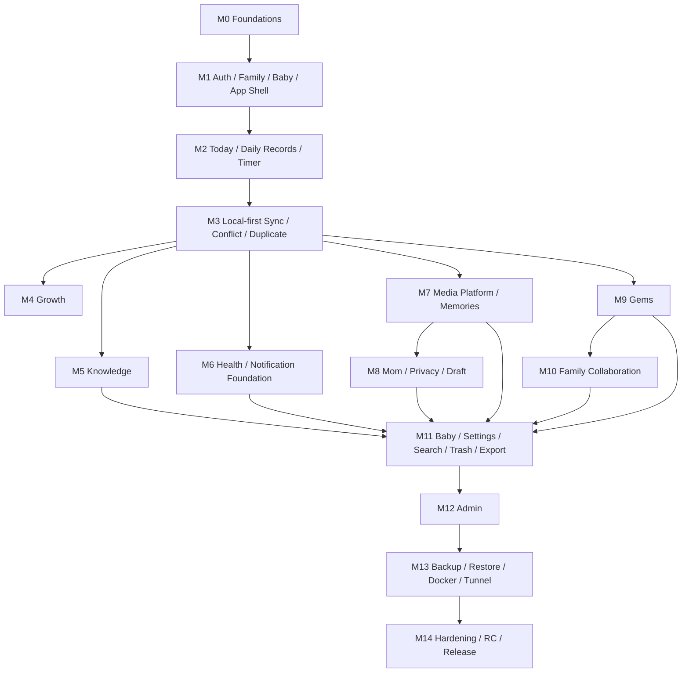

# 🌱 润芽 · RUNEW — IMPLEMENTATION_PLAN.md

> **文档类型：** Implementation Plan / Engineering Delivery Plan  
> **事实源：** `PRD_RUNEW_V3.0.md` + `UI_IMPLEMENTATION_SPEC.md` + `TECHNICAL_DESIGN.md`  
> **目标：** 将已经闭环的产品、UI 与技术设计拆分为可逐阶段开发、逐阶段验证、逐阶段提交的工程实施计划。  
> **当前交付端：** Mobile（微信小程序 + H5 Mobile），设计基准 390×844，兼容 375 / 430。  
> **核心原则：** 不一次性实现全部 268 张 Figma Frame；不把离线、权限、媒体可靠性、恢复、备份留到最后返工。

---

# 0. 文档治理

## 0.1 事实源优先级

实现中遇到冲突时：

1. `PRD_RUNEW_V3.0.md`：业务规则、权限、状态机、产品边界；
2. Figma `11 R6.2 Mobile Complete`：视觉、布局、交互入口；
3. `UI_IMPLEMENTATION_SPEC.md`：Route / Sheet / Dialog / Component / State / Motion；
4. `TECHNICAL_DESIGN.md`：数据库、API、同步、媒体、安全、备份、部署；
5. 本文档：实施顺序、任务拆分、里程碑和验收；
6. 代码。

本计划不得通过“实现方便”改变 PRD，也不得把 Figma Frame 机械映射为独立 Route。

## 0.2 本计划解决什么

本计划解决四个问题：

- 先做什么、后做什么；
- 每一阶段包含哪些前端、后端、数据库、状态和测试；
- 每一阶段做到什么程度才能进入下一阶段；
- Codex / Cursor 如何在不失控的情况下连续施工。

## 0.3 不允许的施工方式

禁止：

- 一次性让 Agent “完成整个 PRD”；
- 一次性实现 11 个模块后再补测试；
- 先写 268 个静态页面再接数据；
- 所有页面都各写一套 Card / Button / Glass CSS；
- 先假数据完成 UI，最后整体替换真实 API；
- 离线逻辑最后统一“包一层”；
- 权限只做前端隐藏；
- 计时依赖前台 `setInterval` 累加；
- 图片/录音直接依赖临时文件路径；
- 宝石余额直接 `balance += 1` 而没有不可变流水；
- SQLite 生产库用 `drizzle push --force`；
- Backup 只复制运行中的 `runew.db`；
- 一个 Milestone 改动跨越大量无关模块。

---

# 1. 当前 P0 交付目标

当前 P0 必须形成一个真正可用的移动端闭环：

- 登录 / 注册 / Onboarding；
- 家庭、成员、宝宝、多宝宝数据模型；
- 11 个普通业务菜单；
- Today；
- 日常记录；
- 成长；
- 育儿知识；
- 健康；
- 宝宝回忆；
- 妈妈空间；
- 宝石商城；
- 我们的小家；
- 宝宝档案；
- 设置；
- 独立管理员模式；
- 全局搜索；
- 通知中心；
- 离线记录；
- 后台计时；
- 自动草稿；
- 编辑 / 删除 / 撤销 / 最近删除；
- 重复记录检测；
- 图片 / 音频可靠上传；
- PRIVATE 权限隔离；
- 宝石账本一致；
- 备份状态、验证和恢复；
- Docker + Cloudflare Tunnel；
- P0 自动化测试与上线验收。

P1/P2 不得阻塞 P0，除非当前 Figma 已明确存在并被 PRD 提升到 P0。

---

# 2. 实施策略

## 2.1 Vertical Slice，而不是“前端做完 → 后端做完”

每个里程碑优先形成可运行的 Vertical Slice：

```text
Schema
→ Migration
→ Repository
→ Domain Service
→ API
→ Client Repository
→ Query/Store
→ UI
→ State
→ Test
→ Visual Review
```

一个模块不应长期停留在“UI 看起来完成，但数据是假数据”或“API 全部写完，但没有真实客户端验证”。

## 2.2 Cross-cutting Foundation 先行

下列能力必须尽早建立公共实现：

- ULID；
- UTC/timezone；
- version / ETag；
- idempotency；
- Soft Delete；
- unified error envelope；
- auth context；
- permission policy；
- Local Repository；
- Pending Queue；
- Media local persistence；
- common UI Design System。

## 2.3 为什么 Sync 提前

UI 模块顺序从 Foundations、Shell/Auth、Today/Records 开始。技术实施中在 `Today/Records` 之后立即插入 Sync Foundation，是为了避免成长、健康、回忆、妈妈空间、家庭任务全部先写成 online-only CRUD 再大规模重构。

因此本计划采用：

```text
M0 Foundation
M1 Identity/Shell
M2 Today/Records/Timer
M3 Offline Sync/Conflict
M4 Growth
...
```

这是工程依赖调整，不改变产品优先级。

---

# 3. 里程碑依赖图



---

# 4. Milestone 总览

| Milestone | 主题 | 核心退出条件 |
|---|---|---|
| M0 | Foundations | Monorepo、Design System、Fastify、SQLite WAL、Migration、CI 可运行 |
| M1 | Auth / Family / Baby / Shell | 登录到 Today 的真实链路完成，11 菜单 Shell 可导航 |
| M2 | Today / Daily Records / Timer | 奶瓶、母乳、睡眠、尿布、辅食 CRUD 与后台计时闭环 |
| M3 | Offline Sync / Conflict | 离线创建、重启恢复、自动同步、版本冲突、重复记录可验证 |
| M4 | Growth | 成长记录、趋势、里程碑、月度基础故事闭环 |
| M5 | Knowledge | 推荐、详情、收藏、稍后、学到了、版本更新闭环 |
| M6 | Health / Notification Foundation | 健康事项、提醒、DND、通知中心基础闭环 |
| M7 | Media / Memories | 照片/音频持久化、断点上传、回忆、语录、声音、第一次、胶囊 |
| M8 | Mom / Privacy / Draft | 心情、日记、PRIVATE 后端隔离、草稿恢复 |
| M9 | Gems | Gem Rule、Immutable Ledger、兑换、订单、取消/兑现一致 |
| M10 | Family | 成员、邀请、任务、纪念日、成就，无贡献排行榜 |
| M11 | Baby / Settings / Search / Trash / Export | 设置、全局搜索、最近删除、导出、多宝宝辅助闭环 |
| M12 | Admin | 独立 Admin Session、管理模块、二次认证、审计 |
| M13 | Backup / Restore / Deploy | 可验证 Backup、真实 Restore、Docker、Cloudflare Tunnel |
| M14 | Hardening / RC | P0 E2E、视觉、性能、安全、灾备、Release Gate 全通过 |

---

# 5. M0 — Foundations

## 5.1 目标

建立所有后续模块共用的工程地基。M0 不追求业务页面数量，追求后续不会重复搭地基。

## 5.2 Repository / Tooling

完成：

```text
apps/client
apps/server
packages/contracts
packages/domain-types
packages/validation
packages/shared-utils
db/schema
db/migrations
docs
deploy
```

建立 TypeScript strict、ESLint、Prettier、pnpm workspace、`.env.example`、`.gitignore`、`AGENTS.md`、基础 scripts 和 CI。

建议命令至少：

```text
pnpm typecheck
pnpm lint
pnpm test
pnpm build
pnpm db:migrate
pnpm db:check
```

## 5.3 Server Foundation

完成 Fastify bootstrap、Pino JSON logger、request ID、error handler、config loader、security headers、CORS baseline、SQLite connection、WAL/FK/busy timeout、Drizzle migration、`/health/live`、`/health/ready`。

## 5.4 Client Foundation

完成 Taro、React、TypeScript、Zustand、TanStack Query、SCSS/CSS Modules、route skeleton、theme provider、error boundary、request client、platform adapter。

## 5.5 Design System

第一阶段就实现公共组件：

```text
PageShell
GlassSurface
SectionHeader
AppTopBar
RoundIconButton
GemBadge
BottomNav
AppDrawer
PrimaryActionButton
SecondaryGlassButton
IconActionButton
DangerButton
TextAction
GlassInput
GlassTextArea
SegmentedControl
FilterChip
BottomSheet
ConfirmDialog
Toast
Skeleton
EmptyState
ErrorState
OfflineBanner
```

禁止后续页面重新写一套 glass CSS。

## 5.6 Shared Contract

确定 API success envelope、error envelope、ULID、UTC millis、pagination、ETag / If-Match、Idempotency-Key。

## 5.7 Database

建立 `system_metadata` 以及 Identity/Family/Baby 所需基础 Schema/migration。

## 5.8 测试

至少覆盖 server boot、health endpoint、SQLite WAL、FK、migration from empty DB、client build、shared contract compile、Design System smoke render。

## 5.9 Exit Gate

只有满足：

```text
typecheck ✅
lint ✅
tests ✅
client build ✅
server build ✅
migration from empty DB ✅
health ready ✅
```

才进入 M1。

---

# 6. M1 — Auth / Family / Baby / App Shell

## 6.1 目标

实现：

```text
打开产品
→ 注册/登录
→ Onboarding
→ 创建家庭
→ 创建宝宝
→ 选择身份/关注主题
→ Today
```

以及完整 App Shell。

## 6.2 Backend

完成：

- `/auth/register`、`/login`、`/logout`、`/me`、`/bootstrap`；
- Family/Member/Invite baseline；
- Baby CRUD；
- Argon2id；
- opaque session；
- H5 Cookie；
- Mini Program Bearer token；
- session token hash；
- active family/member policy；
- baby-family 校验。

## 6.3 Frontend

完成 Figma 对应登录、注册、Onboarding Wizard、AppDrawer 11 菜单、管理模式独立入口、BottomNav、Current Family / Current Baby、单宝宝隐藏 Switch。

## 6.4 状态

必须覆盖 loading、auth error、field error、session expired、first-run、family missing、baby missing。

## 6.5 Tests

必须覆盖 register/login/logout、invalid password、disabled user、session revoke、family A/B 越权、baby-family mismatch、onboarding bootstrap、375/390/430 UI。

## 6.6 Exit Gate

用户真实登录后，App Shell 不使用 Mock Auth。

---

# 7. M2 — Today / Daily Records / Timer

## 7.1 目标

完成产品最高频核心链路。

## 7.2 Schema

建立：

```text
feeding_records
feeding_segments
sleep_records
diaper_records
food_records
```

所有离线可编辑实体包含 ULID、family_id、baby_id、created_by、updated_by、version、deleted_at、UTC timestamp。

## 7.3 API

完成 Timeline 聚合、奶瓶 CRUD、母乳 start/switch/pause/resume/finish、sleep start/finish/edit、diaper CRUD、food CRUD、Today summary、running timer bootstrap。

## 7.4 Timer

必须：

```text
started_at / ended_at / segments 是业务真相
setInterval 只刷新 UI
```

验证切后台、锁屏、页面退出、重新进入后时长正确。

## 7.5 UI

实现 Today Default/SleepRunning/FeedingRunning、summary、timeline、quick entries，以及 Daily Records timeline、filter、date、feeding、breast、sleep、diaper、food、detail、edit、delete。

Inline State 不创建多余 Route。

## 7.6 Tests

覆盖各类型 CRUD、Timeline order、ETag baseline、sleep single running、breast segment、cross-midnight、background timer、Soft Delete、权限、375/390/430。

## 7.7 Exit Gate

凌晨用户能在移动端真实完成一次记录，不依赖 Mock Data。

---

# 8. M3 — Local-first / Offline Sync / Conflict / Duplicate

## 8.1 目标

把 RUNEW 从“联网 CRUD App”升级为正式 Local-first 产品。

## 8.2 Client Local Repository

完成 LocalEntityStore、PendingOperationStore、DraftStore base、SyncCursorStore、Device ID。H5 使用 IndexedDB；Mini Program 使用 Taro storage/FileSystem abstraction。

## 8.3 Pending Operations

支持 CREATE / UPDATE / DELETE / RESTORE，保存 operationId、entityType、entityId、baseVersion、baseSnapshot、patch/fullPayload、changedFields、retryCount、clientCreatedAt。

## 8.4 Server Sync

建立 `sync_operations`、`POST /sync/push`、`GET /sync/pull`、`GET /sync/snapshot`、`sync_epoch`。

## 8.5 Three-way Conflict

完成非重叠字段 Auto Merge、重叠字段 Conflict、deleted-vs-update、restore、full resync。禁止 Last-write-wins。

## 8.6 Duplicate Detection

建立 `duplicate_candidates`，同 family/baby/type/相近时间检测，用户选择 Merge 或 Keep Both，禁止 silent delete。

## 8.7 UI

完成 OfflineBanner、SyncBadge、Pending count、Retry、Conflict dialog、DuplicateRecordDialog。

## 8.8 Tests

最关键：

```text
airplane mode create
kill app
restart
record still exists
restore network
only one server entity
```

同时覆盖 same operation retry、两设备非重叠更新、重叠冲突、delete vs offline update、full resync preserving pending、duplicate merge/keep both。

## 8.9 Exit Gate

如果离线后 App 重启记录会消失，M3 不通过。

---

# 9. M4 — Growth

建立 `growth_records`、`milestones`；完成成长 CRUD、latest metrics、height/weight/head trend、里程碑、monthly base story；复用 M3 Sync/Version/Soft Delete。UI 实现 Growth main、三个指标切换、ECharts、record/detail/edit/delete、milestone、monthly story。测试 partial metric、ordering、offline、conflict、restore、chart numeric accessibility。

---

# 10. M5 — Knowledge

建立 `knowledge`、`knowledge_user_states`。完成 published list、age/category、detail、source/review/version、recommendation、favorite、later、learned、dismissed、feedback。

核心规则：

```text
learned_version == current content_version
→ 当前版本不重复推荐

current content_version > learned_version
→ 可显示内容有更新
```

UI 实现 Knowledge home、category、search、detail、library、source、learned transition、updated state、more sheet。测试年龄边界、learned filter、version update、OFFLINE 状态和 source metadata。

---

# 11. M6 — Health / Notification Foundation

建立 `health_events`、`health_reminders`、`health_event_media`、`notification_preferences`、`notifications`、`scheduled_notifications`、`job_locks`。

完成健康事项 CRUD、提醒、calendar/timeline、Scheduler、In-app Notification、DND、notification read/deep link。

默认 DND 建议 21:00–08:00。禁止压力型提醒。健康只做事项/提醒，不做诊断。

测试 scheduler restart idempotency、DND、reschedule/cancel、offline edit、permission。

---

# 12. M7 — Media Platform / Memories

## 12.1 Media Foundation

先建立：

```text
media_files
media_uploads
media_upload_parts
```

客户端：

- Mini Program 临时文件先复制到 `USER_DATA_PATH`；
- H5 优先 OPFS，fallback IndexedDB Blob；
- durable local copy 成功后才能提示安全保存。

上传完成 Init、4 MiB Chunk、Part Hash、Resume、Complete、Size/Hash Verify、Atomic Rename、Processing、Retry。

图片处理约 1600px display + 400px thumbnail；音频 AAC/Opus metadata + duration + HTTP Range。SQLite 不存 Binary。

## 12.2 Memories

建立 photo_memories、baby_quotes、audio_memories、first_moments、time_capsules 及关联表。实现照片、语录+音频、宝宝声音、第一次、时光胶囊、珍藏、去年的今天、年度回顾。

胶囊严格：

```text
DRAFT → SEALED → OPENED
```

## 12.3 Exit Gate

录音上传中退出/杀 App 后如果需要重新录，M7 不通过。

---

# 13. M8 — Mom / PRIVATE / Auto Draft

建立 `moods`、`diaries`。完成 mood、diary、visibility PRIVATE/FAMILY、owner policy、Search/Media 权限继承。

自动草稿接入 diary、baby quote、capsule、health note，支持 debounce、onBlur、onAppHide、route leave、baseVersion。

安全测试必须证明：PRIVATE 日记其他家庭成员列表看不到、Search 看不到、直链/API 拒绝、日志/分析不含正文。

---

# 14. M9 — Gems

建立 `gem_rules`、`gem_transactions`、`rewards`、`reward_orders`。

`gem_transactions` 不可变，Family Balance Cache 必须可由 Ledger 校验。

完成 Rule、Daily Cap、自动奖励、Ledger、Reward、Redeem、Waiting、Fulfill、Cancel/Refund、Custom Reward、Reconcile。

必须同事务：

```text
record + reward
redeem + debit + order
cancel + refund
```

测试 same create retry no double gem、daily cap、并发兑换、余额不足、cancel exactly one refund、ledger reconcile。

---

# 15. M10 — Family Collaboration

完善 Invite、Member、Permission、Task、Achievement、Anniversary。

禁止爸爸排名、妈妈排名、贡献排行榜；不得为此创建 API 字段。

测试 invite expiry/reuse、permission、disabled member、task conflict、anniversary、no ranking。

---

# 16. M11 — Baby / Settings / Search / Trash / Export

完成 Baby Profile/Edit/Preferences/Changes/Multi-baby；Settings 的 account、notification、DND、appearance、night、privacy、backup status、storage、export、backup history、recently deleted、about。

Search 使用 SQLite FTS5 + 中文 Bigram，覆盖 records/growth/knowledge/health/memories/quotes/audio/authorized diary，PRIVATE 在查询层过滤。

统一 Trash/Restore；基础异步 Export；若 M3 尚未补齐 WebSocket，在此补 one-time ticket + sync_hint / notification_hint / session_revoked / maintenance。

全局审查所有一级页面的 Default / Loading / Empty / Error / Offline / Success / Disabled / Uploading / Permission / Draft / Deleted 状态。

---

# 17. M12 — Admin

建立 `admin_credentials`、`admin_sessions`、`admin_reauth_grants`、`audit_logs`、`system_settings`。

实现独立 Admin Password + Argon2id + 约 30min Absolute Session + Rate Limit。普通 User Session 不等于 Admin Session。

危险操作必须：

```text
风险说明
→ Reauth
→ 单次 Scoped Grant
→ Final Confirm
→ Execute
→ Audit
```

完成 Knowledge/Gems/Gem Rules/Rewards/Content/Members/Data/System/Audit 管理 UI/API。Admin UI 仍保持 RUNEW Warm Glass。

测试 Admin session expiry、rate limit、reused grant、wrong scope、Audit、PRIVATE 内容 redaction。

---

# 18. M13 — Backup / Restore / Docker / Cloudflare

完成 Backup Runs、SQLite Online Backup、Manifest、Hash、Verify、Retention、本机 `/backups`、可选 Restic 加密异地。

禁止直接复制运行中的 `runew.db`。

真实 Restore：

```text
Admin Reauth
→ Maintenance
→ PRE_RESTORE Snapshot
→ Restore Staging
→ integrity_check
→ Manifest/Hash
→ Atomic Activate
→ Migration
→ Smoke
→ sync_epoch++
→ Exit Maintenance
```

Docker 生产结构：

```text
runew-app
cloudflared
runew-backup
```

runew-app 不直接暴露公网 Host Port。

必须真实执行一次 Restore Drill，并产出 `docs/RESTORE_DRILL_REPORT.md`。没有 Restore Drill，Backup 不算完成。

---

# 19. M14 — Hardening / Release Candidate

不新增新产品功能，只做：

- Full P0 E2E；
- 375/390/430 Visual Regression；
- Glass/Alignment/Icon/Spacing；
- Night Mode；
- Motion / Reduce Motion；
- Accessibility；
- Performance；
- Security；
- Failure/Chaos；
- Docker Smoke；
- Disaster Recovery；
- Release Docs。

必须生成：

```text
docs/RC_CHECKLIST.md
docs/KNOWN_ISSUES.md
docs/DEPLOYMENT_RUNBOOK.md
docs/DR_RUNBOOK.md
```

任何 P0 Blocker 未清零不得声明 RC Ready。

---

# 20. Migration Discipline

每个涉及 DB 的 Milestone：

1. 修改 Drizzle Schema；
2. 生成 Migration；
3. 从空 DB Apply；
4. 从上一 Milestone DB Apply；
5. Integration Test；
6. 禁止手工改生产 DB；
7. Release 前 Backup。

---

# 21. API Contract Discipline

前后端同时变更时：

```text
packages/contracts
→ Server
→ Integration Test
→ Client
→ UI State
```

如果 API 修改会改变产品状态机，应回到 PRD/Technical Design 评审，不直接改代码。

---

# 22. UI Implementation Discipline

每个页面开发前：

1. 找 Figma Frame；
2. 找 UI Spec Screen Registry；
3. 判断 Route / Sheet / Dialog / Inline State；
4. 找已有公共 Component；
5. 不复制 CSS；
6. 实现真实状态；
7. 375/390/430 截图；
8. 对照 Figma。

每个明显按钮必须属于 Navigate / Open Sheet / Open Dialog / Inline State / Async Action / System Native 之一。

---

# 23. Development Log

建立：

```text
docs/DEVELOPMENT_LOG.md
```

每个 Task 完成追加：

```md
## YYYY-MM-DD — Mx / Task
- 完成内容
- Migration
- API
- UI
- Tests
- Known issues
- Design/Tech decisions
- Next
```

只保留有长期价值的工程事实，不写流水账。

---

# 24. Issue 分类

## P0 Blocker

- 数据丢失；
- PRIVATE 泄露；
- 宝石重复扣/发；
- Backup 无法 Restore；
- Timer 错误；
- 媒体丢失；
- 管理员越权。

## P1 Major

- 核心链路无法完成；
- 显著视觉偏离；
- 状态遗漏；
- 重复记录错误；
- Search 漏权限。

## P2 Minor

- 细微视觉；
- 低频体验；
- 非阻断动画。

P0 未清零不得进入 RC。

---

# 25. Change Control

开发发现四份事实源不能同时满足时，不自行选择。

创建：

```text
docs/issues/DECISION-xxx.md
```

至少包含 Problem、PRD Rule、Figma、UI Spec、Technical Constraint、Options、Recommendation、Decision。

---

# 26. 每个 Milestone 统一完成模板

```text
[ ] 阅读对应 PRD
[ ] 阅读 UI Spec
[ ] 阅读 Tech Design
[ ] 找到 Figma Frames
[ ] Schema
[ ] Migration
[ ] Index
[ ] Policy
[ ] API Contract
[ ] Server
[ ] Client repository/query
[ ] UI
[ ] Loading
[ ] Empty
[ ] Error
[ ] Offline（适用）
[ ] Permission（适用）
[ ] Draft（适用）
[ ] Delete/Restore（适用）
[ ] Version/Conflict（适用）
[ ] Idempotency（适用）
[ ] Audit（适用）
[ ] Unit
[ ] Integration
[ ] E2E
[ ] Typecheck
[ ] Lint
[ ] Build
[ ] 375/390/430 visual
[ ] DEVELOPMENT_LOG
```

---

# 27. 最终 Release Gate

## Product
- 11 menus；
- Admin；
- 所有主要 CRUD；
- 无 Dead Button。

## Data
- Offline；
- Background Timer；
- Draft；
- Soft Delete；
- Restore；
- Conflict；
- Duplicate。

## Media
- Local Persistence；
- Resume Upload；
- Audio/Photo survive app kill；
- Restore。

## Security
- PRIVATE Backend Isolation；
- Search Permission；
- Admin Backend Auth；
- Danger Reauth；
- Audit。

## Gems
- Immutable Ledger；
- Idempotent Reward；
- Redeem Consistency；
- Reconcile。

## Backup
- Scheduled Backup；
- Verify；
- Real Restore Drill；
- Sync Epoch。

## UI
- Figma Alignment；
- 375 / 390 / 430；
- Night；
- Reduced Motion；
- Accessibility。

## Engineering
- Typecheck；
- Lint；
- Tests；
- Build；
- Migrations；
- Docker；
- Health；
- Cloudflare；
- Logs。

---

# 28. 实施结论

最危险的方式是：

```text
先把所有页面做出来
→ 最后再补数据、离线、媒体、权限、恢复
```

本计划采用：

```text
Foundation
→ Identity
→ 高频真实记录
→ Local-first / Sync
→ 业务模块扩展
→ Media / Privacy / Ledger
→ Admin
→ Backup / Restore
→ Hardening
```

最终验收单位不是“Figma 268 张截图都能打开”，而是：

> **每个页面背后都有真实状态、真实数据、真实权限、真实恢复路径，并且能在宝宝家庭真实长期使用。**
