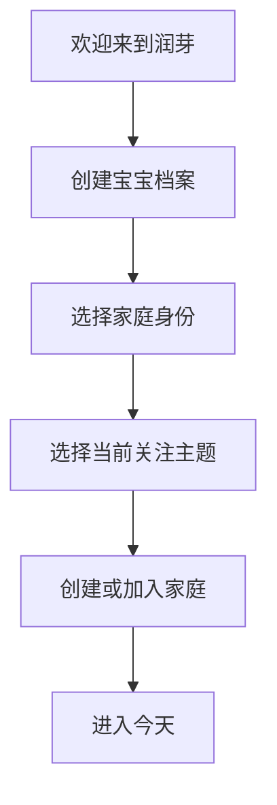
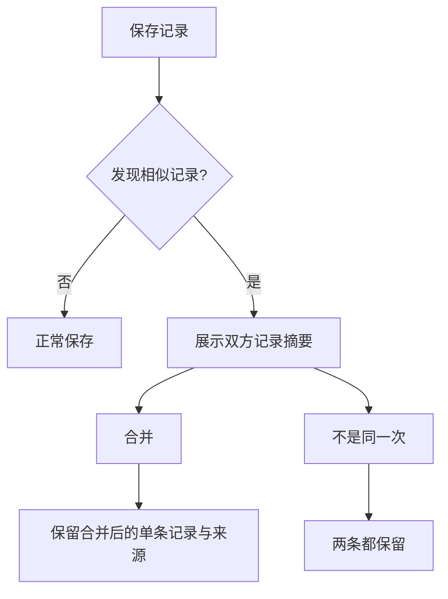
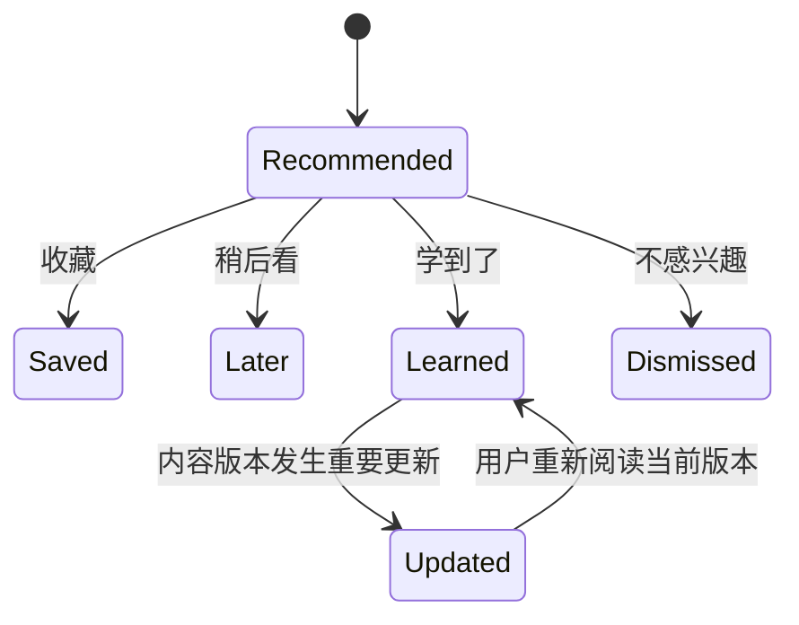
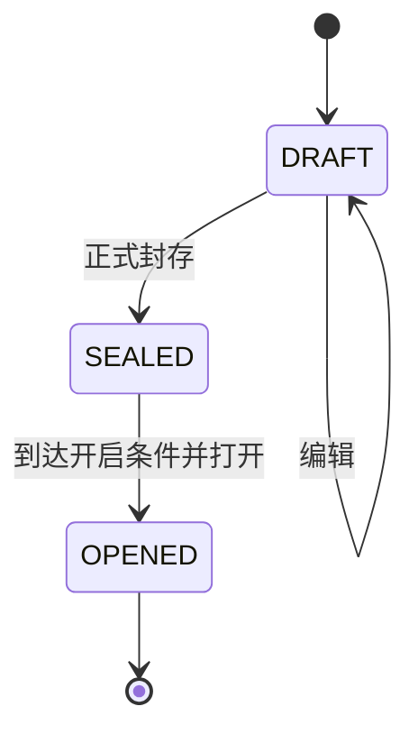
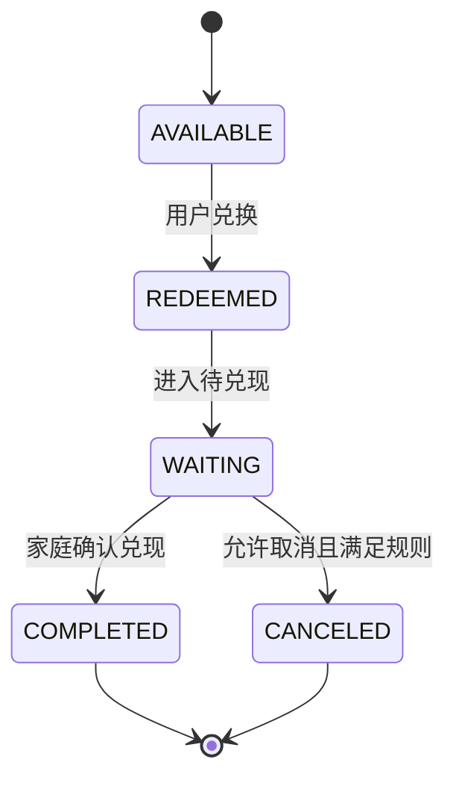
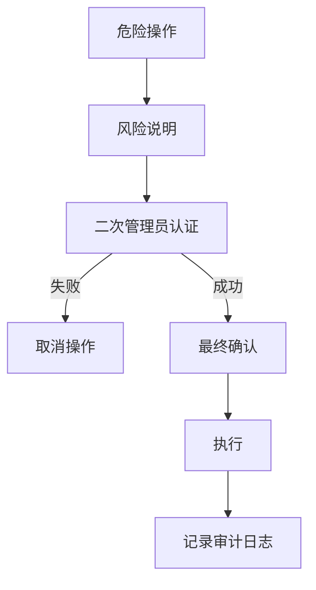
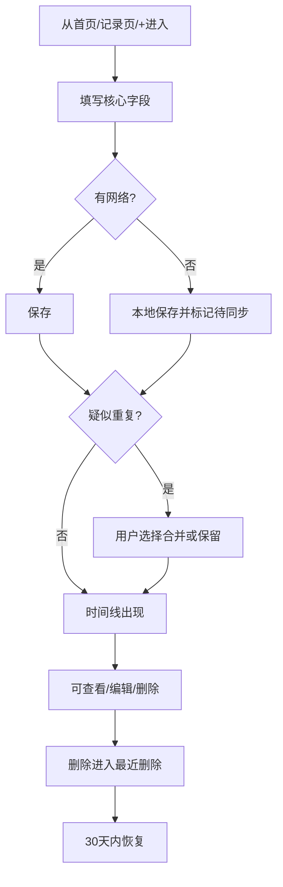
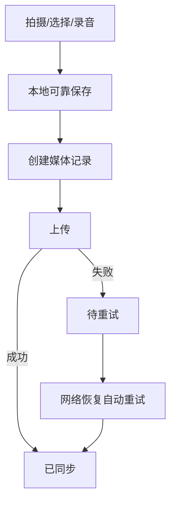
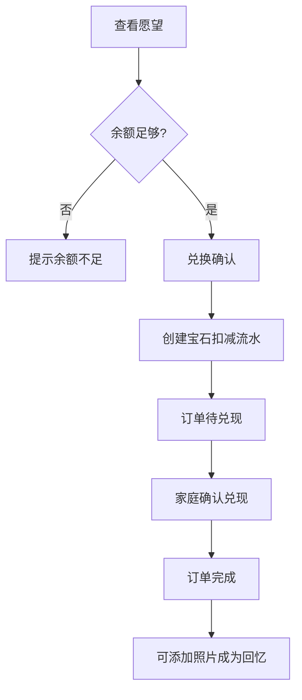
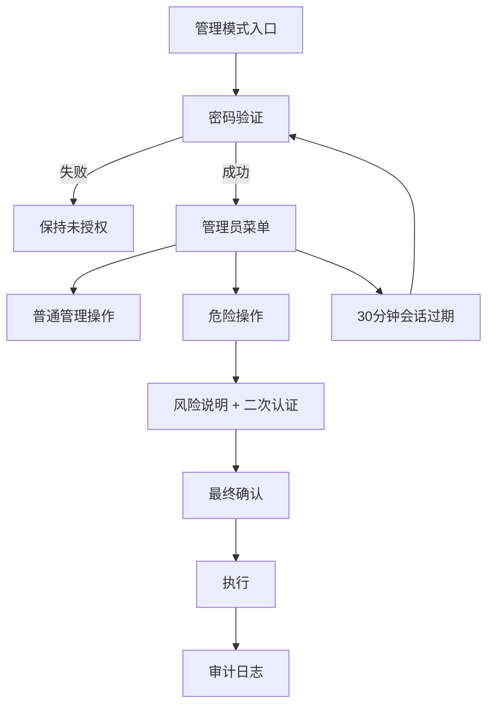

# 🌱 润芽 · RUNEW 产品需求文档 PRD V3.0

> **产品副标题：** 润润的家庭成长工作台  
> **产品 Slogan：** 把润润长大的每一天，认真收藏起来。🌱  
> **文档类型：** 产品需求文档 / Product Requirements Document  
> **当前设计事实源：** Figma `11 R6.2 Mobile Complete`  
> **当前交付端：** Mobile（390×844 为设计基准，兼容 375 / 430 宽度）  
> **文档目标：** 作为后续 `UI_IMPLEMENTATION_SPEC.md`、`TECHNICAL_DESIGN.md`、开发计划、测试计划与验收的产品事实源。

---

# 0. 文档使用规则

## 0.1 事实源优先级

当产品、UI、开发实现之间出现冲突时，按以下优先级处理：

1. **本 PRD V3.0：业务规则、权限规则、状态机、功能范围、产品边界的最高事实源。**
2. **Figma `11 R6.2 Mobile Complete`：页面结构、交互入口、视觉结果的最高事实源。**
3. `UI_IMPLEMENTATION_SPEC.md`：将本 PRD 与 Figma 翻译为开发可执行的 UI / Component / Interaction 规格。
4. `TECHNICAL_DESIGN.md`：数据库、API、离线同步、文件存储、部署等技术实现方案。
5. 代码实现。

如果 Figma 中存在某个页面，但与本 PRD 的业务规则冲突，应优先修正 UI 或后续 UI 实现规格，不得通过代码“猜测”产品逻辑。

## 0.2 本版本范围

本 PRD **只约束当前移动端版本**。当前 UI 设计基于 390×844，要求适配常见 375、390、430 宽度。

本阶段不要求交付 Tablet / Desktop UI，但产品数据模型与服务端能力不得人为限制未来多端扩展。

## 0.3 当前 UI 覆盖情况

当前 Figma `11 R6.2 Mobile Complete` 共：

- **268 张顶层移动端 Frame**；
- 覆盖登录与首次使用；
- 11 个一级业务模块；
- 独立管理员模式；
- Loading / Empty / Error / Offline / Uploading / Success / Permission / Backup 等状态；
- 新增、编辑、详情、筛选、删除确认、恢复、导出等分支。

本 PRD 不要求“一种数据一条独立页面”。播放/暂停、Toggle、Tab、单选等应属于 Inline Action，不为了增加页面数量而制造无意义跳转。

---

# 1. 产品定义

## 1.1 一句话定义

**润芽是一款围绕宝宝成长与家庭生活构建的私人家庭成长工作台。**

它把日常育儿记录、成长趋势、育儿知识、健康提醒、宝宝回忆、妈妈私人空间、家庭奖励与家庭协作放进一个可以使用很多年的家庭空间。

## 1.2 产品不是什​​么

润芽不是：

- 单纯的喂奶计时器；
- 医疗诊断工具；
- 育儿 KPI 打卡器；
- 爸爸妈妈贡献排行榜；
- 母婴电商平台；
- 用焦虑推动活跃度的提醒工具；
- 只看数据的 Dashboard；
- 面向公众发布宝宝内容的社交平台。

## 1.3 产品长期价值

润芽的价值随时间增长：

> 使用一天，它是育儿工具。  
> 使用一年，它是成长档案。  
> 使用很多年，它应该成为家庭记忆博物馆。

产品最终保存的不是单纯的数据，而是：

- 宝宝如何长大；
- 妈妈如何成为妈妈；
- 爸爸如何成为爸爸；
- 一个家庭如何一天一天形成自己的故事。

---

# 2. 产品目标与成功标准

## 2.1 四个核心目标

| 目标 | 产品价值 | 典型能力 |
|---|---|---|
| 👶 照顾宝宝 | 高频记录尽可能轻松 | 喂奶、睡眠、尿布、辅食、成长、健康 |
| 🌱 看见成长 | 把零散数据变成趋势和故事 | 成长曲线、里程碑、月度故事、最近变化 |
| ❤️ 照顾家庭 | 让家庭协作更温柔 | 妈妈空间、家庭任务、家庭奖励、成员协作 |
| 📖 收藏时间 | 保留不可复刻的内容 | 照片、语录、宝宝声音、第一次、时光胶囊 |

## 2.2 产品成功的判断方式

第一阶段不以 DAU、连续打卡、记录次数最大化作为主要成功标准。

更重要的成功指标是：

1. 高频记录是否能快速完成；
2. 用户中途退出是否不丢数据；
3. 多人记录是否不制造混乱；
4. 私密内容是否真正隔离；
5. 图片、声音等高价值媒体是否可靠保存；
6. 3 个月后是否仍愿意使用；
7. 1 年后是否能形成有价值的回忆；
8. 用户是否感到被帮助，而不是被考核。

---

# 3. 产品体验最高原则

以下原则高于单个功能需求。

## 3.1 高频操作尽量三步完成

典型路径：

```text
打开产品
  ↓
选择记录类型
  ↓
填写核心值 / 开始计时
  ↓
完成
```

原则：

- 非必要字段不得阻塞保存；
- 高频操作优先使用默认值、最近值、快捷选项；
- 保存按钮始终处于容易触达的位置；
- 核心点击区域不小于 48px；
- 夜间操作应支持单手完成。

## 3.2 不因页面关闭丢数据

以下场景必须能够恢复：

- 微信小程序切后台；
- H5 刷新；
- 手机锁屏；
- 电话打断；
- 网络断开；
- 页面异常关闭；
- 上传进行中离开页面。

计时型业务以真实 `start_time / end_time` 计算，不依赖页面一直打开。

## 3.3 不制造育儿焦虑

禁止：

- “今天还没记录”；
- “连续打卡即将中断”；
- “挑战失败”；
- 用红色或警告式 KPI 表示“记录不够”；
- 妈妈与爸爸贡献排名；
- 把宝宝发育结果与宝石奖励绑定。

允许温柔提示，但用户永远可以忽略。

## 3.4 奖励“留下记录”，不评价育儿结果

宝石奖励的是记录行为，而不是：

- 宝宝今天吃得多不多；
- 睡得好不好；
- 妈妈今天心情好不好；
- 家长是否“完成任务”。

例如任何心情选项都应获得相同宝石规则。

## 3.5 真正重要的数据必须可恢复

所有核心记录至少支持：

- 查看；
- 编辑；
- 删除；
- 删除后恢复；
- 查看创建人和更新时间。

图片、宝宝声音、时光胶囊等高价值内容的恢复能力优先级更高。

---

# 4. 用户、家庭与权限模型

## 4.1 用户角色

### 妈妈

普通家庭成员，典型高频模块：

- 日常记录；
- 妈妈空间；
- 育儿知识；
- 健康；
- 回忆；
- 宝石商城。

妈妈空间默认私人。

### 爸爸

普通家庭成员，可：

- 记录宝宝；
- 查看成长；
- 写宝宝语录；
- 保存宝宝声音；
- 创建时光胶囊；
- 参与家庭任务；
- 创建/兑现家庭奖励（依据权限）。

### 其他家庭成员

例如爷爷、奶奶、其他照护者。

权限按家庭成员配置，可包括：

- 查看；
- 新增记录；
- 上传媒体；
- 编辑；
- 管理家庭内容。

### 系统管理员

管理员身份与家庭成员身份分离。

必须通过独立管理员验证进入“管理模式”。

可管理：

- 育儿知识；
- 宝石余额与规则；
- 宝石商城；
- 内容；
- 家庭成员与权限；
- 数据与备份；
- 系统配置；
- 操作日志。

## 4.2 家庭空间

一个用户可以属于一个或多个家庭（第一版 UI 可先聚焦当前家庭）。

一个家庭可包含：

- 多个成员；
- 一个或多个宝宝。

业务数据必须绑定家庭；涉及宝宝的数据必须同时绑定宝宝。

## 4.3 多宝宝支持

第一版产品能力即支持多个宝宝。

规则：

- 只有一个宝宝时，不强制展示切换器；
- 多宝宝时显示宝宝切换入口；
- 日常记录、成长、健康、知识、回忆必须切换到明确宝宝；
- 家庭任务、家庭成员、家庭奖励可以是家庭级数据。

## 4.4 私密内容

妈妈日记等私密内容必须在权限层真正隔离。

默认：

- `仅自己`。

用户可主动修改单条内容可见范围，例如：

- 仅自己；
- 我和伴侣；
- 家庭成员。

搜索、通知、列表、详情、导出都必须遵守相同权限，不能只在首页隐藏。

---

# 5. 信息架构与导航

## 5.1 11 个一级业务模块

1. 今天
2. 日常记录
3. 成长
4. 育儿知识
5. 健康
6. 宝宝回忆
7. 妈妈空间
8. 宝石商城
9. 我们的小家
10. 宝宝档案
11. 设置

## 5.2 管理员入口

管理员为独立“管理模式”，**不计入普通 11 个业务菜单**。

在完整抽屉底部提供独立入口：

```text
管理模式
  ↓
管理员密码验证
  ↓
管理员菜单
```

不得把管理员功能散落在普通业务页面。

## 5.3 Bottom Navigation

固定五个高频入口：

- 今天；
- 记录；
- `+` 快速新增；
- 回忆；
- 小家。

中间 `+` 打开“留下这一刻”，作为高频创建入口。

## 5.4 `+` 快速新增

至少包含：

- 喂奶；
- 睡眠；
- 尿布；
- 辅食；
- 成长；
- 照片；
- 宝宝声音；
- 宝宝语录；
- 心情；
- 日记/育儿心得。

## 5.5 全局抽屉

提供全部 11 个业务模块、宝宝/家庭信息、搜索、通知以及独立管理模式入口。

---

# 6. 登录、注册与首次使用

对应 Figma `00.xx`。

## 6.1 登录

支持：

- 账号；
- 密码；
- 登录；
- 注册切换；
- 账号异常反馈。

登录成功后：

- 有现有家庭 → 进入今天；
- 无家庭/无宝宝 → 进入 Onboarding。

## 6.2 注册

完成账号创建后进入首次使用流程。

## 6.3 Onboarding

推荐顺序：



关注主题用于知识推荐初始偏好，不影响用户之后查看全部知识。

## 6.4 首次权限申请原则

首次进入不得一次性请求：

- 相机；
- 相册；
- 麦克风；
- 通知。

必须在用户首次触发对应能力时说明用途并申请。

---

# 7. 模块一：今天

对应 Figma `01.xx`。

## 7.1 页面目标

用户打开首页后首先回答：

> “润润现在怎么样？”

首页不是功能导航墙，而是上下文感知的今日工作台。

## 7.2 首页内容优先级

优先级：

```text
正在进行中的状态
>
今天重要事项
>
快速记录
>
今日摘要
>
知识提醒
>
妈妈状态入口
>
今日时间线
>
最近回忆
```

有正在睡眠、喂奶或当天健康事项时，对应模块应自动前移。

## 7.3 普通状态

展示：

- 宝宝头像与月龄；
- 今日喂奶次数/总量摘要；
- 睡眠摘要；
- 尿布摘要；
- 辅食摘要；
- 快速记录；
- 下一件健康事项；
- 今日知识；
- 今日时间线；
- 最近回忆。

## 7.4 睡眠进行中

显示：

- 入睡时间；
- 已睡时长；
- “润润醒了”主操作；
- 允许调整开始时间。

结束后生成睡眠记录并回到普通首页。

## 7.5 喂奶进行中

母乳计时支持：

- 左侧；
- 右侧；
- 切换侧；
- 暂停/继续（如设计需要）；
- 结束。

结束后生成喂奶记录。

## 7.6 今日全部记录

进入完整时间线，支持按时间查看当日发生的：

- 喂奶；
- 睡眠；
- 尿布；
- 辅食；
- 成长；
- 照片；
- 宝宝声音；
- 健康事项等。

每条记录可进入对应详情。

---

# 8. 模块二：日常记录

对应 Figma `02.xx / 13.xx / 14.01–14.04 / 15.01–15.04`。

## 8.1 页面目标

把润润的一天按时间组织起来，并让补录、修改、计时都尽量轻松。

## 8.2 日期导航

支持：

- 今天；
- 昨天；
- 前一天/后一天；
- 日历选择。

## 8.3 记录筛选

支持：

- 全部；
- 喂奶；
- 睡眠；
- 尿布；
- 辅食。

## 8.4 奶瓶记录

字段：

- 时间（必填）；
- 奶量 ml（必填）；
- 类型：母乳 / 配方奶 / 混合 / 其他；
- 备注；
- 图片（可选）。

支持创建、详情、编辑、复制、删除、恢复。

## 8.5 母乳计时

支持：

- 左侧；
- 右侧；
- 双侧；
- 开始；
- 切换；
- 暂停/继续；
- 结束；
- 修改开始时间；
- 手工补录。

结束后展示：

- 总时长；
- 左侧时长；
- 右侧时长。

计时必须支持后台恢复。

## 8.6 睡眠

支持：

- 开始睡眠；
- 醒来；
- 修改开始时间；
- 修改结束时间；
- 手工补录；
- 跨午夜；
- 后台运行。

## 8.7 尿布

字段：

- 时间；
- 湿；
- 便便；
- 两者都有；
- 可选性状：正常 / 偏稀 / 偏干 / 其他；
- 备注。

只作家庭记录，不基于此直接诊断疾病。

## 8.8 辅食

字段：

- 食物；
- 时间；
- 食量；
- 是否第一次尝试；
- 喜爱程度；
- 照片；
- 备注。

喜爱程度为情绪表达，不属于医学结论。

## 8.9 快速补录

高频记录支持：

- 刚刚；
- 15 分钟前；
- 30 分钟前；
- 1 小时前；
- 自定义时间。

## 8.10 重复记录检测

当不同家庭成员在很接近的时间为同一宝宝创建相同类型记录时：



禁止后台静默删除。

## 8.11 后续增强（P1）

以下能力保留在后续优先级，不阻塞当前 UI 开发：

- 食物图鉴；
- 一日周期图；
- 更复杂的节律洞察。

---

# 9. 模块三：成长

对应 Figma `03.xx / 15.34`。

## 9.1 页面目标

不是“育儿 KPI”，而是帮助家长看到宝宝的变化。

## 9.2 成长指标

支持：

- 身高；
- 体重；
- 头围；
- 牙齿数量（可作为扩展指标）。

每条记录包含：

- 测量日期；
- 值；
- 单位；
- 备注；
- 创建人。

## 9.3 趋势

身高、体重、头围分别展示趋势。

图表必须同时提供可读数字，不能只有图形。

## 9.4 记录成长

支持：

- 新增；
- 查看详情；
- 编辑；
- 删除；
- 恢复。

## 9.5 里程碑

示例：

- 第一次坐起来；
- 第一次翻身；
- 第一次扶站；
- 第一次叫妈妈；
- 第一次旅行。

里程碑支持：

- 标题；
- 日期；
- 描述；
- 照片；
- 关联声音；
- 珍藏。

## 9.6 月度成长故事

“这个月的润润”将成长记录、第一次、辅食尝试、照片等组织为可读故事。

第一版可基于规则模板生成；未来可由 AI 增强，但不得编造事实。

---

# 10. 模块四：育儿知识

对应 Figma `04.xx / 13.05 / 14.05–14.09 / 14.19 / 15.16 / 15.35`。

## 10.1 页面目标

提供“适合润润现在阶段”的知识，而不是无差别信息流。

## 10.2 推荐输入

推荐综合：

- 宝宝生日 / 当前月龄；
- 最近育儿记录；
- 用户关注主题；
- 已收藏；
- 已学习；
- 不感兴趣；
- 减少推荐的主题。

## 10.3 知识分类

分类至少支持：

- 推荐；
- 辅食；
- 睡眠；
- 出牙；
- 发育/大运动；
- 语言；
- 认知；
- 亲子；
- 安全。

分类属于内容 taxonomy，不要求每个分类都拥有独立代码页面，可复用统一分类模板。

## 10.4 知识卡字段

每条知识必须包含：

- 标题；
- 摘要；
- 分类；
- 适用月龄/天龄；
- 阅读时间；
- 来源；
- 审核/更新时间；
- 内容版本；
- 为什么推荐。

## 10.5 用户操作

支持：

- 收藏；
- 稍后看；
- 学到了；
- 不感兴趣；
- 减少此类推荐；
- 内容有问题。

## 10.6 “学到了”闭环



核心规则：

- “学到了”针对**内容版本**；
- 当前版本进入 LEARNED 后，不再出现在正常推荐流；
- 已学内容仍可在“已学”中找到；
- 如果知识发生重要版本更新，可提示“内容有更新”，由用户决定是否重新阅读。

## 10.7 内容边界

育儿知识用于教育和科普，不提供诊断结论。

---

# 11. 模块五：健康

对应 Figma `05.xx / 14.10–14.12 / 15.36`。

## 11.1 页面目标

帮助家庭记录和提醒重要健康事项，不替代医生。

## 11.2 健康事项类型

支持：

- 疫苗；
- 儿保；
- 医院就诊；
- 牙科；
- 用药提醒；
- 其他。

## 11.3 健康事项字段

- 名称；
- 类型；
- 日期（必填）；
- 时间；
- 医院；
- 医生；
- 地址；
- 提醒；
- 备注；
- 附件（图片 / PDF）。

## 11.4 日历与时间轴

支持：

- 月历查看；
- 日期上的事项标记；
- 当天事项；
- 健康时间轴；
- 类型筛选。

## 11.5 提醒

支持：

- 7 天前；
- 3 天前；
- 1 天前；
- 当天；
- 自定义。

## 11.6 详情闭环

事项必须支持：

- 新增；
- 详情；
- 编辑；
- 删除；
- 附件预览；
- 地点查看；
- 提醒修改。

## 11.7 产品边界

润芽可以：

- 记录；
- 提醒；
- 整理；
- 展示科普。

润芽不应该：

- 诊断疾病；
- 替代医生；
- 根据记录直接判断宝宝患病。

---

# 12. 模块六：宝宝回忆

对应 Figma `06.xx / 13.xx / 15.03–15.10 / 15.24 / 15.26`。

## 12.1 页面定位

正式概念：**润润的小小博物馆**。

这是产品长期价值最高的模块之一。

## 12.2 内容分类

- 照片；
- 宝宝语录；
- 宝宝声音；
- 第一次；
- 时光胶囊；
- 珍藏；
- 去年的今天；
- 年度回顾。

## 12.3 照片回忆

支持：

- 从相机拍照；
- 从相册选择；
- 添加日期；
- 描述；
- 珍藏；
- 编辑；
- 删除；
- 恢复；
- 分享/导出。

“今天的一张”是鼓励，不是每日强制任务。

## 12.4 宝宝语录

字段：

- 文字；
- 时间；
- 发生场景；
- 备注；
- 可关联照片；
- 可关联录音。

支持新增、详情、编辑、删除、恢复、珍藏。

## 12.5 宝宝声音

声音分类包括：

- 第一次叫妈妈；
- 第一次叫爸爸；
- 大笑；
- 咿咿呀呀；
- 唱歌；
- 爸爸故事；
- 妈妈摇篮曲；
- 其他。

录音流程：

```text
申请麦克风权限（首次）
  ↓
开始录音
  ↓
停止
  ↓
预览/播放
  ↓
填写标题、分类、日期、描述
  ↓
保存
  ↓
本地可靠保存 + 上传/同步
```

如果上传失败，不得要求用户重新录制。

## 12.6 音频播放器

支持：

- 播放 / 暂停；
- 进度；
- 时长；
- 珍藏；
- 编辑元数据；
- 删除。

播放/暂停为 Inline Action，不跳转新页面。

## 12.7 第一次

“第一次”是统一成长时间轴，可关联：

- 照片；
- 声音；
- 描述；
- 日期。

支持新增、详情、编辑、删除、珍藏。

## 12.8 时光胶囊

字段：

- 标题；
- 写给谁；
- 文字；
- 照片；
- 声音；
- 视频；
- 开启日期。

状态：



规则：

- DRAFT 可反复编辑；
- SEALED 后不可普通编辑；
- 封存后展示开启日期/倒计时；
- OPENED 后完整查看历史内容；
- 系统不得因客户端时间变化提前解封；
- 删除等高风险行为需明确确认。

## 12.9 珍藏

所有重要回忆可标记为珍藏，形成“润润的珍藏”。

## 12.10 去年的今天

当历史数据达到一年后，展示对应日期的回忆内容。

## 12.11 年度回顾

每个生日/年度可形成：

- 照片数量；
- 声音数量；
- 宝宝语录数量；
- 第一次；
- 时光胶囊；
- 代表性成长变化。

支持导出。

---

# 13. 模块七：妈妈空间

对应 Figma `07.xx / 13.06–13.07`。

## 13.1 核心理念

在这里，妈妈不是被考核的照护者，而首先是自己。

因此妈妈空间应比其他模块更安静、更私人。

## 13.2 今日心情

选项可包括：

- 特别开心；
- 还不错；
- 普通；
- 有点累；
- 需要抱抱。

规则：

- 所有心情平等；
- 不给情绪打分；
- 不生成“平均心情 KPI”；
- 不以连续记录施压；
- 宝石奖励不因情绪好坏变化。

## 13.3 一句话心得

允许快速记录一句话，无需写完整日记。

## 13.4 完整日记

支持：

- 文字；
- 照片；
- 语音；
- 标签；
- 自动草稿；
- 可见范围。

## 13.5 心情日历

仅用于个人回顾，不作心理诊断或风险判断。

## 13.6 权限

默认仅本人可见。

其他家庭成员访问未授权日记时，无论通过列表、搜索、直链还是 API，都必须不可见。

---

# 14. 模块八：宝石商城

对应 Figma `08.xx / 14.13–14.17 / 15.14–15.15 / 15.37`。

## 14.1 页面定位

正式概念：**润芽宝石屋**。

它是家庭内部的小愿望系统，不是电商商城。

## 14.2 宝石余额

展示：

- 当前余额；
- 最近获得；
- 宝石账本入口。

所有余额必须能够由交易流水校验。

## 14.3 获得规则

原则：奖励留下记录，不评价结果。

管理员可配置：

- 行为；
- 单次奖励；
- 每日奖励次数上限；
- 启用/停用。

同类型记录可以存在每日奖励上限，但记录本身永远不限次数。

## 14.4 连续记录

可以展示正向历史：

> “曾连续留下 29 天记录。”

中断后不得出现失败惩罚。

## 14.5 愿望/奖励

示例：

- 一束花；
- 奶茶；
- 妈妈休息 2 小时；
- 一顿喜欢的大餐；
- 宝宝玩具；
- 家庭写真。

支持家庭自定义：

- 名称；
- 图片；
- 宝石价格；
- 数量；
- 备注。

## 14.6 兑换闭环

兑换不是结束。

状态：



完成兑现后可关联一张照片，使奖励本身也成为家庭回忆。

## 14.7 宝石账本

每笔交易必须可查：

- 增加/扣减；
- 原因；
- 关联业务；
- 创建时间；
- 操作者。

人工调整必须写明原因并进入管理员审计日志。

---

# 15. 模块九：我们的小家

对应 Figma `09.xx / 13.08–13.11 / 15.11–15.13`。

## 15.1 页面目标

表达“我们一起在照顾这个家”，而不是绩效协作工具。

## 15.2 家庭成员

显示：

- 头像；
- 昵称；
- 关系；
- 权限。

支持：

- 邀请二维码；
- 邀请链接；
- 成员详情；
- 权限修改；
- 停用/恢复（管理员权限）。

邀请凭证应短期有效。

## 15.3 未加入家庭

支持：

- 创建小家；
- 加入小家。

## 15.4 家庭任务

字段：

- 名称；
- 负责人；
- 日期；
- 重复规则；
- 家庭经验；
- 完成状态。

支持新增、详情、编辑、完成、删除。

## 15.5 家庭任务原则

禁止：

- 爸爸排名；
- 妈妈排名；
- 贡献排行榜。

允许展示：

> “这周我们一起完成了 46 件小事情。”

## 15.6 家庭等级与成就

家庭经验可来自：

- 记录；
- 里程碑；
- 家庭任务；
- 照片；
- 纪念日。

等级只产生：

- 徽章；
- 纪念动画；
- 家庭成就。

不产生竞争优势。

## 15.7 家庭纪念日

支持：

- 宝宝生日；
- 结婚纪念日；
- 第一次旅行；
- 搬家纪念日；
- 自定义。

支持新增、详情、编辑、删除、提醒。

---

# 16. 模块十：宝宝档案

对应 Figma `10.xx`。

## 16.1 页面定位

宝宝档案应像人物主页，而不是医院表格。

## 16.2 基础资料

字段：

- 昵称；
- 正式姓名（可选）；
- 生日；
- 性别；
- 出生身高；
- 出生体重；
- 出生头围；
- 头像。

## 16.3 当前状态

自动读取最近成长记录：

- 身高；
- 体重；
- 头围；
- 牙齿数量（如维护）。

## 16.4 喜欢 / 不喜欢

“喜欢”可来自：

- 辅食记录推导；
- 用户手工维护。

“不喜欢”由用户维护或从辅食偏好中辅助形成。

## 16.5 最近变化

自动聚合：

- 最近长高；
- 新里程碑；
- 新尝试食物；
- 新的第一次。

每条变化应能跳转到原始记录。

## 16.6 多宝宝

支持切换宝宝与添加宝宝。

---

# 17. 模块十一：设置

对应 Figma `11.xx / 13.30–13.32 / 15.27 / 15.38–15.39`。

## 17.1 账号与安全

支持：

- 当前账号信息；
- 修改密码；
- 已登录设备；
- 退出登录；
- 退出确认。

## 17.2 家庭成员管理

普通设置中提供当前家庭成员入口；更高权限操作进入家庭/管理员流程。

## 17.3 通知设置

分类：

- 健康提醒；
- 家庭任务；
- 商城兑换；
- 备份异常；
- 时光胶囊；
- 家庭纪念日。

禁止发送压力型提醒。

## 17.4 免打扰

默认建议：21:00–08:00，可修改。

重要主动健康提醒可以按产品规则例外。

## 17.5 外观与主题

支持：

- 自动；
- 奶油暖色；
- 鼠尾草绿；
- 夜间育儿模式。

## 17.6 夜间育儿模式

不是简单反色。

必须：

- 降低大面积高亮白色；
- 减少动画；
- 放大核心操作；
- 首页优先喂奶、睡眠、尿布等夜间任务；
- 完整菜单仍可进入。

## 17.7 隐私与权限

支持查看与管理：

- 相机；
- 相册；
- 麦克风；
- 通知；
- 家庭内容权限。

## 17.8 数据与备份

用户可以看到：

- 最近备份时间；
- 备份是否正常；
- 备份失败；
- 备份历史；
- 存储空间。

## 17.9 数据导出

至少支持：

- 成长报告；
- CSV；
- 照片；
- 录音；
- 回忆档案；
- 完整备份。

家庭数据归家庭自己所有。

## 17.10 最近删除

用户可查看最近删除内容并恢复。

普通数据默认 30 天后再物理清理；高价值媒体可根据技术设计延长保留策略。

## 17.11 关于润芽

显示产品信息、版本和必要说明，不承载业务操作。

---

# 18. 独立管理员模式

对应 Figma `12.xx / 15.16–15.23 / 15.25 / 15.28–15.33 / 15.40`。

## 18.1 管理员验证

进入管理模式前必须输入独立管理员密码。

验证成功后产生独立管理员会话。

默认会话约 30 分钟，过期后重新验证。

## 18.2 管理员菜单

至少包含：

- 知识管理；
- 宝石管理；
- 宝石规则；
- 宝石商城；
- 内容管理；
- 家庭成员；
- 数据与备份；
- 系统设置；
- 操作日志。

## 18.3 知识管理

支持：

- 列表；
- 搜索；
- 分类；
- 新增；
- 编辑基本信息；
- 编辑正文；
- 内容详情；
- 上下架；
- 用户状态统计。

核心字段：

- 标题；
- 摘要；
- 正文；
- 分类；
- 最小/最大适用天龄；
- 来源；
- 更新时间；
- 版本；
- 优先级；
- 状态。

## 18.4 宝石管理

支持：

- 当前家庭宝石余额；
- 宝石流水；
- 流水详情；
- 人工调整；
- 调整确认。

人工调整必须记录原因与管理员身份。

## 18.5 宝石规则

支持：

- 新建；
- 编辑；
- 启用/停用；
- 单次奖励；
- 每日奖励上限。

## 18.6 宝石商城管理

支持：

- 新建奖励；
- 编辑；
- 上下架；
- 价格；
- 库存；
- 排序。

## 18.7 内容管理

用于管理家庭音频内容，例如：

- 白噪音；
- 摇篮曲；
- 爸爸录音；
- 妈妈录音；
- 睡前故事。

## 18.8 家庭成员管理

支持查看：

- 成员；
- 关系；
- 权限；
- 加入时间；
- 账号状态。

支持：

- 调整权限；
- 停用；
- 恢复。

## 18.9 数据中心

展示：

- 数据库大小；
- 照片空间；
- 录音空间；
- 剩余磁盘；
- 最近备份；
- 备份状态。

## 18.10 数据操作

支持：

- 立即备份；
- 导出；
- 恢复；
- 检查备份；
- 清理缓存。

## 18.11 危险操作

以下操作必须二次认证：

- 恢复历史备份；
- 删除全部照片；
- 删除宝宝档案；
- 关闭备份；
- 其他不可逆或大范围数据操作。

流程：



## 18.12 操作日志

记录：

- 时间；
- 管理员/用户；
- 动作；
- 资源；
- 修改前；
- 修改后；
- 结果。

---

# 19. 全局搜索

对应 Figma `00.08`。

## 19.1 搜索范围

可以搜索：

- 日常记录；
- 成长；
- 知识；
- 健康；
- 回忆；
- 宝宝语录；
- 宝宝声音；
- 妈妈日记（仅有权限的人）。

## 19.2 权限过滤

权限校验必须在搜索结果产生之前或服务端查询层完成。

不能先返回私人日记，再由前端隐藏。

## 19.3 结果行为

每条搜索结果必须跳转到真实详情或原始记录。

---

# 20. 通知中心

对应 Figma `00.09`。

通知包括：

- 健康提醒；
- 家庭任务；
- 奖励待兑现/已兑现；
- 备份失败；
- 时光胶囊开启；
- 家庭纪念日；
- 系统必要提醒。

通知点击后进入对应业务详情。

不得发送无价值的“回来打开 App”类压力提醒。

---

# 21. 离线、同步与冲突

对应 Figma `00.11 / 13.22–13.26`。

## 21.1 离线记录

普通记录在无网络时可以正常创建。

用户得到明确反馈：

> 已离线保存，网络恢复后会自动同步。

## 21.2 待同步

用户可以看到同步状态和失败项。

网络恢复后自动重试。

## 21.3 媒体上传失败

照片/录音上传失败时：

- 本地文件不能消失；
- 不要求重新拍照或重新录音；
- 进入待上传队列；
- 支持重试。

## 21.4 冲突原则

多人同时操作时：

- 新增相似记录 → 进入重复检测；
- 编辑同一数据 → 技术方案必须保留可解释的冲突处理；
- 系统不得静默覆盖用户重要内容。

具体同步算法放入技术详细设计。

---

# 22. 自动草稿

以下内容必须自动保存草稿：

- 妈妈日记；
- 一句话心得；
- 宝宝语录；
- 时光胶囊；
- 健康备注；
- 其他长文本编辑页。

重新进入时提示：

- 继续；
- 丢弃。

不得因刷新或退出丢失正在编辑的长文本。

---

# 23. 编辑、删除、撤销与恢复

## 23.1 通用原则

所有重要业务实体默认支持：

- 编辑；
- 删除；
- 删除确认；
- 删除后撤销；
- 最近删除恢复。

## 23.2 最近删除

普通内容默认进入最近删除 30 天。

永久清理属于后台策略，不作为用户首次删除动作。

## 23.3 高价值内容

宝宝声音、时光胶囊、照片等应优先保证可恢复性。

---

# 24. 媒体与系统原生边界

以下属于系统原生能力，不要求额外设计 RUNEW 内部页面：

- 相机拍照；
- 系统相册选择；
- 系统视频选择；
- 保存到相册；
- 系统分享；
- 地图导航；
- 文件保存/打开系统界面。

RUNEW 必须设计调用前、调用后、权限拒绝、取消等业务状态。

---

# 25. 数据安全、备份与数据所有权

## 25.1 数据所有权

家庭数据属于家庭自己。

用户必须能够：

- 导出；
- 备份；
- 恢复；
- 查看备份状态。

## 25.2 备份可视化

设置页应展示：

- 最近备份；
- 是否成功；
- 失败告警；
- 查看历史。

## 25.3 恢复

恢复历史备份属于管理员危险操作，必须经过二次认证与最终确认。

## 25.4 数据安全底线

如果这是宝宝第一次叫妈妈的声音，系统必须假设：

> 这条数据不可复刻。

产品设计不能接受一次普通误操作导致永久消失。

---

# 26. 页面状态规范（产品层）

每个主要模块必须考虑：

- Default；
- Loading；
- Empty；
- Error；
- Offline；
- Success；
- Disabled；
- Uploading；
- Permission Required；
- Draft Recovery（适用页面）；
- Deleted / Restorable（适用实体）。

## 26.1 Loading

优先 Skeleton，不用长时间大面积 Spinner 阻塞页面。

## 26.2 Empty

空状态需要：

- 解释当前没有什么；
- 给出自然的下一步；
- 不制造压力。

## 26.3 Error

错误文案面向普通用户表达：

> 暂时没连上，刚刚的内容已经安全保存在手机里。

不得直接暴露技术错误码作为主要文案。

---

# 27. 文案与情绪原则

产品文案应：

- 温暖；
- 直接；
- 不幼稚；
- 不说教；
- 不制造焦虑；
- 不把设计说明写进 UI。

避免机械：

- “提交成功”；
- “暂无数据”；
- “操作失败”；
- “连续打卡失败”。

可使用更自然的表达：

- “记好啦”；
- “润润睡着啦”；
- “润润醒啦”；
- “一个小愿望兑换啦”；
- “有些爱，适合晚一点打开”。

“仅家人可见”“仅做个人回顾、不做心理判断”等产品原则不应长期占据主 UI；只有在用户做权限决定时才展示必要解释。

---

# 28. 可访问性与易用性

必须考虑：

- 支持系统字体放大；
- 不仅依赖颜色表达状态；
- 图标提供可访问名称；
- 图表提供数字详情；
- 支持减少动态效果；
- 文字对比度足够；
- 核心触摸区域 ≥ 48px；
- 重要快捷操作建议 ≥ 56px；
- 夜间使用不刺眼。

---

# 29. 产品分析与隐私边界

可以记录匿名产品事件，例如：

- page_view；
- record_created；
- record_edited；
- knowledge_learned；
- reward_redeemed；
- memory_created。

不得用于产品埋点的私人内容：

- 日记正文；
- 录音内容；
- 照片内容；
- 时光胶囊正文。

产品行为分析与私人内容必须分离。

---

# 30. AI 能力边界

未来 AI 优先用于：

- 月度成长故事；
- 年度故事；
- 回忆整理；
- 宝宝语录整理；
- 知识推荐排序。

AI 不优先用于：

- 医疗诊断；
- 疾病判断；
- 根据家庭记录自动给出高风险医疗结论。

AI 的定位是：

> 把真实数据变成故事，而不是替用户编造事实。

---

# 31. 版本范围与优先级

## P0：当前移动端可上线闭环

当前开发必须实现：

- 登录 / 注册 / 首次使用；
- 家庭与宝宝；
- 11 个业务菜单；
- 今天；
- 日常记录；
- 成长；
- 育儿知识；
- 健康；
- 宝宝回忆；
- 妈妈空间；
- 宝石商城；
- 我们的小家；
- 宝宝档案；
- 设置；
- 独立管理员；
- 全局搜索；
- 通知中心；
- 离线记录；
- 后台计时；
- 自动草稿；
- 编辑/删除/恢复；
- 重复记录检测；
- 图片/音频可靠上传；
- 权限隔离；
- 备份状态与恢复；
- 年度回顾与去年的今天（当前 UI 已存在，纳入当前闭环）。

## P1：当前 UI 未完整展开但应预留

- 食物图鉴；
- 一日周期图；
- 更深入的节律洞察；
- 更丰富家庭徽章；
- 高级导出排版；
- 异地加密备份增强；
- 更多知识分类运营能力；
- 月亮电台/家庭音频内容消费体验增强。

## P2：未来能力

- AI 月报；
- AI 年度故事；
- 自动成长纪念册；
- 智能回忆搜索；
- Tablet / Desktop 独立交互设计；
- 原生 App。

---

# 32. 关键功能状态机总表

| 业务 | 核心状态 | 必须闭环 |
|---|---|---|
| 睡眠 | 未开始 → 进行中 → 已结束 | 后台恢复、手工调整 |
| 母乳计时 | 未开始 → 左/右计时 → 暂停/切换 → 已结束 | 后台恢复 |
| 普通记录 | 草稿/编辑 → 已保存 → 已编辑 → 已删除 → 可恢复 | 离线保存 |
| 媒体 | 本地 → 待上传 → 上传中 → 已同步 / 失败待重试 | 不得丢原文件 |
| 知识 | 推荐 → 收藏/稍后看/学到了/不感兴趣 | 版本更新可重新出现 |
| 健康事项 | 待发生 → 已提醒 → 已完成/过期 → 历史 | 支持编辑提醒 |
| 时光胶囊 | DRAFT → SEALED → OPENED | 封存后不可普通编辑 |
| 宝石订单 | 可兑换 → 已兑换 → 待兑现 → 已完成/取消 | 账本一致 |
| 家庭任务 | 待处理 → 已完成 / 删除 | 不做成员排行榜 |
| 管理员 Session | 未验证 → 有效 → 过期 | 过期重新认证 |
| 最近删除 | 活跃 → 已删除 → 恢复 / 到期清理 | 30 天默认策略 |

---

# 33. 核心业务流程验收

## 33.1 普通记录闭环



## 33.2 媒体闭环



## 33.3 宝石兑换闭环



## 33.4 管理员闭环



---

# 34. 功能闭环审核矩阵

| 模块 | 入口 | 创建/操作 | 结果 | 编辑/反向 | 异常/恢复 | 权限 | 审核结论 |
|---|---|---|---|---|---|---|---|
| 登录/Onboarding | 登录页 | 注册、创建宝宝、身份、主题 | 进入今天 | 可后续改资料 | 账号异常可处理 | 用户级 | ✅ 闭环 |
| 今天 | Bottom/Drawer | 快速记录、进行中任务 | 今日状态更新 | 进入详情修改 | 离线状态可见 | 家庭/宝宝 | ✅ 闭环 |
| 日常记录 | 记录页/+ | 奶瓶、母乳、睡眠、尿布、辅食 | 时间线 | 编辑/复制/删除 | 离线、重复、恢复 | 家庭/宝宝 | ✅ 闭环 |
| 成长 | Drawer/Today | 成长值、里程碑 | 曲线/月度故事 | 编辑/删除 | 空状态/恢复 | 家庭/宝宝 | ✅ 闭环 |
| 育儿知识 | Drawer/Today | 收藏、稍后看、学到了 | 用户知识状态 | 可取消收藏等 | 内容问题反馈 | 用户+宝宝推荐 | ✅ 闭环 |
| 健康 | Drawer/Today | 新增事项/提醒 | 日历/时间轴 | 编辑/删除 | 附件/提醒异常 | 家庭/宝宝 | ✅ 闭环 |
| 宝宝回忆 | Bottom/Drawer/+ | 照片、语录、声音、第一次、胶囊 | 博物馆/珍藏 | 编辑/删除/恢复 | 上传失败重试 | 家庭/宝宝 | ✅ 闭环 |
| 妈妈空间 | Drawer/+ | 心情、心得、日记 | 私人历史 | 编辑/删除 | 自动草稿 | 私密权限 | ✅ 闭环 |
| 宝石商城 | Drawer | 兑换/自定义愿望 | 待兑现/完成 | 取消/编辑愿望 | 余额不足 | 家庭+管理员规则 | ✅ 闭环 |
| 我们的小家 | Bottom/Drawer | 成员、任务、纪念日 | 家庭协作 | 权限/任务编辑 | 邀请/删除确认 | 家庭权限 | ✅ 闭环 |
| 宝宝档案 | Drawer | 编辑资料、喜好、多宝宝 | 人物主页 | 可持续维护 | 删除由管理员危险操作 | 家庭/宝宝 | ✅ 闭环 |
| 设置 | Drawer | 通知、主题、权限、备份、导出 | 配置生效 | 可修改 | 备份失败/恢复 | 用户/家庭 | ✅ 闭环 |
| 管理员 | 独立入口 | 知识、宝石、商城、成员、数据 | 配置生效 | 编辑/上下架/恢复 | 二次认证/Session 过期 | Admin | ✅ 闭环 |
| 全局搜索 | Header/Drawer | 搜索 | 详情跳转 | — | 空结果 | 权限过滤 | ✅ 闭环 |
| 离线同步 | 全局 | 本地创建/上传 | 自动同步 | 失败重试 | Pending Queue | 与业务权限一致 | ✅ 闭环 |
| 删除恢复 | 各详情 | 删除 | 最近删除 | 恢复 | 到期清理 | 原资源权限 | ✅ 闭环 |

---

# 35. PRD 逻辑一致性审核

本章节是本次 V3.0 相比旧 PRD 的正式审核结论。

## 35.1 已解决的冲突

### 冲突 A：旧 PRD 要求多端完整，当前设计只做移动端

**处理：** 本阶段 PRD 明确只交付 Mobile。未来多端作为 P2，不再要求当前开发同时维护 Tablet/Desktop。

### 冲突 B：旧 PRD 中部分 P1 功能，当前 UI 已经完成

例如：

- 年度回顾；
- 去年的今天；
- 多宝宝切换；
- 高级导出部分流程。

**处理：** 当前 UI 已存在的完整能力提升到 P0，避免“设计有、产品说以后再做”。

### 冲突 C：食物图鉴、一日周期图在旧 PRD 中存在，但当前完整 UI 未独立展开

**处理：** 明确降为 P1，不阻塞当前开发，不要求开发自行创造页面。

### 冲突 D：管理员入口定义不统一

**处理：** 管理员定义为全局抽屉底部的独立“管理模式”，不计入 11 个普通菜单。管理员验证后进入独立菜单。

### 冲突 E：隐私原则被写成长期 UI 提示

**处理：** “仅家人可见”“仅做个人回顾”等保留为业务规则，但不要求每页持续展示。只有权限决策/风险说明时出现。

## 35.2 已确认的业务闭环

以下关键链路已有明确入口、操作、结果、异常与恢复：

- 登录与首次使用；
- 高频日常记录；
- 后台计时；
- 多人重复记录；
- 成长记录与里程碑；
- 知识“学到了”版本逻辑；
- 健康事项与提醒；
- 图片/录音上传失败；
- 宝宝语录/声音/第一次编辑删除；
- 时光胶囊状态机；
- 妈妈私人日记；
- 宝石收入/兑换/兑现/账本；
- 家庭任务/成员/纪念日；
- 多宝宝；
- 通知/免打扰；
- 数据导出/备份/恢复；
- 最近删除；
- 管理员认证/Session/危险操作/审计日志。

## 35.3 当前无产品级阻塞问题

完成本次审核后，没有发现会阻止进入下一阶段 `UI_IMPLEMENTATION_SPEC.md` 与技术详细设计的产品逻辑断点。

后续设计必须继续遵守三条原则：

1. **UI_IMPLEMENTATION_SPEC 不得重新发明业务规则。**
2. **TECHNICAL_DESIGN 必须为本 PRD 的离线、权限、恢复、备份、状态机提供真实技术闭环。**
3. **如果技术上无法满足“不丢数据/权限隔离/可恢复”，必须返回 PRD 评审，不能静默降低要求。**

---

# 36. 上线前核心测试场景

必须至少通过：

## 夜间场景

凌晨单手完成喂奶记录。

## 后台场景

```text
开始睡眠
→ 关闭/切后台
→ 2 小时后重新进入
→ 时长正确
```

## 断网场景

```text
无网络创建记录
→ 本地成功
→ 网络恢复
→ 自动同步
```

## 重复场景

爸爸妈妈同时记录相近的尿布/喂奶，系统提示合并或保留，不静默删除。

## 草稿场景

妈妈写日记到一半退出，重新进入仍能恢复。

## 删除场景

误删宝宝录音，最近删除中可恢复。

## 媒体场景

图片或录音上传到一半断网，文件仍存在，网络恢复后继续。

## 备份场景

主数据库损坏后，可由最近有效备份恢复。

## 权限场景

没有权限的家庭成员通过搜索/直链访问 PRIVATE 日记，必须拒绝。

## 长期搜索

使用数年后搜索“第一次叫妈妈”，可以找到对应语录/声音/第一次记录。

---

# 37. P0 上线验收标准

产品达到以下条件才可认为“功能闭环”：

- [ ] Mobile 拥有完整 11 个业务菜单；
- [ ] 管理员有独立管理模式；
- [ ] 11 个模块主要创建、详情、编辑、删除路径可用；
- [ ] 所有明显 App 内按钮有行为或明确 Inline State；
- [ ] 高频记录支持离线；
- [ ] 后台计时正确；
- [ ] 图片/录音不会因页面退出丢失；
- [ ] 上传失败可以自动或手工重试；
- [ ] 重复记录不会静默删除；
- [ ] 核心数据可编辑；
- [ ] 删除可恢复；
- [ ] 妈妈 PRIVATE 内容后端隔离；
- [ ] 全局搜索遵守权限；
- [ ] “学到了”当前版本不重复推荐；
- [ ] 知识版本更新可以重新提示；
- [ ] 健康提醒可设置、修改、取消；
- [ ] 宝石余额与账本一致；
- [ ] 商城兑换有待兑现与已完成状态；
- [ ] 家庭任务无成员排行榜；
- [ ] 时光胶囊状态不可越级；
- [ ] 自动草稿工作正常；
- [ ] 备份状态可见；
- [ ] 管理员由后端验证；
- [ ] 管理员危险操作二次认证；
- [ ] 管理员操作有审计日志；
- [ ] 夜间模式不是简单反色；
- [ ] 核心点击区域满足移动端使用；
- [ ] 系统权限采用 Just-in-time 申请；
- [ ] 数据可导出；
- [ ] 所有主要页面有 Loading / Empty / Error / Offline 等必要状态。

---

# 38. 下一阶段输入约束

本 PRD 审核通过后，下一份文档应为：

## `UI_IMPLEMENTATION_SPEC.md`

必须基于：

- 本 PRD；
- Figma `11 R6.2 Mobile Complete`；

并合并：

- UI Implementation Spec；
- Design System；
- Component Spec；
- Interaction Spec；
- Screen / Route Mapping；
- UI State Mapping；
- Motion Implementation Rules；
- Figma → Code 验收规则。

之后再编写：

## `TECHNICAL_DESIGN.md`

至少包括：

- 系统架构；
- 领域模型；
- 数据库设计；
- API 设计；
- 权限模型；
- 状态机；
- 离线同步设计；
- 冲突与幂等；
- 媒体存储；
- 文件上传；
- 搜索；
- 通知；
- 任务调度；
- 备份恢复；
- 管理员安全；
- 审计日志；
- 缓存策略；
- 错误码；
- 配置管理；
- 日志与可观测性；
- 性能指标；
- 安全设计；
- 测试策略；
- 数据迁移；
- Docker / 部署；
- 灾难恢复；
- 开发分阶段计划。

---

# 39. 产品最终判断标准

以后每增加一个功能，先问：

### 它能让家庭更轻松吗？

如果只增加维护成本，不做。

### 半夜抱着宝宝能用吗？

不能，就重新设计。

### 操作一半退出会丢吗？

会，就不能上线。

### 会不会制造育儿焦虑？

会，就重新设计。

### 三年后还有价值吗？

没有，就降低优先级。

### 如果这是一段不可复刻的声音或照片，我们能保证它不会因为普通误操作消失吗？

如果不能，数据安全设计就还没有完成。

---

# 🌱 润芽 · RUNEW

> **把润润长大的每一天，认真收藏起来。**

