# 🌱 润芽 · RUNEW — TECHNICAL_DESIGN.md

> **文档类型：** Technical Design / System Design / Engineering Specification  
> **产品事实源：** `PRD_RUNEW_V3.0.md`  
> **UI 实现事实源：** `UI_IMPLEMENTATION_SPEC.md`  
> **当前交付端：** Mobile（微信小程序 + H5 Mobile；设计基准 390×844，兼容 375 / 430）  
> **前端：** Taro + React + TypeScript + Zustand + TanStack Query + ECharts + SCSS/CSS Modules  
> **后端：** Node.js + Fastify + TypeScript + Drizzle ORM  
> **数据库：** SQLite + WAL  
> **媒体：** 本地文件系统，不把 Binary 写入 SQLite  
> **部署：** Docker Compose + Cloudflare Tunnel + 独立 Backup Service  
> **设计目标：** 为 PRD 中“不丢数据、权限隔离、离线可用、后台计时、媒体可靠、可恢复、可备份”的要求提供真实工程闭环。

---

# 0. 文档治理

## 0.1 事实源优先级

1. `PRD_RUNEW_V3.0.md`：业务规则、权限、状态机、产品边界最高优先级；
2. Figma `11 R6.2 Mobile Complete`：视觉和交互结果事实源；
3. `UI_IMPLEMENTATION_SPEC.md`：页面、Route / Sheet / Dialog / Inline State、组件和交互规格；
4. `TECHNICAL_DESIGN.md`：数据模型、API、同步、媒体、权限、备份、部署等实现方式；
5. 代码。

技术设计不得重新发明以下产品规则：

- 妈妈私人内容默认 PRIVATE；
- 普通记录支持离线；
- 图片/录音失败不得要求用户重新操作；
- 后台计时必须可靠；
- 多人重复记录不能静默删除；
- 编辑冲突不能静默覆盖重要数据；
- 最近删除默认 30 天；
- 时光胶囊只能 `DRAFT → SEALED → OPENED`；
- 宝石余额必须能够由交易流水校验；
- 管理员身份与普通家庭成员身份分离；
- 管理员危险操作必须二次认证；
- 管理员操作必须有审计日志。

## 0.2 技术设计原则

### 简单优先，但不能牺牲正确性

第一版不引入 Redis、Kafka、Elasticsearch、Kubernetes、微服务和分布式数据库；但幂等、事务、版本号、权限、离线队列、媒体重试、软删除、备份校验、审计日志不能省略。

### SQLite 是正式 P0 架构

SQLite 必须启用 WAL、外键、Busy Timeout、合理索引和短事务。P0 仅允许单写实例；需要水平扩容时先迁 PostgreSQL，而不是直接把容器副本数改成 2。

### 客户端 Local-first，但不是 Client-authoritative

客户端可以离线创建、本地立即显示、保存草稿、维护 Pending Queue 和本地 Timer；服务端仍负责最终权限、业务约束、版本号、冲突、宝石账本、管理员安全、备份与审计。

### 高价值媒体按不可复刻数据处理

照片、宝宝声音、时光胶囊必须先保证原始数据安全，再做上传、压缩、缩略图、转码和清理。

---

# 1. 系统目标与非功能要求

## 1.1 当前系统边界

P0：微信小程序、H5 Mobile、Fastify API、SQLite、本地媒体、离线同步、媒体上传、全局搜索、通知、管理员、自动备份、恢复、Cloudflare Tunnel。

暂不要求：Tablet/Desktop 独立交互、Native App、AI 医疗诊断、复杂推荐平台、多机水平扩容、多活数据库。

## 1.2 非功能目标

| 目标 | 技术要求 |
|---|---|
| 数据不丢 | Local-first + Pending Queue + Soft Delete + Backup |
| 离线可用 | 普通记录离线创建、编辑排队 |
| 后台计时 | UTC Timestamp，不依赖前台 Timer |
| 多人协作 | Version + Duplicate Detection + Sync Feed |
| 私密 | 服务端 Policy，不靠前端隐藏 |
| 可恢复 | 最近删除 + Verified Backup Restore |
| 媒体可靠 | 本地持久化 + Resumable Upload |
| 简单部署 | 3 Service Docker Compose |
| 可追溯 | created_by / updated_by / Audit |
| 长期搜索 | SQLite FTS5 |
| 可迁移 | Drizzle Migration + 清晰领域边界 |

## 1.3 性能预算

```text
Local record save feedback            < 100 ms
普通 API GET p95（服务端处理）           < 200 ms
普通 API write p95                     < 300 ms
Search p95                             < 300 ms（10 万级文档）
Today cached first render              < 500 ms
running timer 恢复显示                  < 200 ms
离线队列入队                            < 50 ms
```

---

# 2. 总体系统架构

## 2.1 Context Diagram

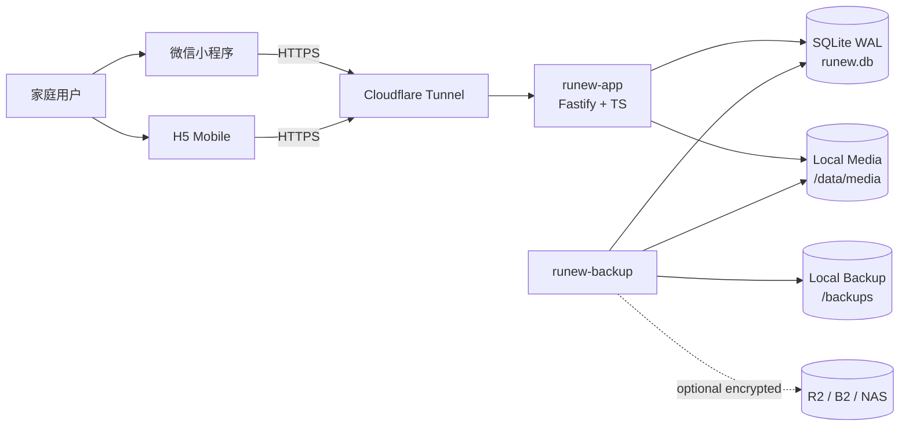

## 2.2 Runtime Architecture

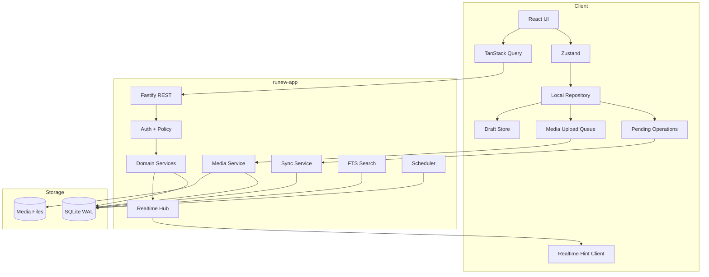

## 2.3 模块化单体

`runew-app` 是一个正式的模块化单体：一个部署单元、多个领域模块、一个 SQLite、一个媒体目录、一个 Policy Layer、一个 Sync Layer。P0 不拆微服务。

---

# 3. 推荐仓库结构

```text
runew/
├── apps/
│   ├── client/
│   └── server/
├── packages/
│   ├── contracts/
│   ├── domain-types/
│   ├── validation/
│   └── shared-utils/
├── db/
│   ├── schema/
│   ├── migrations/
│   ├── seed/
│   └── scripts/
├── deploy/
│   ├── docker/
│   ├── cloudflared/
│   └── backup/
├── docs/
│   ├── PRD_RUNEW_V3.0.md
│   ├── UI_IMPLEMENTATION_SPEC.md
│   └── TECHNICAL_DESIGN.md
├── docker-compose.yml
├── .env.example
├── AGENTS.md
└── package.json
```

---

# 4. 前端技术架构

## 4.1 分层

```text
Page
 ↓
Feature Hook
 ↓
Domain Store / Query Hook
 ↓
Repository / API Client
 ↓
Local Driver + Remote API
```

禁止 Page 直接拼 fetch、直接 `Taro.setStorage`、直接维护文件上传队列。

## 4.2 Zustand

用于 auth runtime、current family/current baby、running timer 展示、draft metadata、pending counts、media queue summary、UI overlay、theme/night mode、realtime connection。

完整 Server List 交给 TanStack Query，不在 Zustand 再复制一份。

## 4.3 TanStack Query

管理 bootstrap、today、records、growth、knowledge、health、memories、gems、family、baby、settings、admin、search、notifications。

Mutation 后做精准 cache update / invalidation，不常规使用全站 `invalidateQueries()`。

## 4.4 Local Repository

```ts
interface LocalRepository {
  entities: LocalEntityStore
  operations: PendingOperationStore
  drafts: DraftStore
  media: LocalMediaStore
  syncState: SyncCursorStore
}
```

Driver：

```text
H5:
  IndexedDB
  OPFS（可用时）/ IndexedDB Blob fallback

WeChat:
  Taro Storage
  FileSystemManager
  USER_DATA_PATH 持久媒体
```

禁止用 localStorage 保存照片 Base64；禁止依赖微信临时文件路径长期存在。

## 4.5 Local Key Space

```text
runew:entity:{entityType}:{id}
runew:op:{operationId}
runew:draft:{userId}:{entityType}:{draftKey}
runew:sync:{familyId}:{cursor}
runew:media:{localMediaId}
runew:config:{key}
```

## 4.6 Client ID

所有离线可创建实体使用 ULID，客户端生成。服务器接受合法 client-generated ULID，以保证离线关联和幂等重试。

---

# 5. 后端模块划分

```text
modules/
├── auth
├── users
├── families
├── babies
├── records
├── growth
├── knowledge
├── health
├── memories
├── mom
├── gems
├── family-tasks
├── notifications
├── media
├── search
├── sync
├── exports
├── backup
├── admin
├── audit
└── system
```

每个模块建议：`route.ts / schema.ts / service.ts / repository.ts / policy.ts / types.ts`。

## 5.1 Fastify Plugin 顺序

```text
config
logger
request-id
database
security headers
cors
session parser
csrf/origin guard
rate limit
auth context
routes
error handler
scheduler/realtime startup
```

## 5.2 Request Context

```ts
interface RequestContext {
  requestId: string
  user?: { id: string; sessionId: string }
  familyId?: string
  babyId?: string
  admin?: { sessionId: string; expiresAt: number }
  ipHash?: string
}
```

禁止从客户端 body 信任 `created_by / updated_by / admin_user_id / family membership`。

---

# 6. 领域模型

| Context | 负责 |
|---|---|
| Identity | 用户、登录、Session |
| Family | 家庭、成员、邀请、权限 |
| Baby | 宝宝档案、多宝宝 |
| Daily Care | 喂奶、睡眠、尿布、辅食 |
| Growth | 身高体重头围、里程碑 |
| Knowledge | 内容、版本、用户状态 |
| Health | 健康事项、提醒、附件 |
| Memories | 照片、语录、声音、第一次、胶囊 |
| Mom | 心情、日记、隐私 |
| Gems | 规则、流水、愿望、订单 |
| Collaboration | 家庭任务、成就、纪念日 |
| Media | 文件生命周期、上传 |
| Sync | Offline operations、change feed |
| Search | FTS 索引 |
| Notification | 通知、DND |
| Admin | 管理认证与操作 |
| Backup | 备份、导出、恢复 |
| Audit | 不可变审计 |

不做万能 `records` 物理表；Timeline 在 Query Layer 聚合分表。

---

# 7. 数据库基础规范

## 7.1 SQLite PRAGMA

```sql
PRAGMA foreign_keys = ON;
PRAGMA journal_mode = WAL;
PRAGMA synchronous = NORMAL;
PRAGMA busy_timeout = 5000;
PRAGMA temp_store = MEMORY;
```

备份检查：`PRAGMA quick_check;`；定期深度检查：`PRAGMA integrity_check;`。

## 7.2 时间

统一 UTC Epoch Milliseconds（INTEGER）。需要历史本地语义时保存 `timezone_name`，必要时保存 `local_date`。

规则：DB 不把无时区本地时间当真相；补录保留用户选择；旅行和时区变化不重写历史 UTC；跨午夜拆分发生在统计层，不修改原始记录。

## 7.3 ID / Version / Soft Delete

```text
业务主键: TEXT ULID
同步序列: INTEGER AUTOINCREMENT
version: INTEGER NOT NULL DEFAULT 1
soft delete: deleted_at / deleted_by
```

不可变账本 `gem_transactions / audit_logs / sync_operations` 不做 UPDATE/DELETE。

## 7.4 通用业务字段

```text
id
family_id
baby_id
created_by
created_at
updated_by
updated_at
version
deleted_at
deleted_by
```

---

# 8. ER 总览

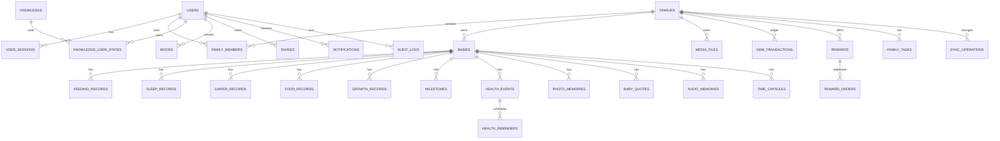

---

# 9. Identity / Family / Baby 表

## 9.1 `users`

| 字段 | 类型 | 说明 |
|---|---|---|
| id | TEXT PK | ULID |
| nickname | TEXT | 昵称 |
| avatar_media_id | TEXT nullable | 头像 |
| status | TEXT | ACTIVE / DISABLED |
| locale | TEXT | default zh-CN |
| timezone_name | TEXT nullable | 当前默认时区 |
| created_at | INTEGER | |
| updated_at | INTEGER | |

## 9.2 `user_auth_credentials`（support）

| 字段 | 类型 |
|---|---|
| id | TEXT PK |
| user_id | TEXT FK UNIQUE |
| identifier_type | TEXT USERNAME / EMAIL / PHONE |
| identifier_normalized | TEXT UNIQUE |
| password_hash | TEXT |
| password_changed_at | INTEGER |
| failed_attempts | INTEGER |
| locked_until | INTEGER nullable |
| created_at | INTEGER |

密码使用 Argon2id。

## 9.3 `user_sessions`（support）

| 字段 | 类型 |
|---|---|
| id | TEXT PK |
| user_id | TEXT FK |
| token_hash | TEXT UNIQUE |
| platform | TEXT H5 / WEAPP |
| device_id | TEXT nullable |
| created_at | INTEGER |
| last_seen_at | INTEGER |
| expires_at | INTEGER |
| revoked_at | INTEGER nullable |
| ip_hash | TEXT nullable |
| user_agent_hash | TEXT nullable |

原始 token 仅返回 Client，DB 只存 SHA-256 hash。

## 9.4 `devices`（support）

```text
id TEXT PK
user_id TEXT FK
platform TEXT
device_name TEXT nullable
app_version TEXT nullable
sync_cursor INTEGER default 0
push_capabilities_json TEXT nullable
last_seen_at INTEGER
created_at INTEGER
```

## 9.5 `families`

```text
id TEXT PK
name TEXT
owner_user_id TEXT FK
gem_balance_cache INTEGER
level INTEGER
experience INTEGER
timezone_name TEXT
created_at INTEGER
updated_at INTEGER
version INTEGER
```

## 9.6 `family_members`

```text
id TEXT PK
family_id TEXT FK
user_id TEXT FK
relationship TEXT
role TEXT
status TEXT ACTIVE / DISABLED
joined_at INTEGER
created_at INTEGER
updated_at INTEGER
version INTEGER
UNIQUE(family_id,user_id)
```

## 9.7 `family_member_permissions`（support）

```text
id TEXT PK
family_member_id TEXT FK
resource TEXT
action TEXT
effect TEXT ALLOW / DENY
UNIQUE(family_member_id,resource,action)
```

资源：records/growth/knowledge/health/memories/mom/gems/family/baby/settings/media；动作：VIEW/CREATE/EDIT/DELETE/UPLOAD/MANAGE。

## 9.8 `family_invites`

```text
id TEXT PK
family_id TEXT FK
token_hash TEXT UNIQUE
created_by TEXT
relationship_hint TEXT nullable
expires_at INTEGER
used_at INTEGER nullable
used_by TEXT nullable
created_at INTEGER
```

邀请 token DB 只存 hash。

## 9.9 `babies`

```text
id TEXT PK
family_id TEXT FK
name TEXT
nickname TEXT nullable
sex TEXT nullable
birthday TEXT DATE
birth_time INTEGER nullable
avatar_media_id TEXT nullable
birth_height_cm REAL nullable
birth_weight_kg REAL nullable
notes TEXT nullable
created_by TEXT
created_at INTEGER
updated_by TEXT
updated_at INTEGER
version INTEGER
deleted_at INTEGER nullable
```

## 9.10 `baby_preferences`

```text
id TEXT PK
family_id TEXT
baby_id TEXT
type TEXT LIKE / DISLIKE
category TEXT nullable
label TEXT
source_type TEXT MANUAL / FOOD / OTHER
source_id TEXT nullable
created_by TEXT
created_at INTEGER
updated_at INTEGER
version INTEGER
deleted_at INTEGER nullable
```

---

# 10. 日常记录表

## 10.1 `feeding_records`

```text
id TEXT PK
family_id TEXT
baby_id TEXT
feeding_type TEXT BOTTLE / BREAST
milk_type TEXT nullable
amount_ml REAL nullable
status TEXT COMPLETED / RUNNING / PAUSED
started_at INTEGER nullable
ended_at INTEGER nullable
duration_seconds INTEGER nullable
recorded_at INTEGER
timezone_name TEXT
note TEXT nullable
created_by TEXT
created_at INTEGER
updated_by TEXT
updated_at INTEGER
version INTEGER
deleted_at INTEGER nullable
deleted_by TEXT nullable
```

Checks：BOTTLE 时 amount_ml > 0；ended_at >= started_at。

Indexes：`(baby_id, recorded_at DESC)`、`(baby_id, feeding_type, recorded_at DESC)`、`(family_id, updated_at)`。

## 10.2 `feeding_segments`

```text
id TEXT PK
feeding_record_id TEXT FK
side TEXT LEFT / RIGHT
started_at INTEGER
ended_at INTEGER nullable
duration_seconds INTEGER nullable
sequence_no INTEGER
created_at INTEGER
```

切换侧边必须“关闭当前 segment + 打开新 segment”同一事务。

## 10.3 `sleep_records`

```text
id TEXT PK
family_id TEXT
baby_id TEXT
status TEXT RUNNING / COMPLETED
started_at INTEGER
ended_at INTEGER nullable
duration_seconds INTEGER nullable
start_timezone TEXT
end_timezone TEXT nullable
note TEXT nullable
created_by TEXT
created_at INTEGER
updated_by TEXT
updated_at INTEGER
version INTEGER
deleted_at INTEGER nullable
```

推荐：

```sql
CREATE UNIQUE INDEX uq_sleep_running_per_baby
ON sleep_records(baby_id)
WHERE status='RUNNING' AND deleted_at IS NULL;
```

## 10.4 `diaper_records`

```text
id TEXT PK
family_id TEXT
baby_id TEXT
diaper_type TEXT WET / DIRTY / BOTH / DRY
stool_color TEXT nullable
stool_texture TEXT nullable
recorded_at INTEGER
timezone_name TEXT
note TEXT nullable
created_by TEXT
created_at INTEGER
updated_by TEXT
updated_at INTEGER
version INTEGER
deleted_at INTEGER nullable
```

## 10.5 `food_records`

```text
id TEXT PK
family_id TEXT
baby_id TEXT
food_name TEXT
amount_text TEXT nullable
reaction TEXT nullable
preference TEXT nullable
recorded_at INTEGER
timezone_name TEXT
note TEXT nullable
created_by TEXT
created_at INTEGER
updated_by TEXT
updated_at INTEGER
version INTEGER
deleted_at INTEGER nullable
```

---

# 11. 成长表

## 11.1 `growth_records`

```text
id TEXT PK
family_id TEXT
baby_id TEXT
height_cm REAL nullable
weight_kg REAL nullable
head_circumference_cm REAL nullable
recorded_at INTEGER
timezone_name TEXT
note TEXT nullable
created_by TEXT
created_at INTEGER
updated_by TEXT
updated_at INTEGER
version INTEGER
deleted_at INTEGER nullable
```

至少一个指标有值。

## 11.2 `milestones`

```text
id TEXT PK
family_id TEXT
baby_id TEXT
title TEXT
description TEXT nullable
happened_at INTEGER
timezone_name TEXT
cover_media_id TEXT nullable
created_by TEXT
created_at INTEGER
updated_by TEXT
updated_at INTEGER
version INTEGER
deleted_at INTEGER nullable
```

---

# 12. Knowledge

## 12.1 `knowledge`

```text
id TEXT PK
title TEXT
summary TEXT
body TEXT
category TEXT
min_age_days INTEGER nullable
max_age_days INTEGER nullable
source_name TEXT
source_url TEXT nullable
reviewed_at INTEGER nullable
content_version INTEGER
priority INTEGER
status TEXT DRAFT / PUBLISHED / OFFLINE
published_at INTEGER nullable
created_by TEXT
created_at INTEGER
updated_by TEXT
updated_at INTEGER
version INTEGER
```

## 12.2 `knowledge_user_states`

```text
id TEXT PK
user_id TEXT
baby_id TEXT
knowledge_id TEXT
saved INTEGER BOOL
read_later INTEGER BOOL
dismissed INTEGER BOOL
learned_version INTEGER nullable
learned_at INTEGER nullable
created_at INTEGER
updated_at INTEGER
version INTEGER
UNIQUE(user_id,baby_id,knowledge_id)
```

规则：`learned_version == content_version` 不再普通推荐；内容版本变大可提示“内容有更新”。

---

# 13. Health

## `health_events`

```text
id TEXT PK
family_id TEXT
baby_id TEXT
event_type TEXT CHECKUP / VACCINE / VISIT / DENTAL / MEDICATION / OTHER
title TEXT
scheduled_at INTEGER
completed_at INTEGER nullable
status TEXT UPCOMING / COMPLETED / EXPIRED / CANCELED
location_name TEXT nullable
location_address TEXT nullable
note TEXT nullable
created_by TEXT
created_at INTEGER
updated_by TEXT
updated_at INTEGER
version INTEGER
deleted_at INTEGER nullable
```

## `health_reminders`

```text
id TEXT PK
health_event_id TEXT
user_id TEXT
fire_at INTEGER
allow_dnd_override INTEGER BOOL
status TEXT SCHEDULED / SENT / CANCELED
created_at INTEGER
updated_at INTEGER
```

## `health_event_media`

```text
health_event_id
media_id
role
sort_order
```

---

# 14. 妈妈空间

## `moods`

```text
id TEXT PK
family_id TEXT
user_id TEXT
mood TEXT GREAT / GOOD / OK / TIRED / NEED_HUG
note TEXT nullable
visibility TEXT PRIVATE / FAMILY
recorded_at INTEGER
timezone_name TEXT
created_at INTEGER
updated_at INTEGER
version INTEGER
deleted_at INTEGER nullable
```

默认 `visibility=PRIVATE`。

## `diaries`

```text
id TEXT PK
family_id TEXT
owner_user_id TEXT
title TEXT nullable
body TEXT
visibility TEXT PRIVATE / FAMILY
recorded_at INTEGER
timezone_name TEXT
created_at INTEGER
updated_at INTEGER
version INTEGER
deleted_at INTEGER nullable
deleted_by TEXT nullable
```

PRIVATE：普通其他家庭成员、家庭管理员、搜索均无权读取正文。系统维护任务只能处理元数据和备份，不应进入业务层返回内容。

---

# 15. 媒体与回忆

## 15.1 `media_files`

```text
id TEXT PK
family_id TEXT
baby_id TEXT nullable
owner_user_id TEXT
media_type TEXT IMAGE / AUDIO / VIDEO / FILE
status TEXT PENDING / UPLOADING / PROCESSING / READY / FAILED / DELETED
storage_key TEXT nullable
original_storage_key TEXT nullable
thumbnail_storage_key TEXT nullable
mime_type TEXT
original_filename TEXT nullable
size_bytes INTEGER
sha256 TEXT nullable
width INTEGER nullable
height INTEGER nullable
duration_ms INTEGER nullable
waveform_json TEXT nullable
keep_original INTEGER BOOL
created_at INTEGER
updated_at INTEGER
version INTEGER
deleted_at INTEGER nullable
```

SQLite 不存 Binary。

## 15.2 `media_uploads`

```text
id TEXT PK
media_id TEXT
upload_token_hash TEXT
expected_size INTEGER
expected_sha256 TEXT nullable
chunk_size INTEGER
received_bytes INTEGER
status TEXT INIT / UPLOADING / COMPLETE / EXPIRED
expires_at INTEGER
created_at INTEGER
updated_at INTEGER
```

## 15.3 `media_upload_parts`

```text
upload_id TEXT
part_no INTEGER
size_bytes INTEGER
sha256 TEXT
temp_path TEXT
received_at INTEGER
UNIQUE(upload_id,part_no)
```

## 15.4 回忆表

```text
photo_memories:
  id,family_id,baby_id,title,story,happened_at,timezone_name,favorite,
  created_by,created_at,updated_by,updated_at,version,deleted_at

photo_memory_media:
  photo_memory_id,media_id,sort_order

baby_quotes:
  id,family_id,baby_id,quote_text,audio_media_id,happened_at,timezone_name,
  favorite,created_by,created_at,updated_by,updated_at,version,deleted_at

audio_memories:
  id,family_id,baby_id,media_id,title,category,happened_at,timezone_name,
  favorite,created_by,created_at,updated_by,updated_at,version,deleted_at

first_moments:
  id,family_id,baby_id,title,description,happened_at,timezone_name,favorite,
  created_by,created_at,updated_by,updated_at,version,deleted_at

first_moment_media:
  first_moment_id,media_id,sort_order
```

---

# 16. 时光胶囊

## `time_capsules`

```text
id TEXT PK
family_id TEXT
baby_id TEXT nullable
creator_user_id TEXT
recipient_text TEXT nullable
title TEXT
body TEXT
open_at INTEGER
state TEXT DRAFT / SEALED / OPENED
sealed_at INTEGER nullable
opened_at INTEGER nullable
created_at INTEGER
updated_at INTEGER
version INTEGER
deleted_at INTEGER nullable
```

## `time_capsule_media`

```text
time_capsule_id
media_id
sort_order
```

合法状态：`DRAFT -> SEALED -> OPENED`。SEALED 后普通 body/title/media mutation 返回 `409 CAPSULE_SEALED`。OPEN 只在 `now >= open_at` 且授权用户显式打开时发生，不由后台自动展开内容。

---

# 17. 宝石系统

## 17.1 `gem_rules`

```text
id TEXT PK
family_id TEXT nullable
action_type TEXT
amount INTEGER
daily_limit INTEGER nullable
enabled INTEGER
created_by_admin TEXT nullable
created_at INTEGER
updated_at INTEGER
version INTEGER
```

## 17.2 `gem_transactions`

不可变账本：

```text
id TEXT PK
family_id TEXT
user_id TEXT nullable
amount INTEGER signed
balance_after INTEGER
reason_code TEXT
reason_text TEXT nullable
source_type TEXT
source_id TEXT nullable
idempotency_key TEXT
operator_user_id TEXT nullable
admin_session_id TEXT nullable
created_at INTEGER
UNIQUE(family_id,idempotency_key)
```

修正通过新增反向流水，不 UPDATE/DELETE 原流水。

## 17.3 `rewards`

```text
id TEXT PK
family_id TEXT
name TEXT
description TEXT nullable
price_gems INTEGER
stock INTEGER nullable
illustration_key TEXT nullable
status TEXT ACTIVE / OFFLINE
sort_order INTEGER
custom INTEGER BOOL
created_by TEXT
created_at INTEGER
updated_at INTEGER
version INTEGER
deleted_at INTEGER nullable
```

## 17.4 `reward_orders`

```text
id TEXT PK
family_id TEXT
reward_id TEXT
redeemed_by TEXT
price_gems_snapshot INTEGER
status TEXT REDEEMED / WAITING / COMPLETED / CANCELED
redeemed_at INTEGER
fulfilled_at INTEGER nullable
canceled_at INTEGER nullable
fulfilled_by TEXT nullable
completion_photo_memory_id TEXT nullable
version INTEGER
created_at INTEGER
updated_at INTEGER
```

兑换和扣款同一事务。

---

# 18. 家庭协作

## `family_tasks`

```text
id TEXT PK
family_id TEXT
title TEXT
assignee_user_id TEXT nullable
due_at INTEGER nullable
repeat_rule TEXT nullable
experience_reward INTEGER default 0
status TEXT OPEN / COMPLETED
completed_at INTEGER nullable
completed_by TEXT nullable
created_by TEXT
created_at INTEGER
updated_by TEXT
updated_at INTEGER
version INTEGER
deleted_at INTEGER nullable
```

## `achievements / user_achievements`

保留历史命名，但产品表达为家庭共同成就，不做父母贡献排行。

## `family_anniversaries`

```text
id TEXT PK
family_id TEXT
title TEXT
date_month INTEGER
date_day INTEGER
year INTEGER nullable
reminder_days_before INTEGER nullable
created_by TEXT
created_at INTEGER
updated_at INTEGER
version INTEGER
deleted_at INTEGER nullable
```

---

# 19. 通知表

## `notification_preferences`

```text
id TEXT PK
user_id TEXT UNIQUE
health_enabled INTEGER
family_tasks_enabled INTEGER
rewards_enabled INTEGER
backup_enabled INTEGER
capsules_enabled INTEGER
anniversaries_enabled INTEGER
dnd_enabled INTEGER
dnd_start_minute INTEGER
dnd_end_minute INTEGER
timezone_name TEXT
updated_at INTEGER
```

默认 DND 建议 21:00–08:00。

## `notifications`

```text
id TEXT PK
user_id TEXT
family_id TEXT
type TEXT
title TEXT
body TEXT
target_type TEXT nullable
target_id TEXT nullable
payload_json TEXT nullable
created_at INTEGER
read_at INTEGER nullable
deleted_at INTEGER nullable
```

## `scheduled_notifications`

```text
id TEXT PK
user_id TEXT
family_id TEXT
category TEXT
source_type TEXT
source_id TEXT
fire_at INTEGER
dnd_override INTEGER
status TEXT SCHEDULED / SENT / CANCELED / FAILED
attempts INTEGER
last_error_code TEXT nullable
created_at INTEGER
updated_at INTEGER
UNIQUE(user_id,source_type,source_id,fire_at,category)
```

---

# 20. Sync / Admin / Audit 系统表

## `sync_operations`

```text
seq INTEGER PRIMARY KEY AUTOINCREMENT
operation_id TEXT UNIQUE
family_id TEXT
actor_user_id TEXT
device_id TEXT nullable
entity_type TEXT
entity_id TEXT
op TEXT CREATE / UPDATE / DELETE / RESTORE
entity_version INTEGER
visibility_scope TEXT
owner_user_id TEXT nullable
changed_fields_json TEXT nullable
result_json TEXT nullable
occurred_at INTEGER
```

Index：`(family_id,seq)`、`(entity_type,entity_id,seq)`。

## `admin_credentials`

```text
id TEXT PK
password_hash TEXT
changed_at INTEGER
updated_by_user_id TEXT nullable
```

## `admin_sessions`

```text
id TEXT PK
user_id TEXT
user_session_id TEXT
token_hash TEXT UNIQUE
created_at INTEGER
expires_at INTEGER
revoked_at INTEGER nullable
last_action_at INTEGER
ip_hash TEXT nullable
```

Admin Session absolute expiry 约 30 分钟，不无限滑动续期。

## `admin_reauth_grants`

```text
id TEXT PK
admin_session_id TEXT
action_scope TEXT
resource_id TEXT nullable
token_hash TEXT
expires_at INTEGER
used_at INTEGER nullable
```

建议 2 分钟、single-use、scope-bound。

## `audit_logs`

```text
id TEXT PK
request_id TEXT
actor_user_id TEXT nullable
admin_session_id TEXT nullable
family_id TEXT nullable
action TEXT
resource_type TEXT
resource_id TEXT nullable
before_json TEXT nullable
after_json TEXT nullable
result TEXT SUCCESS / FAILED
error_code TEXT nullable
created_at INTEGER
```

禁止 audit snapshot 写 Diary 全正文、Audio/Photo 内容、Time Capsule 正文、password、session token、admin token。

## 其他 support 表

```text
system_settings
backup_runs
export_jobs
duplicate_candidates
idempotency_keys
job_locks
search_documents
```


---

# 21. API Contract 总体规范

## 21.1 Base Path

```text
/api/v1
```

Health：

```text
/health/live
/health/ready
```

## 21.2 Success Envelope

单资源：

```json
{
  "data": {
    "id": "01J...",
    "version": 4
  },
  "meta": {
    "requestId": "req_..."
  }
}
```

列表：

```json
{
  "data": [],
  "meta": {
    "requestId": "req_...",
    "nextCursor": "..."
  }
}
```

## 21.3 Error Envelope

```json
{
  "error": {
    "code": "ENTITY_VERSION_CONFLICT",
    "message": "这条记录刚刚在另一台设备上被修改过。",
    "retryable": false,
    "details": {
      "entityId": "01J..."
    }
  },
  "meta": {
    "requestId": "req_..."
  }
}
```

UI 不直接显示技术 code。

## 21.4 Pagination

不使用大 Offset，统一 Cursor：

```text
cursor = base64url(lastSortValue + id)
limit default 30
limit max 100
```

记录列表排序：`recorded_at DESC, id DESC`。

## 21.5 ETag / Version

响应：

```http
ETag: "7"
```

更新：

```http
If-Match: "7"
```

不一致：`409 ENTITY_VERSION_CONFLICT`。

Offline Sync 使用 `baseVersion`。

## 21.6 Request ID

Client 可传 `X-Request-Id`，否则服务端生成。日志、Audit、Error Response 使用同一 Request ID。

## 21.7 Idempotency

创建型写请求接受：

```http
Idempotency-Key: <ULID>
```

同 key 同 payload 返回第一次结果；同 key 不同 payload 返回 `409 IDEMPOTENCY_KEY_REUSED`。

---

# 22. Auth API 与 Session

## 22.1 Auth API

| Method | Path | 说明 |
|---|---|---|
| POST | `/auth/register` | 注册 |
| POST | `/auth/login` | 登录 |
| POST | `/auth/logout` | 当前 Session 退出 |
| GET | `/auth/me` | 当前用户 |
| POST | `/auth/password/change` | 修改密码 |
| GET | `/auth/sessions` | 已登录设备 |
| DELETE | `/auth/sessions/:id` | 注销设备 |
| POST | `/auth/csrf` | H5 CSRF token |
| GET | `/bootstrap` | 登录后首屏上下文 |

`/bootstrap`：

```json
{
  "user": {},
  "families": [],
  "currentFamily": {},
  "babies": [],
  "currentBaby": {},
  "gemBalance": 1280,
  "unreadNotifications": 3,
  "running": {
    "sleep": null,
    "feeding": null
  },
  "sync": {
    "cursor": 10221,
    "epoch": 5
  }
}
```

## 22.2 H5 Session

推荐 HttpOnly + Secure Cookie：

```text
runew_session=<opaque token>
SameSite=Lax
```

所有 state-changing H5 请求：

```text
CSRF token + Origin check
```

## 22.3 微信小程序 Session

登录后返回 opaque session token：

```http
Authorization: Bearer <token>
```

## 22.4 Token 设计

```text
32 bytes crypto random
base64url
DB stores SHA-256(token)
```

禁止 token 出现在 URL、日志、Audit。

## 22.5 为什么不强制 JWT

当前单体 + SQLite 使用 Opaque Session 更适合：即时吊销、设备管理、权限变化即时生效、无需 Refresh Token 体系。

---

# 23. 家庭权限与认证授权

## 23.1 Policy Pipeline

```text
Authenticated?
  ↓
Family Member ACTIVE?
  ↓
Resource belongs to family?
  ↓
Role default allows action?
  ↓
Member override?
  ↓
Private / owner rule?
  ↓
Entity state rule?
  ↓
ALLOW / DENY
```

## 23.2 Resource Ownership

后端永远不接受 body 的 `family_id / created_by / updated_by` 作为授权依据。

创建实体：

1. 解析目标 family/baby；
2. 查当前用户 membership；
3. 验证 baby 属于 family；
4. Service 注入 family/user；
5. Repository 写 DB。

## 23.3 PRIVATE Diary

```ts
if (diary.visibility === 'PRIVATE' && diary.ownerUserId !== ctx.user.id) {
  throw Forbidden('PRIVATE_RESOURCE')
}
```

搜索同样在服务端结果产生前过滤。

## 23.4 IDOR

任何 `GET /resource/:id` 都必须 family scope + resource policy，不允许只按主键查询后返回。

---

# 24. Admin 安全

## 24.1 独立 Session

普通 `user_session` 不等于 `admin_session`。

```text
POST /admin/auth
→ verify independent admin password
→ create admin_session
→ expires_at ≈ now + 30 min
```

## 24.2 Admin Password

使用 Argon2id。参数在目标主机 benchmark 后配置，目标单次验证约 100–300ms，不在源码写固定明文或默认密码。

## 24.3 Rate Limit

建议：

```text
5 次错误 / 15 min / user + ipHash
之后指数延迟
```

失败只记录安全 metadata，不记录密码。

## 24.4 Admin API 要求

同时满足：

```text
valid user session
+
valid admin session
```

## 24.5 危险操作二次认证

```text
Admin Session valid
→ POST /admin/reauth
→ verify password
→ issue one-time scoped grant
→ final confirmation
→ execute danger endpoint
```

Grant：

```text
<= 2 min
single use
action/resource scoped
```

---

# 25. 普通业务 API

## 25.1 Family / Baby

```text
GET    /families
POST   /families
GET    /families/:familyId
GET    /families/:familyId/members
POST   /families/:familyId/invites
POST   /family-invites/:token/accept
PATCH  /families/:familyId/members/:memberId
GET    /families/:familyId/babies
POST   /families/:familyId/babies
GET    /babies/:babyId
PATCH  /babies/:babyId
GET    /babies/:babyId/preferences
POST   /babies/:babyId/preferences
```

## 25.2 Records

```text
GET    /babies/:babyId/records
GET    /feeding/:id
POST   /babies/:babyId/feeding
PATCH  /feeding/:id
DELETE /feeding/:id
POST   /babies/:babyId/feeding/breast/start
POST   /feeding/:id/breast/switch
POST   /feeding/:id/breast/pause
POST   /feeding/:id/breast/resume
POST   /feeding/:id/breast/finish
POST   /babies/:babyId/sleep/start
POST   /babies/:babyId/sleep
POST   /sleep/:id/finish
PATCH  /sleep/:id
DELETE /sleep/:id
POST   /babies/:babyId/diapers
PATCH  /diapers/:id
DELETE /diapers/:id
POST   /babies/:babyId/foods
PATCH  /foods/:id
DELETE /foods/:id
POST   /duplicates/:id/resolve
```

`GET /records` 是统一 Timeline 聚合 API，不代表物理统一表。

## 25.3 Growth

```text
GET    /babies/:babyId/growth
POST   /babies/:babyId/growth
GET    /growth/:id
PATCH  /growth/:id
DELETE /growth/:id
GET    /babies/:babyId/milestones
POST   /babies/:babyId/milestones
GET    /milestones/:id
PATCH  /milestones/:id
DELETE /milestones/:id
GET    /babies/:babyId/growth/monthly-story?month=
```

## 25.4 Knowledge

```text
GET    /knowledge
GET    /knowledge/:id
GET    /knowledge/search
GET    /babies/:babyId/knowledge/recommendations
PUT    /babies/:babyId/knowledge/:id/state
GET    /babies/:babyId/knowledge/library?state=
POST   /knowledge/:id/feedback
```

## 25.5 Health

```text
GET    /babies/:babyId/health/events
POST   /babies/:babyId/health/events
GET    /health/events/:id
PATCH  /health/events/:id
DELETE /health/events/:id
PUT    /health/events/:id/reminders
DELETE /health/reminders/:id
```

## 25.6 Memories

```text
GET/POST /babies/:babyId/memories/photos
GET/PATCH/DELETE /photo-memories/:id
GET/POST /babies/:babyId/quotes
GET/PATCH/DELETE /quotes/:id
GET/POST /babies/:babyId/audio-memories
GET/PATCH/DELETE /audio-memories/:id
GET/POST /babies/:babyId/firsts
GET/PATCH/DELETE /firsts/:id
GET/POST /babies/:babyId/capsules
GET/PATCH/DELETE /capsules/:id
POST /capsules/:id/seal
POST /capsules/:id/open
GET /babies/:babyId/memories/favorites
GET /babies/:babyId/memories/on-this-day
GET /babies/:babyId/annual-review?year=
POST /babies/:babyId/annual-review/export
```

## 25.7 Mom

```text
GET/POST /mom/moods
PATCH/DELETE /mom/moods/:id
GET/POST /mom/diaries
GET/PATCH/DELETE /mom/diaries/:id
```

## 25.8 Gems

```text
GET /families/:familyId/gems
GET /families/:familyId/gem-transactions
GET /gem-transactions/:id
GET /families/:familyId/rewards
GET /rewards/:id
POST /rewards/:id/redeem
GET /families/:familyId/reward-orders
GET /reward-orders/:id
POST /reward-orders/:id/fulfill
POST /reward-orders/:id/cancel
POST /families/:familyId/custom-rewards
PATCH /rewards/:id
DELETE /rewards/:id
```

## 25.9 Family Tasks / Anniversary

```text
GET/POST /families/:familyId/tasks
GET/PATCH/DELETE /family-tasks/:id
POST /family-tasks/:id/complete
GET /families/:familyId/achievements
GET /achievements/:id
GET/POST /families/:familyId/anniversaries
GET/PATCH/DELETE /anniversaries/:id
```

## 25.10 Notifications / Settings

```text
GET /notifications
POST /notifications/:id/read
POST /notifications/read-all
GET /notification-preferences
PUT /notification-preferences
GET /settings/backup-status
GET /settings/storage
GET /trash
POST /trash/:entityType/:id/restore
POST /exports
GET /exports/:id
GET /exports/:id/download
```

---

# 26. Admin API

Base：`/api/v1/admin/*`。

```text
POST   /admin/auth
DELETE /admin/auth
GET    /admin/session
POST   /admin/reauth

GET  /admin/families/:familyId/gems
GET  /admin/families/:familyId/gem-transactions
POST /admin/families/:familyId/gems/adjust
GET/POST /admin/gem-rules
PATCH /admin/gem-rules/:id

GET/POST /admin/rewards
GET/PATCH /admin/rewards/:id
POST /admin/rewards/:id/offline
POST /admin/rewards/reorder

GET/POST /admin/knowledge
GET/PATCH /admin/knowledge/:id
PATCH /admin/knowledge/:id/body
POST /admin/knowledge/:id/publish
POST /admin/knowledge/:id/offline
GET /admin/knowledge/:id/user-stats

GET /admin/families/:familyId/members
GET /admin/members/:id
PATCH /admin/members/:id/permissions
POST /admin/members/:id/disable
POST /admin/members/:id/restore

GET  /admin/data/status
POST /admin/backups
GET  /admin/backups
GET  /admin/backups/:id
POST /admin/backups/:id/verify
POST /admin/backups/:id/restore
POST /admin/exports
POST /admin/cache/cleanup
GET/PATCH /admin/system/settings
GET /admin/system/app
GET /admin/system/database
GET /admin/system/media
GET /admin/system/tunnel
GET /admin/audit-logs
GET /admin/audit-logs/:id
```

Danger endpoints 必须带 `X-Admin-Reauth-Grant`。

---

# 27. Offline Sync Protocol

## 27.1 Client Pending Operation

```ts
interface PendingOperation {
  operationId: string
  deviceId: string
  familyId: string
  entityType: string
  entityId: string
  op: 'CREATE' | 'UPDATE' | 'DELETE' | 'RESTORE'
  baseVersion?: number
  baseSnapshot?: Record<string, unknown>
  patch?: Record<string, unknown>
  fullPayload?: Record<string, unknown>
  changedFields?: string[]
  dependsOn?: string[]
  clientCreatedAt: number
  retryCount: number
  nextRetryAt?: number
  lastErrorCode?: string
}
```

## 27.2 Push

```http
POST /api/v1/sync/push
```

```json
{
  "deviceId": "01JDEV...",
  "familyId": "01JFAM...",
  "operations": [
    {
      "operationId": "01JOP...",
      "entityType": "DIAPER_RECORD",
      "entityId": "01JREC...",
      "op": "CREATE",
      "fullPayload": {
        "babyId": "01JBABY...",
        "diaperType": "WET",
        "recordedAt": 1788100000000
      },
      "clientCreatedAt": 1788100000200
    }
  ]
}
```

Response：

```json
{
  "data": {
    "results": [
      {
        "operationId": "01JOP...",
        "status": "APPLIED",
        "entityId": "01JREC...",
        "version": 1,
        "duplicateCandidates": []
      }
    ],
    "serverCursor": 12021
  }
}
```

Batch default 50，hard max 100。

## 27.3 Pull

```http
GET /sync/pull?familyId=...&cursor=12021&limit=500
```

```json
{
  "data": {
    "changes": [
      {
        "seq": 12022,
        "entityType": "DIAPER_RECORD",
        "entityId": "01J...",
        "op": "UPDATE",
        "version": 3
      }
    ],
    "nextCursor": 12022,
    "hasMore": false
  }
}
```

PRIVATE 或大正文 Change Feed 只返回安全 ref，不复制正文到 Sync Log。

## 27.4 Realtime Hint

WebSocket 只发送：

```json
{
  "type": "sync_hint",
  "familyId": "01J...",
  "cursor": 12022
}
```

客户端收到后调用 `/sync/pull`。WebSocket 不是数据真相；断线使用 15–30 秒 polling fallback，App 回前台立即 pull。

## 27.5 Operation Dependency

媒体/业务关联允许 `dependsOn`；同步前拓扑排序。循环依赖返回 `SYNC_DEPENDENCY_CYCLE`。

---

# 28. 冲突处理

## 28.1 CREATE

Client ULID + Operation ID：第一次 create；重试返回已存在结果。同 entity ID 不同 payload 返回 `ENTITY_ID_REUSED`。

## 28.2 UPDATE 三方比较

客户端保存 `baseSnapshot / baseVersion / patch / changedFields`。

规则：

```text
server[field] == base[field]
→ client field 可安全应用

server[field] != base[field]
→ overlapping conflict
```

爸爸改 note、妈妈改 amount_ml：自动合并；两边都改 amount_ml：返回 Conflict，不做 Last-write-wins。

Conflict Response：

```json
{
  "status": "CONFLICT",
  "code": "ENTITY_VERSION_CONFLICT",
  "conflictFields": ["amountMl"],
  "server": {},
  "clientPatch": {}
}
```

## 28.3 DELETE vs UPDATE

已删除实体收到离线更新：`ENTITY_DELETED`。客户端提供“恢复后应用修改 / 放弃修改”，默认不自动复活，也不自动丢弃本地修改。

## 28.4 高价值正文

Diary、Baby Quote、Time Capsule、Audio metadata、Photo story 同字段并发冲突必须用户处理，禁止自动覆盖。

---

# 29. 多人重复记录检测

Version Conflict 与“两个家人新建了相似记录”是两类问题。

## 29.1 Candidate

```text
same family
same baby
same record type
record time close
not deleted
not resolved
```

## 29.2 时间窗口

配置化：

```text
feeding 10 min
diaper 10 min
food 15 min
sleep start 15 min
```

这些是可调技术初始值。

## 29.3 `duplicate_candidates`

```text
id TEXT PK
family_id TEXT
baby_id TEXT
entity_type TEXT
entity_a_id TEXT
entity_b_id TEXT
similarity_score REAL
status TEXT PENDING / MERGED / KEEP_BOTH
detected_at INTEGER
resolved_by TEXT nullable
resolved_at INTEGER nullable
```

## 29.4 Merge

Merge 需要：判断字段 compatible、选择 canonical、保留来源、soft delete merged entity、Audit、Sync Change。若核心字段不一致返回 `MERGE_REQUIRES_FIELD_SELECTION`，不静默丢一方数据。

---

# 30. Timer 设计

## 30.1 原则

```text
displayElapsed = nowUTC - startedAt - pausedDuration
```

业务真相是 timestamp/segments，不是前台 `setInterval` 累加。

## 30.2 Sleep

Start：创建 RUNNING record + started_at。Finish：ended_at、duration_seconds、COMPLETED。

## 30.3 Breast

```text
Start Left
→ record RUNNING + LEFT segment
Switch Right
→ close LEFT + open RIGHT
Pause
→ close current segment + PAUSED
Resume
→ open segment + RUNNING
Finish
→ close segment + sum + COMPLETED
```

Switch/Pause/Finish 都使用事务。

## 30.4 Offline Timer

无网生成本地 record/segments，持久化 timestamp；恢复网络同步原始时间，Server 不用“收到请求时间”覆盖 started_at。

## 30.5 Clock Skew

保存 `clientCreatedAt / serverReceivedAt`。时间极端异常返回 `CLIENT_CLOCK_SUSPECT`，但补录不偷偷纠正。

## 30.6 超长 Timer

异常超长标记 `POSSIBLY_STALE`，提示用户调整，不自动猜结束时间。

---

# 31. 媒体本地可靠性

## 31.1 状态机

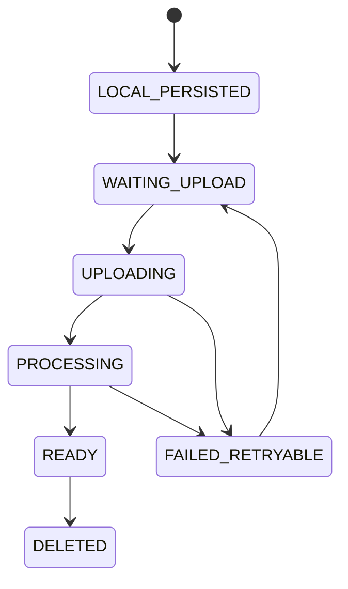

临时相机文件不等于 LOCAL_PERSISTED。

## 31.2 WeChat

```text
temp path
→ copy/save to USER_DATA_PATH
→ file close success
→ LocalMedia metadata
→ enqueue upload
```

## 31.3 H5

优先 OPFS；fallback IndexedDB Blob。禁止只保存 `blob:` URL。

## 31.4 LocalMedia

```ts
interface LocalMedia {
  localMediaId: string
  serverMediaId: string
  kind: 'IMAGE'|'AUDIO'|'VIDEO'
  localUri: string
  mimeType: string
  sizeBytes: number
  sha256?: string
  state: 'LOCAL'|'WAITING'|'UPLOADING'|'READY'|'FAILED'
  uploadId?: string
  uploadedBytes: number
  retryCount: number
  createdAt: number
}
```

---

# 32. Media Server Storage

## 32.1 目录

```text
/data/media/
├── photos/YYYY/MM/
├── audio/YYYY/MM/
├── video/YYYY/MM/
├── thumbs/
├── exports/
└── temp/
```

最终文件名使用 `<mediaId>.<normalized_ext>`，不使用用户原始 filename 作为路径。

## 32.2 Path Safety

Server-generated path + `path.resolve` prefix check，禁止 `../` 和客户端绝对路径。

## 32.3 Image

上传后：magic bytes、实际 decode、sha256。若不保留原图，生成长边约 1600px 的 WebP/JPEG（约 80%），缩略图长边约 400px。推荐 Sharp。处理失败原始文件仍保留，可重试。

## 32.4 Audio

优先 AAC/Opus、Mono。服务端 sniff mime、读取 duration，可生成 waveform。可使用 ffprobe/ffmpeg；不强制 WAV。

## 32.5 Video

P0 保证可靠上传、metadata、可选 thumbnail，不强制复杂转码。

---

# 33. Resumable Upload Protocol

## 33.1 Init

```http
POST /media/uploads
```

```json
{
  "mediaId": "01J...",
  "mimeType": "image/jpeg",
  "sizeBytes": 8459921,
  "sha256": "optional"
}
```

Response：

```json
{
  "uploadId": "01JUPLOAD...",
  "chunkSize": 4194304,
  "uploadedParts": []
}
```

默认 chunk 4 MiB。

## 33.2 Part

```http
PUT /media/uploads/:uploadId/parts/:partNo
Content-Type: application/octet-stream
X-Part-SHA256: ...
```

已存在且 hash 相同：idempotent；不同：`UPLOAD_PART_MISMATCH`。

## 33.3 Query / Resume

```text
GET /media/uploads/:uploadId
```

返回 received parts/bytes/expiresAt，Client 重启可恢复。

## 33.4 Complete

```text
check continuous parts
assemble temp
validate size/hash
atomic rename
media PROCESSING
thumbnail/metadata
media READY
```

## 33.5 Retry

Backoff：1s、2s、5s、10s、30s、1m、5m。Offline 不计 retry failure；网络恢复立即尝试。

---

# 34. 缓存策略

## 34.1 不用 Redis

单实例 + 本机 SQLite 下不引入 Redis。

## 34.2 Client Query Cache

| Query | staleTime |
|---|---:|
| Today | 5s |
| Records | 10s |
| Running bootstrap | 0 |
| Growth | 30s |
| Knowledge list | 5m |
| Knowledge detail | 30m |
| Health | 30s |
| Memories | 30s |
| Settings | 5m |
| Admin | 10s |

Realtime hint 可提前 invalidate。

## 34.3 Server Cache

仅小型内存 Cache：Published knowledge detail、system config、static dictionary，TTL 30–120s。

禁止跨用户缓存 PRIVATE Diary、Permission result、Gem transactional state、Admin auth。

## 34.4 Conditional GET

Knowledge/static config 支持 ETag / If-None-Match / 304。

---

# 35. 全局搜索

## 35.1 SQLite FTS5

```text
search_documents
+
search_documents_fts
```

`search_documents`：

```text
rowid INTEGER
family_id TEXT nullable
baby_id TEXT nullable
owner_user_id TEXT nullable
visibility TEXT
entity_type TEXT
entity_id TEXT
title TEXT
body TEXT
occurred_at INTEGER
deleted INTEGER
```

FTS：

```sql
CREATE VIRTUAL TABLE search_documents_fts
USING fts5(title, body, content='search_documents', content_rowid='rowid', tokenize='unicode61');
```

中文搜索建议应用层增加 bigram/2-gram terms，不引入 Elasticsearch。

## 35.2 索引内容

可索引 record note、food name、growth note、milestone、knowledge、health、photo story、quote、audio title、first moment、Diary（受 PRIVATE 过滤）。

SEALED Capsule 只索引 title/recipient/open_at；正文 OPENED 后才按权限加入普通搜索。

## 35.3 权限过滤

```text
family scope
AND
(visibility != PRIVATE OR owner_user_id = currentUser)
```

必须在 DB Query 层完成。

---

# 36. 通知系统

## 36.1 来源

```text
health reminder
family task
reward waiting/completed
backup failure
capsule openable
anniversary
system necessary
```

禁止“今天没记录”“连续记录要断了”“回来看看”。

## 36.2 Architecture

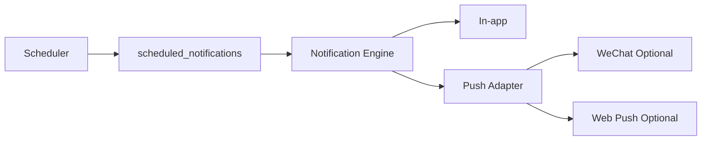

P0 必须有 In-app；外部 Push 仅 Provider configured 时启用。

## 36.3 DND

普通通知在 DND 内延迟到 DND end；用户主动配置的必要健康提醒可 `allow_dnd_override=true`。

## 36.4 幂等

`userId + sourceType + sourceId + fireAt + category` 唯一，Scheduler 重启不能重复通知。

---

# 37. Scheduler

P0 在 runew-app 内单实例 Scheduler，不引入消息队列。

| Job | 周期 |
|---|---|
| due notifications | 1 min |
| capsule openable notification | 5 min |
| export cleanup | 10 min |
| admin session cleanup | 15 min |
| temp upload cleanup | 1 h |
| sync feed prune | daily |
| recent-delete purge | daily |
| storage threshold | 1 h |
| backup status alert | 30 min |
| search repair | daily |
| gem reconcile | daily |

推荐 `job_locks(job_name,locked_until,owner_id)` 防止热重启重入。所有 Job 必须可重跑且幂等。


# 38. 宝石事务设计

## 38.1 普通记录奖励

记录获得宝石时必须保证：

```text
业务记录
+
奖励规则判断
+
宝石流水
+
余额缓存
```

在同一个 SQLite Transaction 内完成。

推荐奖励幂等键：

```text
reward:{ruleId}:{entityType}:{entityId}
```

同一离线 Operation 重试 10 次，也只能产生一次奖励流水。

## 38.2 每日奖励上限

每日上限只限制“获得宝石”，不限制记录本身。

计算依据：

```text
family_id
user_id（若规则按用户）
action_type
family local_date
```

当天已达到上限：

```text
记录仍保存
宝石不再增加
```

不得返回业务保存失败。

## 38.3 兑换事务

兑换是典型资金类并发写，必须避免两个请求同时读到同一余额后都成功。

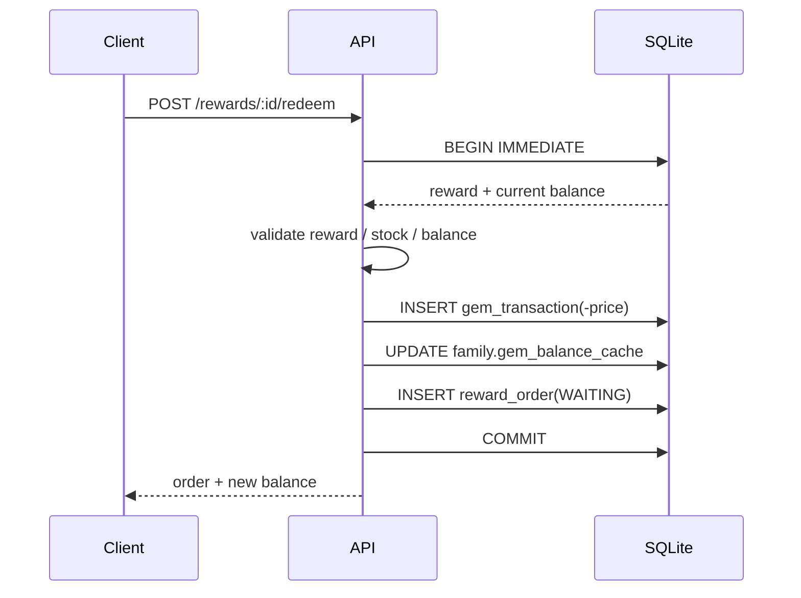

SQLite 这里推荐：

```sql
BEGIN IMMEDIATE;
```

锁住写事务，避免并发透支。

## 38.4 取消与退款

如果订单满足取消规则：

```text
WAITING -> CANCELED
```

同一 Transaction：

1. 校验当前状态；
2. 创建正向退款流水；
3. 更新余额缓存；
4. 更新订单状态；
5. 产生 Sync Change。

退款幂等键：

```text
refund:reward_order:{orderId}
```

禁止修改原扣减流水。

## 38.5 人工调整

管理员人工调整：

```text
insert gem_transaction
update balance cache
insert audit_log
```

同一 Transaction。

必须有：

```text
reason_text
admin_session_id
operator_user_id
```

## 38.6 余额 Reconciliation

每天 Scheduler：

```sql
SELECT COALESCE(SUM(amount), 0)
FROM gem_transactions
WHERE family_id = ?;
```

与：

```text
families.gem_balance_cache
```

对比。

不一致：

```text
GEM_BALANCE_DRIFT
```

进入管理员数据中心告警。

**不得为了“修好数字”自动伪造一条平账流水。**

---

# 39. 删除、最近删除与物理清理

## 39.1 Soft Delete

普通业务删除：

```text
deleted_at = now
deleted_by = actor
version = version + 1
```

随后：

- 普通列表立即隐藏；
- 搜索立即隐藏；
- Sync Feed 产生 DELETE tombstone；
- 最近删除可见；
- 媒体 Binary 暂不删除。

## 39.2 Undo / Restore

撤销和最近删除恢复统一调用服务端 Restore：

```text
POST /trash/:entityType/:id/restore
```

Restore：

```text
deleted_at = null
deleted_by = null
version++
```

并同步恢复 Search Index / Notification（必要时）/ Sync Feed。

客户端不能本地直接清 `deleted_at` 当作最终恢复。

## 39.3 30 天策略

产品层最近删除默认：

```text
30 days
```

Scheduler 对普通低价值数据可在超过 30 天后物理清理。

高价值内容建议更保守：

```text
照片 / 音频 Binary grace >= 90 days
```

或者必须确认：

```text
至少一个包含该媒体的 verified backup 已存在
```

后才允许 Physical Purge。

因此：

> “UI 最近删除 30 天”不等于第 31 天立刻擦除所有不可复刻媒体 Binary。

## 39.4 Media Purge 前置条件

```text
no active references
AND delete grace reached
AND latest verified backup exists
```

否则延期并在 maintenance report 中记录。

## 39.5 已物理清理

客户端还拿着旧直链/Offline Operation 时：

```http
410 Gone
ENTITY_GONE
```

不能返回一份“空对象”让客户端误以为正常。

---

# 40. 自动草稿

## 40.1 Draft 保存位置

Draft 优先在客户端持久化，不要求每一次输入都发网络请求。

结构：

```ts
interface Draft {
  draftId: string
  userId: string
  familyId: string
  entityType: string
  entityId?: string
  fields: Record<string, unknown>
  baseVersion?: number
  updatedAt: number
}
```

## 40.2 Autosave 时机

建议：

```text
debounce 500–1000 ms
onBlur
onAppHide
before route leave
```

至少覆盖：

```text
妈妈日记
一句话心得
宝宝语录
时光胶囊
健康备注
管理员长知识正文
```

## 40.3 Draft 恢复

重新进入发现 Draft：

```text
[继续写]
[丢弃]
```

不得自动覆盖服务器当前内容。

## 40.4 编辑 Draft 的版本冲突

若：

```text
draft.baseVersion != server.version
```

先提示：

```text
原记录已经在另一处更新
```

用户可恢复 Draft，但最终提交仍必须通过统一 Conflict Pipeline。

---

# 41. 事务策略

## 41.1 必须使用 Transaction 的场景

```text
记录创建 + 宝石奖励
feeding side switch
feeding finish
reward redeem
reward cancel + refund
family task complete + reward（如配置）
duplicate merge
capsule seal
restore + search index
admin gem adjust
member permission change + audit
notification source + scheduled notification
```

## 41.2 Transaction 原则

必须：

- 尽可能短；
- 不在 Transaction 内做网络请求；
- 不在 Transaction 内压缩图片；
- 不在 Transaction 内等待 FFmpeg；
- 不在 Transaction 内上传 Offsite；
- 不让一个 Scheduler batch 长时间占写锁。

目标：

```text
绝大多数业务写事务 < 100 ms
```

## 41.3 文件系统与数据库

文件系统和 SQLite 无法天然一个 ACID Transaction。

媒体采用状态 + 原子 rename：

```text
DB media = PROCESSING
      ↓
assemble file in temp
      ↓
validate/hash
      ↓
atomic rename to final path
      ↓
DB media = READY
```

异常补偿：

```text
file exists + DB PROCESSING too long
→ reconciliation

DB READY + file missing
→ mark ERROR + alert
```

---

# 42. 幂等性详细设计

## 42.1 为什么必须有幂等

移动网络常见：

```text
请求成功
↓
响应在网络中丢失
↓
客户端认为失败
↓
重试
```

如果没有幂等：

- 奶量重复两条；
- 宝石重复奖励；
- 商城重复扣款；
- 管理员重复调整；
- 通知重复创建。

## 42.2 `idempotency_keys`

| 字段 | 类型 |
|---|---|
| key | TEXT PK |
| user_id | TEXT |
| endpoint | TEXT |
| request_hash | TEXT |
| response_status | INTEGER |
| response_json | TEXT |
| created_at | INTEGER |
| expires_at | INTEGER |

同 key + 同 request hash：

```text
返回第一次结果
```

同 key + 不同 payload：

```http
409 IDEMPOTENCY_KEY_REUSED
```

## 42.3 强制幂等 Endpoint

```text
register
create record
create media upload
reward redeem
reward cancel
admin gem adjust
family invite
export create
backup create
sync push operations
```

## 42.4 Retention

资金/管理员：

```text
>= 90 days
```

普通 Create：

```text
7–30 days
```

Offline Operation 的 `operationId` 由 `sync_operations` 长期承担幂等记录。

---

# 43. 异常码规范

## 43.1 HTTP 状态

| HTTP | 使用场景 |
|---|---|
| 400 | Request 格式错误 |
| 401 | 未登录/Session 失效 |
| 403 | 已登录但无权限 |
| 404 | 资源不存在或策略选择隐藏存在性 |
| 409 | 版本、状态、幂等、并发冲突 |
| 410 | 已永久清理 |
| 413 | 文件/请求过大 |
| 422 | 业务校验失败 |
| 429 | Rate Limit |
| 500 | 未预期服务端错误 |
| 503 | DB Busy / Maintenance / 暂不可用 |

## 43.2 Auth

```text
AUTH_REQUIRED
AUTH_INVALID_CREDENTIALS
AUTH_SESSION_EXPIRED
AUTH_SESSION_REVOKED
AUTH_ACCOUNT_DISABLED
AUTH_RATE_LIMITED
CSRF_INVALID
CLIENT_VERSION_UNSUPPORTED
```

## 43.3 Permission

```text
FAMILY_ACCESS_DENIED
BABY_ACCESS_DENIED
RESOURCE_PERMISSION_DENIED
PRIVATE_RESOURCE
ADMIN_REQUIRED
ADMIN_SESSION_EXPIRED
ADMIN_REAUTH_REQUIRED
ADMIN_REAUTH_INVALID
```

## 43.4 Data / Sync

```text
ENTITY_NOT_FOUND
ENTITY_DELETED
ENTITY_GONE
ENTITY_VERSION_CONFLICT
ENTITY_ID_REUSED
IDEMPOTENCY_KEY_REUSED
VALIDATION_FAILED
SYNC_OPERATION_CONFLICT
SYNC_DEPENDENCY_FAILED
SYNC_DEPENDENCY_CYCLE
SYNC_CURSOR_EXPIRED
FULL_RESYNC_REQUIRED
CLIENT_CLOCK_SUSPECT
```

## 43.5 Timer

```text
SLEEP_ALREADY_RUNNING
SLEEP_NOT_RUNNING
FEEDING_ALREADY_RUNNING
FEEDING_NOT_RUNNING
TIMER_INVALID_RANGE
```

## 43.6 Media

```text
MEDIA_UPLOAD_NOT_FOUND
UPLOAD_PART_MISMATCH
UPLOAD_INCOMPLETE
MEDIA_HASH_MISMATCH
MEDIA_UNSUPPORTED_TYPE
MEDIA_PROCESSING_FAILED
MEDIA_TOO_LARGE
MEDIA_FILE_MISSING
```

## 43.7 Capsule

```text
CAPSULE_SEALED
CAPSULE_NOT_OPENABLE
CAPSULE_INVALID_TRANSITION
```

## 43.8 Gems / Reward

```text
GEM_INSUFFICIENT_BALANCE
GEM_RULE_LIMIT_REACHED
REWARD_OFFLINE
REWARD_OUT_OF_STOCK
ORDER_INVALID_STATE
GEM_BALANCE_DRIFT
```

## 43.9 Backup / System

```text
BACKUP_IN_PROGRESS
BACKUP_FAILED
BACKUP_VERIFY_FAILED
BACKUP_NOT_FOUND
RESTORE_IN_PROGRESS
RESTORE_VERIFY_FAILED
MAINTENANCE_MODE
DB_BUSY
DISK_SPACE_LOW
```

## 43.10 Error Envelope

```json
{
  "error": {
    "code": "ENTITY_VERSION_CONFLICT",
    "message": "这条记录刚刚在另一台设备上被修改过。",
    "retryable": false,
    "details": {
      "entityId": "01J..."
    }
  },
  "meta": {
    "requestId": "req_..."
  }
}
```

UI 只消费 `code` 做状态映射，主文案不得直接把技术错误码显示给普通用户。

---

# 44. 数据迁移

## 44.1 Drizzle Migration

Schema 修改统一：

```text
create migration
review SQL
backup
maintenance（必要时）
apply
quick_check
start app
```

生产禁止：

```text
drizzle push --force
```

## 44.2 Migration Flow

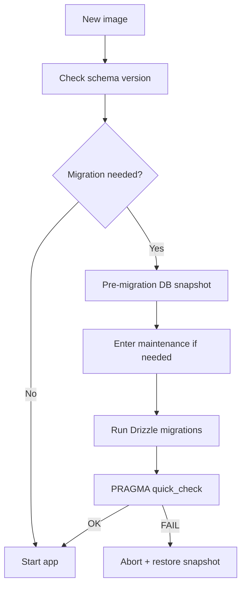

## 44.3 破坏性 Migration

SQLite 删除/重构 Column 时：

1. 建新表；
2. 按 explicit column map copy；
3. 校验行数/关键 checksum；
4. rebuild indexes/triggers；
5. rename；
6. `quick_check`；
7. 保留 pre-migration snapshot。

## 44.4 Schema Metadata

增加 `system_metadata`：

```text
schema_version
app_version
sync_epoch
last_migration_at
```

恢复历史备份时 `sync_epoch` 必须变化，详见 Restore。

---

# 45. 配置管理

## 45.1 Environment Variables

建议：

```text
NODE_ENV
PORT
APP_BASE_URL
DATABASE_PATH
MEDIA_ROOT
BACKUP_ROOT
LOG_LEVEL

SESSION_SECRET
CSRF_SECRET

ADMIN_BOOTSTRAP_PASSWORD_FILE
CLOUDFLARE_TUNNEL_TOKEN

BACKUP_SCHEDULE
BACKUP_RETENTION_DAYS

OFFSITE_BACKUP_ENABLED
RESTIC_REPOSITORY
RESTIC_PASSWORD_FILE
AWS_ACCESS_KEY_ID
AWS_SECRET_ACCESS_KEY
```

## 45.2 `.env`

```text
.env            不入 Git
.env.example    只放 key 和说明
```

不能在 `.env.example` 写演示真实 secret。

## 45.3 DB Config vs Secret

适合 `system_settings`：

```text
duplicate windows
upload size limits
backup schedule display config
feature switches
general operational config
```

不适合 DB 明文：

```text
Cloudflare token
R2/B2 secret
session secret
CSRF secret
backup encryption password
```

这些进入环境变量或 mounted secret files。

## 45.4 配置版本

管理员可修改的 system setting：

```text
version
updated_by
updated_at
```

修改必须 Audit。

---

# 46. 日志设计

## 46.1 Logger

Fastify 使用：

```text
Pino structured JSON
```

基础字段：

```text
timestamp
level
requestId
route
method
statusCode
durationMs
userId
familyId
errorCode
```

## 46.2 Redaction

必须 redact：

```text
req.headers.authorization
req.headers.cookie
password
adminPassword
sessionToken
csrfToken
media binary
```

## 46.3 禁止日志内容

```text
日记正文
时光胶囊正文
照片内容
录音内容
完整 Push token
登录密码
Admin 密码
完整 Session Token
```

## 46.4 IP

不需要长期保存原始家庭公网 IP。

安全统计需要时：

```text
HMAC/SHA hash with rotating salt
```

## 46.5 Docker Log Rotation

```yaml
logging:
  driver: json-file
  options:
    max-size: "20m"
    max-file: "5"
```

---

# 47. 可观测性与监控

P0 不强制 Prometheus/Grafana，但系统必须可被诊断。

## 47.1 Health Endpoint

### Liveness

```http
GET /health/live
```

只确认进程存活，不执行重 IO。

### Readiness

```http
GET /health/ready
```

检查：

```text
SQLite SELECT 1
media root writable
not RESTORING
scheduler heartbeat not stale（可选）
```

## 47.2 Admin Data Center 状态

必须可查看：

```text
app version
schema version
DB size
WAL size
media sizes
free disk
pending media processing
last backup
last verified backup
scheduler heartbeat
sync backlog
search index status
```

## 47.3 关键 Metrics

P0 至少内部计数：

```text
http_request_duration_ms
http_5xx_count
db_busy_count
sync_push_count
sync_conflict_count
sync_failed_count
media_upload_fail_count
media_processing_fail_count
backup_fail_count
scheduler_job_fail_count
auth_fail_count
admin_auth_fail_count
```

第一阶段可以：

```text
rolling in-memory counters
+
定时写 system health snapshot
```

未来再接 Prometheus。

## 47.4 系统级告警

至少通知 Admin：

```text
backup failed
disk low
DB integrity issue
repeated media processing failures
gem balance drift
```

---

# 48. 性能设计

## 48.1 SQLite Index 原则

根据真实 Query 建组合索引，重点：

```text
family_id
baby_id
recorded_at
updated_at
deleted_at
status
```

不要给所有字段机械创建单列索引。

## 48.2 Timeline

统一 Timeline 不创建万能业务表。

可使用 `UNION ALL`：

```sql
SELECT id, 'FEEDING' AS type, recorded_at
FROM feeding_records
WHERE baby_id = ? AND deleted_at IS NULL

UNION ALL

SELECT id, 'DIAPER' AS type, recorded_at
FROM diaper_records
WHERE baby_id = ? AND deleted_at IS NULL

UNION ALL
...
ORDER BY recorded_at DESC, id DESC
LIMIT ?;
```

各表拥有：

```text
(baby_id, recorded_at DESC)
```

## 48.3 Cursor Pagination

全部长期列表用 cursor，不用大 Offset。

## 48.4 Media 性能

```text
Thumbnail first
原图 lazy load
Audio HTTP Range
不经 JSON Base64
Export 流式写文件
```

图片处理并发限制：

```text
1–2 worker/concurrency
```

家庭 NAS 不应该因为一次导入 100 张图让 API 整体卡死。

## 48.5 SQLite Busy

`SQLITE_BUSY`：

```text
random short backoff
最多 2–3 次
```

仍失败：

```http
503 DB_BUSY
retryable=true
```

普通记录客户端因为 Local-first，仍表现为：

```text
已安全保存，稍后同步
```

---

# 49. 安全设计

## 49.1 Transport

公网：

```text
HTTPS only
Cloudflare TLS
```

runew-app 不直接暴露到 Internet。

## 49.2 Security Headers

H5 至少：

```text
Content-Security-Policy
X-Content-Type-Options: nosniff
Referrer-Policy
Permissions-Policy
frame-ancestors
HSTS
```

## 49.3 CORS

只允许配置的 H5 Origin / Mini Program Domain。

禁止：

```text
Access-Control-Allow-Origin: *
```

尤其 Cookie Auth 时。

## 49.4 CSRF

H5 Cookie Session 写请求：

```text
CSRF token
+
Origin/Referer validation
```

Mini Program Bearer Token 不依赖浏览器 Cookie CSRF 模型，但仍校验 Origin/业务签名边界（可用时）。

## 49.5 XSS

Knowledge/Admin 正文如果支持 Markdown：

```text
server sanitize
client render sanitize
禁止任意 raw <script>
```

Diary / Quote 默认 plain text escaped。

## 49.6 SQL Injection

Drizzle 参数化查询。

Raw SQL 必须：

```text
placeholder binding
code review
```

## 49.7 IDOR

所有资源详情都需要 family/owner policy。

不能：

```text
SELECT by id -> return
```

必须：

```text
SELECT scoped by family
+
resource policy
```

## 49.8 Upload Security

同时验证：

```text
auth
permission
size
declared MIME
magic bytes
actual decoder
hash
path
```

不信任扩展名。

## 49.9 Path Traversal

最终文件路径完全由 Server 生成：

```text
/media/YYYY/MM/<mediaId>.<normalized_ext>
```

所有 `path.resolve` 后检查必须仍位于允许 root 内。

## 49.10 Rate Limit

至少：

```text
login
register
admin auth
admin reauth
search
media init
export
backup
```

## 49.11 Brute Force

普通登录/Admin：

```text
failed attempts
temporary lock
exponential delay
security log
```

不能向攻击者区分：

```text
账号不存在
密码错误
```

## 49.12 PRIVATE Data

PRIVATE 内容不得进入：

```text
普通 family cache
analytics body
logs
audit body
realtime payload
push body
```

## 49.13 Backup Security

本机备份目录权限：

```text
0700
```

异地备份：

```text
client-side encryption required
```

不能把明文宝宝照片目录裸同步到第三方 Bucket。

---

# 50. 数据导出

## 50.1 Export 类型

```text
成长报告
CSV
所有照片
所有录音
回忆档案
完整备份
年度回顾
```

## 50.2 Async Export Job

```text
POST /exports
→ QUEUED
→ RUNNING
→ READY
→ download
```

使用数据库 `export_jobs`，不引入外部 Queue。

## 50.3 下载权限

不要生成永久公开 URL。

```text
GET /exports/:id/download
```

每次：

```text
user session
family permission
job owner/policy
```

Export file 默认：

```text
24–72h expiry
```

然后清理。

## 50.4 Export 与 Backup 区别

Export：

```text
给用户阅读/迁移
可整理格式
```

Backup：

```text
给系统灾难恢复
包含 schema/version/manifest
不可手工编辑
```

---

# 51. Backup Architecture

## 51.1 三层 Backup

```text
A. Primary /data
B. Local /backups
C. Optional encrypted offsite
```

**如果 `/data` 和 `/backups` 在同一块物理磁盘，B 只能算版本快照，不能算完整灾备。**

## 51.2 WAL 下不能简单 `cp runew.db`

运行中的 WAL 数据库直接复制单个 `runew.db` 可能不是一致 Snapshot。

必须使用：

```text
SQLite Online Backup API
或 sqlite3 .backup
```

## 51.3 Backup 流程

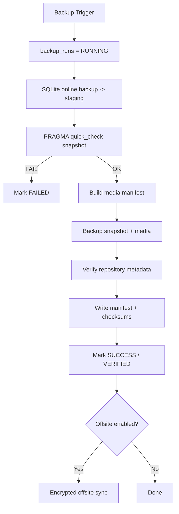

## 51.4 `runew-backup`

独立容器负责：

```text
schedule
SQLite snapshot
media incremental backup
retention
verification
offsite sync
```

推荐工具：

```text
restic
```

因为支持：

- 加密；
- 去重；
- 本地 Repository；
- S3-compatible / R2；
- B2；
- NAS path。

如果不用 restic，也必须自行实现：

```text
versioned snapshots
manifest
hash
retention
encryption offsite
```

## 51.5 默认 Schedule

推荐：

```text
每天 03:00
```

以部署服务器/家庭配置时区解析。

建议增强：

```text
DB full snapshot: daily
media incremental: hourly / configurable
```

## 51.6 Backup 内容

关键：

```text
consistent runew.db snapshot
media originals/display/audio/video
schema version
app version
sync epoch
manifest
checksums
```

可不纳入关键 Backup：

```text
temp upload parts
cache
可重建 thumbnail
logs
```

## 51.7 Retention 默认

技术默认建议：

```text
daily   14
weekly   8
monthly 12
```

实际根据家庭磁盘容量可配置。

## 51.8 Backup Verify

“任务 exit code = 0”不够。

至少：

```text
DB quick_check
manifest readable
files present
repository snapshot readable
checksum sample
```

每周建议做一次真正临时 Restore Verification。

---

# 52. Restore Architecture

## 52.1 Restore 权限

必须：

```text
valid user session
+
valid admin session
+
single-use reauth grant
+
final confirmation
```

## 52.2 Restore 流程

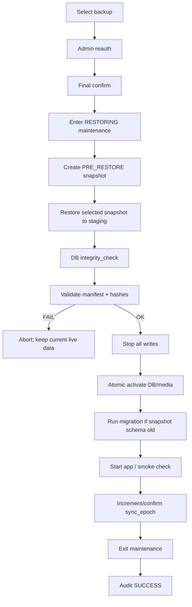

## 52.3 Maintenance Mode

RESTORING 时：

```http
503 MAINTENANCE_MODE
```

Client：

```text
保留 Pending Queue
保留 Draft
恢复后再同步
```

不允许为了恢复“清掉客户端待同步内容”。

## 52.4 Pre-restore Snapshot

Restore 前必须尽可能创建：

```text
PRE_RESTORE
```

当前现场快照。

即使怀疑 DB 损坏，也尽量保留现场，便于回滚/人工提取数据。

## 52.5 Restore 后 Sync Epoch

历史 Restore 会让服务端数据时间线回到过去，而客户端 Cursor 可能“比服务端更未来”。

因此服务端维护：

```text
sync_epoch
```

每次历史 Restore：

```text
sync_epoch++
```

客户端 `/bootstrap` 发现 epoch 改变：

```text
FULL RESYNC
```

同时保存并 replay 本地未确认 Pending Operations。

---

# 53. Disaster Recovery

## 53.1 故障等级

### D1：App Container Crash

处理：

```text
Docker restart
```

目标：

```text
RPO 0
RTO < 5 min
```

### D2：SQLite Corruption

```text
restore latest verified snapshot
```

目标：

```text
RPO <= backup interval
RTO 30–120 min
```

### D3：Primary Disk Loss

必须有：

```text
backup on another physical disk
或 encrypted offsite
```

如果 `/data` 与 `/backups` 都在同盘，则无法覆盖该故障。

### D4：NAS / Host Loss

需要：

```text
encrypted offsite repository
+
separate secret recovery
```

## 53.2 RPO / RTO 建议

基础家庭部署：

```text
RPO target <= 24h
RTO target <= 2h
```

启用小时级媒体增量：

```text
Media RPO 1–6h
```

这些是工程 SLO，非产品文案。

## 53.3 DR Runbook

1. 准备新的 Linux/NAS/Docker 主机；
2. 安装 Docker Compose；
3. 恢复 secrets；
4. 恢复 Backup Repository；
5. Restore 到 staging；
6. 校验 manifest / checksum；
7. `PRAGMA integrity_check`；
8. 激活 snapshot；
9. 启动 `runew-app`；
10. 登录 Smoke；
11. 抽查照片/音频/Search；
12. 重建/验证 Cloudflare Tunnel；
13. 客户端 Full Resync。

---

# 54. Cloudflare Tunnel

## 54.1 网络原则

禁止：

```text
家用路由器直接 Port Forward 3000
公开 SQLite
公开 /data/media
```

只允许：

```text
cloudflared outbound tunnel
```

## 54.2 Docker Network

```text
cloudflared
    ↓
http://runew-app:3000
```

`runew-app` 只 `expose: 3000`，生产不需要：

```yaml
ports:
  - "3000:3000"
```

## 54.3 Tunnel Config

```yaml
ingress:
  - hostname: runew.example.com
    service: http://runew-app:3000
  - service: http_status:404
```

Tunnel Token：

```text
Secret
不进 Git
不写日志
```

## 54.4 Proxy Trust

Fastify `trustProxy` 必须按实际部署配置，不能无条件信任任意客户端伪造：

```text
X-Forwarded-For
CF-Connecting-IP
```

安全日志若需 IP，只存 hash。

## 54.5 Cloudflare Access

普通 RUNEW 用户接口不强制 Access，因为微信小程序兼容和家庭登录由应用自身完成。

可以为独立运维 Hostname 启用 Access。

Admin 业务权限仍必须由 RUNEW 自己验证，不能把 Cloudflare Access 当成 Admin Password 的替代。

---

# 55. Docker Compose

基线：

```yaml
services:
  runew-app:
    image: runew-app:${RUNEW_VERSION}
    restart: unless-stopped
    environment:
      NODE_ENV: production
      PORT: 3000
      DATABASE_PATH: /data/db/runew.db
      MEDIA_ROOT: /data/media
      BACKUP_ROOT: /backups
    volumes:
      - ./data:/data
      - ./backups:/backups
      - ./secrets:/run/secrets:ro
    expose:
      - "3000"
    healthcheck:
      test: ["CMD", "wget", "-qO-", "http://127.0.0.1:3000/health/ready"]
      interval: 30s
      timeout: 5s
      retries: 3
    logging:
      driver: json-file
      options:
        max-size: "20m"
        max-file: "5"

  cloudflared:
    image: cloudflare/cloudflared:latest
    restart: unless-stopped
    command: tunnel --no-autoupdate run
    environment:
      TUNNEL_TOKEN: ${CLOUDFLARE_TUNNEL_TOKEN}
    depends_on:
      runew-app:
        condition: service_healthy

  runew-backup:
    image: runew-backup:${RUNEW_VERSION}
    restart: unless-stopped
    environment:
      DATABASE_PATH: /data/db/runew.db
      MEDIA_ROOT: /data/media
      BACKUP_ROOT: /backups
    volumes:
      - ./data:/data:ro
      - ./backups:/backups
      - ./secrets:/run/secrets:ro
```

## 55.1 Backup Service 不直接写业务 DB

如果 Backup 容器需要报告状态：

推荐：

```text
/internal/backup/*
```

或 app 读取 manifest。

避免 Backup 容器拿业务 SQLite 写权限。

---

# 56. Internal API

Container Network Only：

```text
/internal/*
```

例如：

```text
POST /internal/backup/started
POST /internal/backup/completed
POST /internal/backup/failed
GET  /internal/system/backup-metadata
```

要求：

```http
X-Runew-Internal-Token: <secret>
```

该 Token 通过 Secret File 提供。

Cloudflare ingress 不应公开 `/internal/*`。

---

# 57. Realtime Connection

## 57.1 WebSocket

```text
/ws
```

WebSocket 不传业务正文，只传 Hint。

事件：

```text
sync_hint
notification_hint
session_revoked
maintenance
```

## 57.2 Mini Program Ticket

不要把长期 Session Token 直接放 WebSocket URL Query。

流程：

```text
POST /realtime/ticket
→ one-time ticket <= 60s
→ wss://.../ws?ticket=...
→ server consume ticket
```

Ticket：

```text
single-use
user-bound
short-lived
```

## 57.3 Consistency

WebSocket 断线不会导致数据丢失，因为它只提示：

```text
“有新的 cursor”
```

最终数据仍由：

```text
/sync/pull
```

获得。

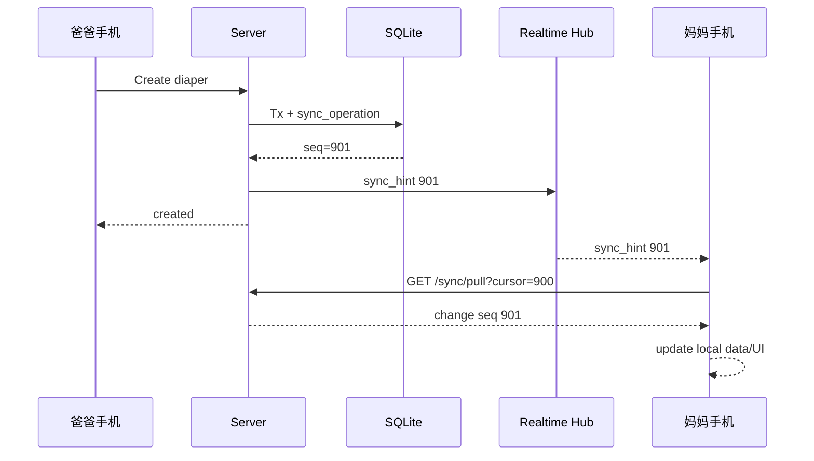

---

# 58. Full Resync

## 58.1 触发条件

```text
sync cursor expired
sync_epoch changed after restore
client local database/storage damaged
manual repair
```

## 58.2 Snapshot API

```http
GET /sync/snapshot?familyId=...
```

按资源分页返回当前授权范围内的 Active Entities 和必要 Tombstones。

## 58.3 Client Flow

1. 暂停普通 Push；
2. 备份/保留 Pending Operations；
3. 拉取 Snapshot；
4. 重建 Local Entity Cache；
5. 更新 Sync Cursor/Epoch；
6. Replay 未确认 Pending Operations；
7. 冲突仍按 Conflict Pipeline 处理。

**禁止 Full Resync 直接清空 Pending Queue。**

## 58.4 Change Feed Retention

建议：

```text
sync_operations 保留 180 days
```

如果设备 cursor 早于最旧可用 seq：

```text
FULL_RESYNC_REQUIRED
```

Audit / Gem Ledger 不跟着 Sync Feed retention 清理。

---

# 59. 审计日志规范

## 59.1 必须 Audit 的操作

```text
Admin auth success/failure summary
Admin session revoke/expire
Gem manual adjustment
Gem rule change
Reward publish/offline
Knowledge publish/offline
Member disable/restore
Permission changes
Backup start/verify/restore
Danger actions
System setting changes
```

## 59.2 普通业务历史

以下可以进入 Domain History/Audit metadata：

```text
record edited/deleted/restored
visibility changed
capsule sealed/opened
reward fulfilled
```

## 59.3 Before / After

宝石规则：

```json
{
  "before": {"amount": 1, "dailyLimit": 3},
  "after":  {"amount": 2, "dailyLimit": 3}
}
```

PRIVATE Diary visibility：

```json
{
  "before": {"visibility": "PRIVATE"},
  "after":  {"visibility": "FAMILY"}
}
```

不写 `body`。

## 59.4 Audit 不可变

普通业务 API 不提供：

```text
UPDATE audit_logs
DELETE audit_logs
```

Retention 如果未来需要，必须是系统级受控策略，并先满足家庭数据/安全合规需求。

---

# 60. Raw Record 与 Statistic 分离

## 60.1 原始数据是真相

Sleep：

```text
23:00 → 07:00
```

永远保存为一条原始记录。

统计层可以得出：

```text
昨日睡眠 1h
今日睡眠 7h
```

但不把原始记录切成两条。

## 60.2 Derived Cache

如果未来性能需要，可增加：

```text
daily_baby_stats
```

字段示例：

```text
family_id
baby_id
local_date
feeding_count
feeding_ml
sleep_seconds
diaper_count
food_count
updated_at
```

Unique：

```text
baby_id + local_date
```

该表：

```text
可丢弃
可重建
不是真相
```

P0 数据量较小时可以实时查询，不急着增加物化层。


# 61. API Runtime Validation

## 61.1 Schema

推荐共享：

```text
Zod
或 TypeBox + Fastify schema
```

建议把 API Contract 放到：

```text
packages/contracts
```

Client / Server 共享 TypeScript Type，但服务端仍必须 Runtime Validate。

## 61.2 三层校验

```text
Transport schema
→ Domain validation
→ Database constraints
```

例如奶瓶：

```text
JSON amountMl number
→ amountMl > 0
→ feedingType == BOTTLE 时 required
→ DB check/index
```

## 61.3 必须 Runtime Validate

```text
ULID
Enums
String length
Number range
end >= start
family/baby ownership
state transition
media size/mime
visibility
version
```

TypeScript 编译成功不代表用户输入安全。

---

# 62. 输入与媒体限制

以下是技术初始默认值，可配置，不是产品不可变文案：

```text
nickname               50 chars
record note          2,000 chars
diary body           50,000 chars
baby quote            5,000 chars
capsule body         100,000 chars
knowledge body       200,000 chars
family task title       100 chars
health note          10,000 chars
```

媒体：

```text
Image      30 MiB / file
Audio     200 MiB / file
Video       1 GiB / file
Chunk       4 MiB
```

服务端限制才是最终安全边界，客户端限制只改善 UX。

---

# 63. 媒体下载与播放权限

## 63.1 不公开 `/data/media`

禁止 Nginx/Cloudflare 直接把：

```text
/data/media/**
```

映射为永久公开 URL。

推荐：

```text
GET /media/:id/content
GET /media/:id/thumbnail
```

每次：

1. 认证；
2. Family Scope；
3. Resource Permission；
4. PRIVATE/Owner Rule；
5. Stream File。

## 63.2 HTTP Range

Audio / Video：

```http
Range: bytes=...
```

响应：

```http
206 Partial Content
Accept-Ranges: bytes
```

支持播放器 Seek，避免每次下载完整音频。

## 63.3 Signed Token 可选优化

未来高负载时可以生成：

```text
/media-public/:shortToken
```

Token 必须：

```text
<= 5 min
single resource
random/unguessable
permission checked at issuance
```

P0 直接 authenticated stream 最安全简单。

---

# 64. Media Reconciliation

定时/管理员检查：

```text
DB READY but file missing
DB PROCESSING too long
orphan final file
orphan temp part
thumbnail missing
hash mismatch
```

原则：

- 疑似孤儿的原始媒体不自动立即删除；
- 先 Report；
- Temp Part 超过安全 TTL 可以清理；
- READY + missing original 属于高优先级数据安全告警。

建议：

```text
PROCESSING stale > 30 min
TEMP upload expiry 24–72h
```

---

# 65. Search Rebuild

提供管理员：

```text
检查搜索索引
重建搜索索引
```

内部命令：

```text
pnpm db:rebuild-search
```

流程：

1. 新建临时 Search Index；
2. 扫描 Active Entity；
3. 按 visibility 生成 Document；
4. Build FTS；
5. 对比 document count；
6. 原子替换/事务切换。

重建失败不能影响原始业务数据。

---

# 66. Storage Threshold

管理员数据中心统计：

```text
DB
WAL
photos
audio
video
thumbs
exports
temp
backups
free disk
```

默认阈值建议：

```text
warning  < 15% free
critical < 5% free
```

Critical：

- Admin/System Notification；
- 大文件上传前拦截或提示；
- 普通文本记录仍尽量允许；
- Backup 任务先判断目标盘空间。

禁止等磁盘 100% 才告警。

---

# 67. 维护模式

系统运行状态：

```text
NORMAL
READ_ONLY
MAINTENANCE
RESTORING
```

## 67.1 READ_ONLY

用于临时存储故障/运维：

- GET 可用；
- Write API 返回 503；
- Client 将可离线业务留在 Pending Queue。

## 67.2 RESTORING

- 所有业务 API 返回 Maintenance；
- Realtime 广播 maintenance hint；
- Client 保留草稿/队列；
- Admin Restore Status 可通过受控 Endpoint 查看。

---

# 68. Client / API Version Compatibility

每次请求：

```http
X-Client-Version: 1.2.3
X-Client-Platform: WEAPP|H5
```

`/bootstrap` 返回：

```json
{
  "apiVersion": "v1",
  "minSupportedClientVersion": "1.0.0",
  "latestClientVersion": "1.2.3",
  "syncEpoch": 5
}
```

若真正不兼容：

```http
426 Upgrade Required
CLIENT_VERSION_UNSUPPORTED
```

第一阶段 `/api/v1` 尽量 backward-compatible，不因增加字段频繁强制升级。

---

# 69. API Evolution

同 `/api/v1` 内允许：

```text
新增 optional response field
新增 endpoint
新增 optional request field
```

新增 Enum Value 时客户端必须有 unknown fallback。

Breaking Change 才考虑：

```text
/api/v2
```

不要现在提前维护两个版本。

---

# 70. State Machine 服务端强制表

| Entity | 合法状态 | Server 强制 |
|---|---|---|
| Sleep | RUNNING → COMPLETED | ✅ |
| Breast Feeding | RUNNING ↔ PAUSED → COMPLETED | ✅ |
| Media | PENDING → UPLOADING → PROCESSING → READY / FAILED | ✅ |
| Time Capsule | DRAFT → SEALED → OPENED | ✅ |
| Reward Order | REDEEMED → WAITING → COMPLETED/CANCELED | ✅ |
| Health Event | UPCOMING → COMPLETED/EXPIRED/CANCELED | ✅ |
| Admin Session | VALID → EXPIRED/REVOKED | ✅ |
| Export | QUEUED → RUNNING → READY/FAILED | ✅ |
| Backup | RUNNING → SUCCESS/FAILED → VERIFIED | ✅ |

UI 隐藏按钮不是状态机安全措施。

---

# 71. Fastify Route 示例

```ts
app.patch('/api/v1/diapers/:id', {
  preHandler: [
    requireUser,
    requireFamilyResource('records', 'EDIT'),
  ],
  schema: {
    params: DiaperIdParams,
    body: UpdateDiaperBody,
    response: {
      200: DiaperResponse,
    },
  },
}, async (req, reply) => {
  const expectedVersion = parseIfMatch(req.headers['if-match'])

  const entity = await diaperService.update({
    ctx: req.ctx,
    id: req.params.id,
    expectedVersion,
    patch: req.body,
  })

  reply.header('ETag', `"${entity.version}"`)
  return {
    data: entity,
    meta: { requestId: req.id },
  }
})
```

Service 不接受客户端伪造：

```text
createdBy
updatedBy
family membership
```

---

# 72. Drizzle Repository 示例

```ts
async function updateDiaper(
  tx: Tx,
  id: string,
  expectedVersion: number,
  patch: UpdateDiaper,
  actorId: string,
  now: number,
) {
  const rows = await tx
    .update(diaperRecords)
    .set({
      ...patch,
      updatedBy: actorId,
      updatedAt: now,
      version: sql`${diaperRecords.version} + 1`,
    })
    .where(and(
      eq(diaperRecords.id, id),
      eq(diaperRecords.version, expectedVersion),
      isNull(diaperRecords.deletedAt),
    ))
    .returning()

  if (rows.length === 0) {
    throw new DomainConflict('ENTITY_VERSION_CONFLICT')
  }

  return rows[0]
}
```

---

# 73. Lightweight Domain Event

不引入 Kafka。

业务 Transaction 完成后发布 In-process Event：

```ts
type DomainEvent =
  | { type: 'EntityChanged'; familyId: string; seq: number }
  | { type: 'RecordCreated'; entityId: string }
  | { type: 'RewardRedeemed'; orderId: string }
  | { type: 'BackupFailed'; backupId: string }
```

用途：

```text
realtime hint
search repair hint
notification processing
query invalidation signal
```

关键一致性不能依赖 Event “一定成功”：

- Gem Transaction 必须已在 DB；
- Sync Operation 必须已在 DB；
- Search 可 Rebuild；
- Realtime 只是 Hint；
- Notification 可 Scheduler Reconcile。

---

# 74. Search 更新时序

普通小文本 Entity Mutation：

```text
entity write
+
search_documents update
+
sync_operation
```

推荐同一 Transaction。

Media：

```text
metadata READY 后更新可搜索 title/story
```

PRIVATE Entity：

```text
Search Document 明确 owner_user_id + visibility
```

权限不能依赖 FTS 自己“碰巧没搜到”。

---

# 75. Notification Materialization

创建/编辑 Health Event：

```text
health_event
+
health_reminder
+
scheduled_notification
```

同一 Transaction。

Task / Anniversary 同理。

Capsule Seal：

```text
open_at scheduled notification
```

删除/取消源实体：

```text
cancel scheduled notifications
```

Scheduler 再做 Due Delivery，不在创建 Event 的 HTTP Request 里等待外部 Push Provider。

---

# 76. Privacy by Design

## 76.1 Analytics

若启用产品行为分析，可记录：

```text
page_view
record_created
record_edited
knowledge_learned
reward_redeemed
memory_created
```

不得记录：

```text
diary body
audio content/photo pixels
time capsule body
baby quote full text（默认不进入 analytics）
```

## 76.2 Push

敏感业务 Notification Push 不携带 PRIVATE 正文。

例如：

```text
“你有一条新的提醒”
```

用户进入 App 后再鉴权查看。

## 76.3 Backup

Backup 会包含 PRIVATE 内容，因为它是家庭数据恢复的一部分；因此 Offsite 必须先加密后离开家庭设备。

---

# 77. Backup Manifest

示例：

```json
{
  "formatVersion": 1,
  "snapshotId": "01JBACKUP...",
  "createdAt": 1788123456000,
  "appVersion": "1.0.0",
  "schemaVersion": 42,
  "syncEpoch": 5,
  "db": {
    "file": "runew.db",
    "sha256": "..."
  },
  "media": {
    "count": 3821,
    "manifest": "media-manifest.json"
  }
}
```

Media Manifest 至少：

```text
storage_key
size
sha256
media_id
```

---

# 78. Release Deployment Flow

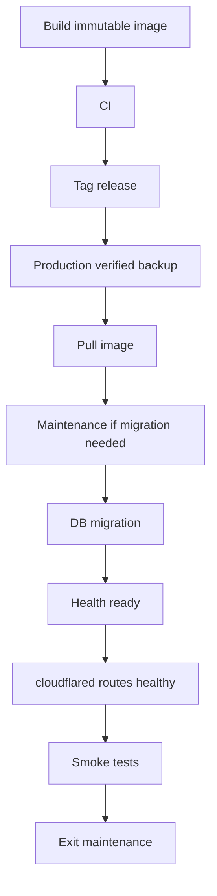

Release 不能使用：

```text
latest-only image without version trace
```

至少保留：

```text
app version
Git commit
migration version
```

---

# 79. Rollback

## 79.1 只有 App Code 失败

DB backward compatible：

```text
rollback previous immutable image
```

## 79.2 Breaking Migration 后失败

```text
enter maintenance
restore pre-deploy snapshot
rollback image
sync_epoch++
client full resync
```

所以破坏性 Migration 之前必须有可验证 Snapshot。

---

# 80. Secrets Runbook

以下 Secrets 不应和普通 `/data` Backup 放在同一个未区分的归档：

```text
Cloudflare tunnel token
SESSION_SECRET
CSRF_SECRET
backup encryption password/key
offsite credentials
internal API token
```

建议：

```text
可信密码管理器
+
单独加密离线 Secret Recovery
```

DR 时如果只有 DB/照片，丢失 Restic Encryption Password：

```text
Offsite Backup 可能无法解密
```

因此 Secrets Recovery 是灾备的一部分。

---

# 81. 推荐生产目录

```text
/opt/runew/
├── docker-compose.yml
├── .env
├── data/
│   ├── db/
│   │   └── runew.db
│   └── media/
├── backups/
├── secrets/
└── logs/            # optional
```

权限建议：

```text
data     app uid write
backups  backup uid write
secrets  dir 0700 / files 0600
```

---

# 82. WAL / Database Maintenance

## 82.1 Backup 不切换 WAL

使用 Online Backup 即可获取一致 Snapshot。

## 82.2 WAL Checkpoint

正常运行：

```text
PASSIVE checkpoint
```

维护窗口必要时：

```text
TRUNCATE
```

不要每几分钟强制 TRUNCATE，避免影响写入。

## 82.3 Integrity

建议：

```text
weekly  PRAGMA quick_check
monthly PRAGMA integrity_check
```

## 82.4 VACUUM

不做每日定时 VACUUM。

只有：

```text
大量 Physical Purge
数据库显著膨胀
维护窗口
```

再执行。

---

# 83. Production Maintenance Cadence

每日：

```text
backup status
free disk
scheduler failures
sync/media backlog
```

每周：

```text
quick_check
backup restore verify
gem reconcile
search consistency
```

每月：

```text
integrity_check
retention review
media orphan report
DR secret review
```

每季度建议做一次完整恢复演练。

---

# 84. Admin Bootstrap

首次部署若 `admin_credentials` 不存在：

从：

```text
ADMIN_BOOTSTRAP_PASSWORD_FILE
```

读取一次。

流程：

1. 读取 Secret File；
2. Argon2id Hash；
3. Insert `admin_credentials`；
4. 日志只输出“bootstrap created”，不输出密码；
5. 管理员首次进入后可修改；
6. 部署者可删除 Bootstrap Secret File。

禁止：

```text
admin/admin
123456
源码固定管理员密码
```

---

# 85. Development Seed

Development 可以 Seed：

```text
Demo family
Demo baby
Daily records
Knowledge sample
Health sample
Memories sample
```

Production Seed 仅：

```text
system settings defaults
approved initial knowledge（如有）
admin bootstrap
```

禁止生产自动创建 Demo 家庭/宝宝。

---

# 86. 测试设计总览

必须包含：

```text
Unit
Repository/DB Integration
API Integration
Migration
Offline Sync
Conflict
Timer
Media Reliability
Permission/Security
Gem Ledger
Backup/Restore
Scheduler
E2E
Failure/Chaos
UI Visual Regression（由 UI Spec）
```

测试数据库必须为独立临时 SQLite 文件，不能 Mock 掉 SQLite 的真实事务/WAL 语义。

---

# 87. Unit Tests

至少覆盖：

```text
permission evaluator
PRIVATE policy
capsule state machine
reward order state machine
gem rule daily limit
gem balance calculation
timer duration/timezone
three-way merge
conflict field detector
duplicate scorer
notification DND
backup retention
event state transition
error mapping
```

优先纯函数化关键业务规则，方便稳定测试。

---

# 88. Database Integration Tests

使用真实 SQLite Temp File。

测试：

```text
foreign_keys ON
WAL enabled
partial unique running timer
transaction rollback
BEGIN IMMEDIATE concurrent redeem
soft delete/restore
version increment
FTS permissions/index
migration from N-1
quick_check
```

并发测试不能只用 Mock Repository。

---

# 89. API Integration Tests

每个核心 Resource 至少：

```text
401
403
404
Create
Read
Update
If-Match version conflict
Delete
Restore
Idempotent retry
Validation
```

PRIVATE Diary 特别：

```text
Owner detail         200
Other family member  denied
Search               not returned
Direct ID             denied
Media attachment      denied
```

---

# 90. Offline Sync Tests

## 90.1 Offline Create

```text
network off
create record
local entity exists
pending op exists
kill/reopen app
both still exist
network on
push
server only one entity
client op clears
```

## 90.2 Retry

```text
same operationId push twice
→ one entity
→ one gem reward
```

## 90.3 Non-overlap Merge

```text
A edits note
B edits amount
→ safe merge
```

## 90.4 Overlap Conflict

```text
A edits amount
B edits amount
→ conflict response
→ no silent overwrite
```

## 90.5 Delete vs Offline Update

```text
A delete
B offline edit
B reconnect
→ ENTITY_DELETED conflict
→ user chooses restore/apply or abandon
```

## 90.6 Restore Epoch

```text
server restore old backup
sync_epoch changes
client detects
full resync
pending operations retained/replayed
```

---

# 91. Timer Tests

## 91.1 Sleep Background

```text
start sleep
kill/close app
wait/simulate +2h
reopen
elapsed correct
finish
duration correct
```

## 91.2 Cross Midnight

```text
23:00 → 07:00
one raw record
stats split by local date
```

## 91.3 DST

选择存在 DST 的测试时区：

```text
America/Los_Angeles
```

跨 DST 前后 duration 以 UTC 正确。

## 91.4 Breastfeeding

```text
left
switch right
pause
app background
resume right
finish
sum segments correct
```

## 91.5 Clock Suspect

设备时间明显异常：

```text
CLIENT_CLOCK_SUSPECT
```

但手工补录历史记录仍可保存。

---

# 92. Media Reliability Tests

必须：

```text
capture -> durable local save -> kill app -> file exists
upload part1 -> disconnect -> restart -> resume
same part retry -> idempotent
part hash mismatch -> reject
wrong complete size -> reject
processing failure -> original remains
memory delete -> trash
restore -> content playable
```

重点真机场景：

```text
录音停止后立即锁屏
拍照后立即切微信后台
H5 上传中刷新
小程序被系统回收
```

---

# 93. Gem Tests

```text
same record retry -> one reward
reward daily cap -> record still succeeds
two concurrent redeem -> max one if balance only enough once
cancel twice -> one refund
manual adjustment -> audit exists
ledger sum == balance cache
```

建议 Property Test：

```text
initial + SUM(transactions) == current balance
```

任何随机订单序列都必须满足账本不变量。

---

# 94. Backup / Restore Tests

自动化：

```text
create rows + media
backup
mutate/delete
restore
verify rows
verify media hash
verify search
verify schema
verify sync_epoch
```

Failure Cases：

```text
backup DB corrupted
media missing
checksum mismatch
disk full during backup
backup process killed mid-run
restore killed before atomic activate
old schema snapshot
```

未 Verify Snapshot：

```text
不得激活
```

---

# 95. Security Tests

至少：

```text
SQL injection payload
Stored XSS in knowledge
Path traversal filename
Fake MIME
Oversized upload
IDOR
PRIVATE diary direct link
PRIVATE search leakage
revoked user session
expired admin session
reused reauth grant
CSRF
login brute force
admin brute force
CORS invalid origin
public media URL guessing
```

---

# 96. Scheduler Tests

```text
same due job runs twice -> one notification
app restart around due time -> no duplicate
DND crossing midnight
health override
capsule open notification
expired upload cleanup
trash not purged before deadline
backup failure notification
job lock expiration recovery
```

---

# 97. E2E P0 Matrix

## Auth / Onboarding

```text
register
login
create/join family
create baby
identity/topics
enter today
```

## Records

```text
bottle
breast timer
sleep timer
diaper
food
edit
copy
delete
undo/restore
duplicate
offline
```

## Growth

```text
record
chart
edit
milestone
monthly story
```

## Knowledge

```text
recommend
favorite
later
learned
version update
feedback
```

## Health

```text
create
reminder
edit
complete/cancel
delete
attachment
```

## Memories

```text
photo
quote
audio
first
capsule DRAFT/SEALED/OPENED
favorites
on this day
annual review/export
```

## Mom

```text
mood
diary draft
PRIVATE isolation
visibility change
```

## Gems

```text
earn
ledger
redeem
waiting
complete
cancel
```

## Family

```text
invite
member permission
task CRUD
achievement
anniversary
```

## Baby

```text
profile
preferences
multiple babies
switch context
```

## Settings

```text
notifications
DND
night
permissions
export
backup status
trash
```

## Admin

```text
auth
session expiry
gem adjust
rules
knowledge
member permissions
backup
danger reauth
audit
```

---

# 98. CI / Release Test Pipeline

每个 PR：

```text
typecheck
lint
unit tests
DB integration
API integration
migration dry-run
client build
server build
```

Nightly：

```text
sync scenarios
media interruption scenarios
scheduler tests
security smoke
backup/restore verification
```

Release Gate：

```text
full P0 E2E
Docker Compose smoke
migration rehearsal
production backup
restore verification recently green
```

---

# 99. 关键业务 Mermaid：普通离线记录

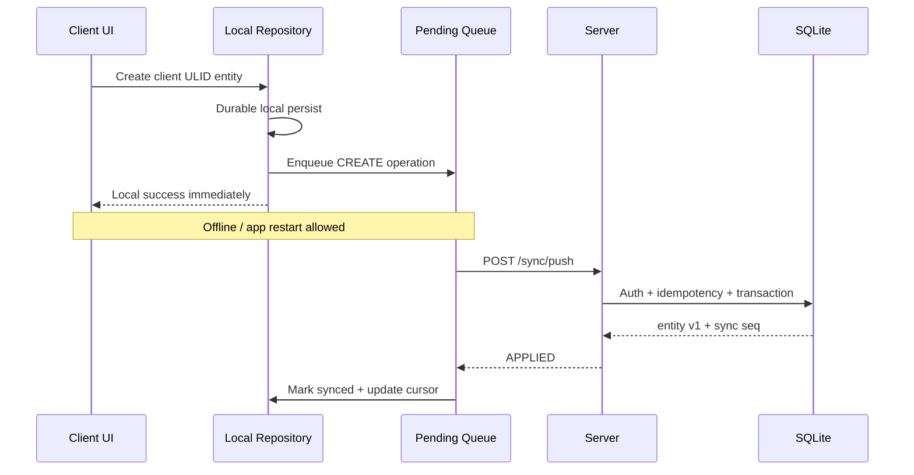

---

# 100. 关键业务 Mermaid：更新冲突

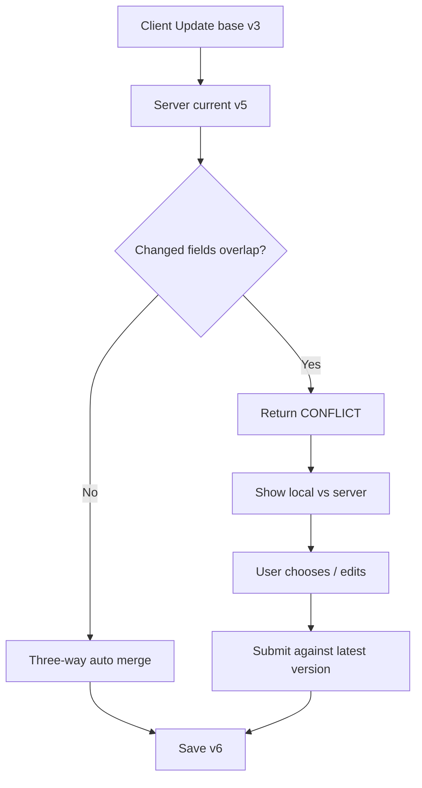

---

# 101. 关键业务 Mermaid：Timer

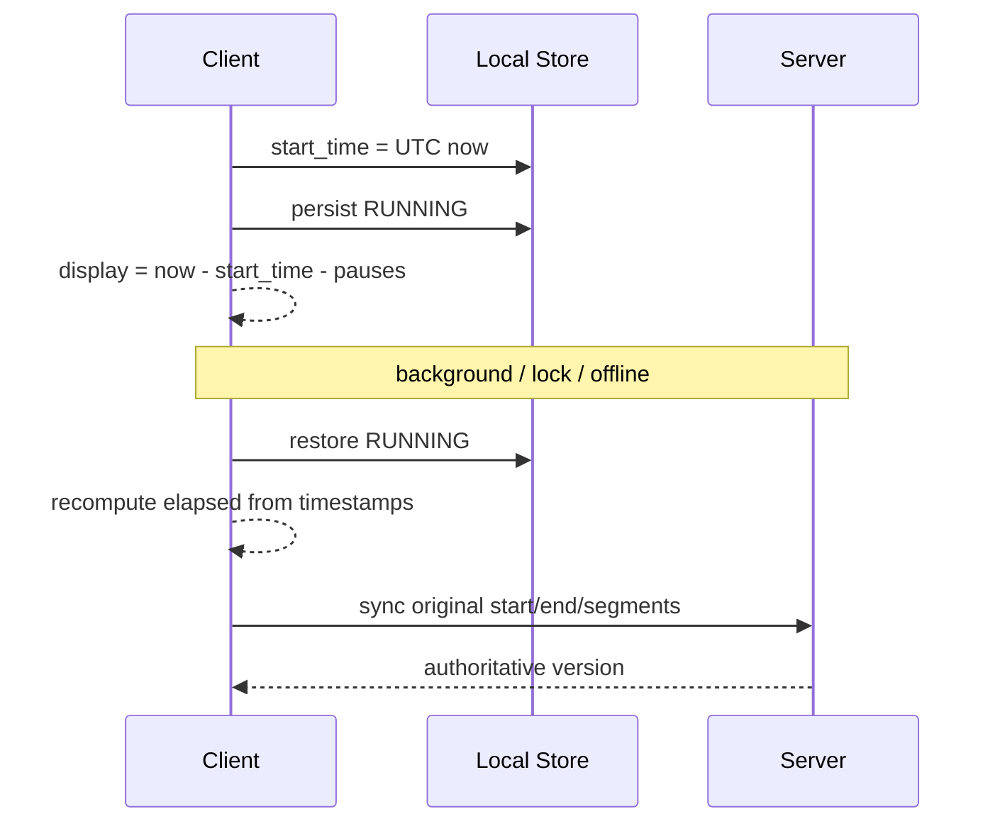

---

# 102. 关键业务 Mermaid：媒体上传

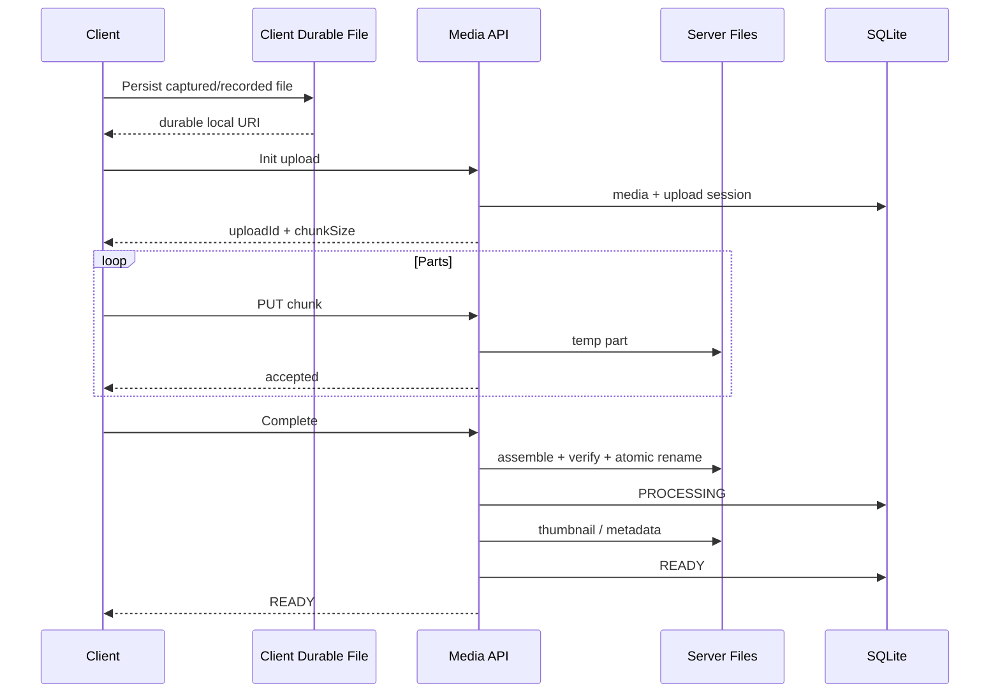

---

# 103. 关键业务 Mermaid：时光胶囊

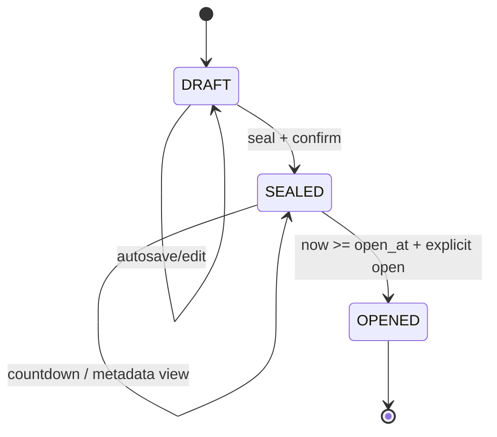

服务端必须拒绝任何越级状态。

---

# 104. 关键业务 Mermaid：管理员危险操作

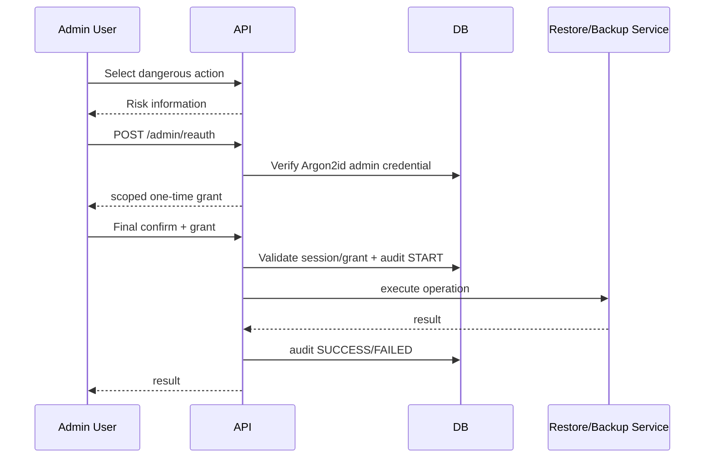

---

# 105. 关键业务 Mermaid：Backup / Restore

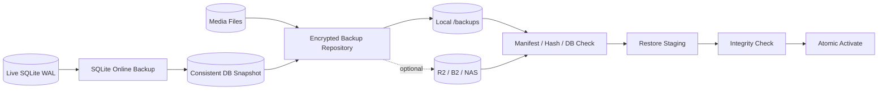

---

# 106. 推荐实现阶段

## M0 Foundation

```text
monorepo
contracts
Fastify bootstrap
Drizzle/SQLite WAL
migration
config
logger
Docker dev
```

## M1 Identity / Family / Baby

```text
credentials
opaque session
family/member/permission
baby
bootstrap
```

## M2 Daily Records

```text
CRUD
timeline
sleep timer
breast segments
duplicate candidate
gem reward base
```

## M3 Offline Sync

```text
Local Repository
Pending Queue
sync_operations
push/pull
version/conflict
realtime hint
full resync
```

## M4 Growth / Knowledge / Health

```text
growth
FTS base
knowledge version state
health reminders
scheduler
```

## M5 Media / Memories

```text
durable local media
resumable upload
image/audio processing
memory CRUD
trash
```

## M6 Mom / Privacy

```text
mood
diary
PRIVATE policy
search isolation
drafts
```

## M7 Gems / Family

```text
immutable ledger
reward order
tasks
anniversary
```

## M8 Settings / Notification

```text
preferences
DND
notification center
export
storage status
```

## M9 Admin

```text
admin credential
30m session
reauth grants
admin APIs
audit
```

## M10 Backup / Restore

```text
runew-backup
snapshot
verify
retention
restore
maintenance
sync_epoch
```

## M11 Hardening

```text
security
performance
failure injection
DR drill
production compose
Cloudflare Tunnel
```

---

# 107. 技术 Definition of Done

一个业务模块只有全部满足才算完成：

```text
[ ] DB schema
[ ] migration
[ ] indexes
[ ] runtime validation
[ ] authorization policy
[ ] API contract
[ ] idempotency
[ ] optimistic version
[ ] soft delete（适用）
[ ] restore（适用）
[ ] sync change（适用）
[ ] search index（适用）
[ ] audit（适用）
[ ] notifications（适用）
[ ] unit tests
[ ] DB/API integration tests
[ ] permission tests
[ ] error mapping
[ ] structured logs
```

Offline-capable Entity 额外：

```text
[ ] client ULID
[ ] Local Repository
[ ] Pending Queue
[ ] restart persistence
[ ] retry
[ ] conflict handling
```

Media 额外：

```text
[ ] durable local copy
[ ] resumable upload
[ ] hash
[ ] retry
[ ] processing state
[ ] delete/restore
[ ] included in backup
```

Admin 额外：

```text
[ ] separate admin session
[ ] expiry
[ ] rate limit
[ ] dangerous reauth
[ ] audit
```

---

# 108. Production Technical Gate

## Database

```text
[ ] WAL enabled
[ ] foreign_keys ON
[ ] busy_timeout configured
[ ] migration repeatable
[ ] latest backup verified
[ ] restore drill passed
```

## Offline

```text
[ ] airplane-mode create
[ ] app restart
[ ] automatic sync
[ ] duplicate operation retry
[ ] overlapping conflict
[ ] full resync preserves queue
```

## Timer

```text
[ ] sleep background 2h
[ ] breast left/right/pause
[ ] cross midnight
[ ] DST
```

## Media

```text
[ ] photo survives app kill
[ ] audio survives app kill
[ ] interrupted upload resumes
[ ] chunk/hash verify
[ ] authenticated playback
[ ] trash restore
```

## Security

```text
[ ] PRIVATE direct access denied
[ ] PRIVATE search denied
[ ] IDOR denied
[ ] CSRF tested
[ ] XSS tested
[ ] path traversal tested
[ ] login rate limit
[ ] admin rate limit
[ ] reauth grant single-use
```

## Gems

```text
[ ] concurrent redemption
[ ] retry does not double debit/reward
[ ] ledger reconciliation
```

## Backup

```text
[ ] automatic backup
[ ] manual backup
[ ] verify
[ ] offsite encryption（启用时）
[ ] restore
[ ] pre-restore snapshot
[ ] sync_epoch invalidation
```

## Deployment

```text
[ ] runew-app no public host port
[ ] Cloudflare Tunnel healthy
[ ] health checks
[ ] secrets absent from repo/image
[ ] container restart verified
```

---

# 109. 最终技术判断标准

以后每个技术方案先回答：

### 断网时，用户刚刚创建的核心数据会不会丢？

会：

```text
不能上线。
```

### 页面关闭后 Timer 是否仍正确？

如果答案依赖：

```text
setInterval 一直运行
```

方案错误。

### 两个家人同时编辑会不会静默覆盖？

会：

```text
必须有 version / conflict。
```

### PRIVATE 内容是否真的在 API/Search 层拒绝？

如果只是：

```text
前端 display:none
```

方案不合格。

### 上传失败是否要求用户重新拍照/重新录音？

需要：

```text
媒体设计不合格。
```

### 一次普通误操作能否永久删除不可复刻媒体？

能：

```text
恢复设计不合格。
```

### Backup 是否真的 Restore 验证过？

如果只是：

```text
每天 copy 了一个文件
```

不能称为可恢复备份。

### 宝石余额能否从账本重新算出来？

不能：

```text
账务设计不合格。
```

---

# 110. 结论

RUNEW 第一阶段正式技术架构：

```text
Local-first Taro Mobile Client
          ↓
Reliable Push/Pull Sync + Realtime Hints
          ↓
Modular Fastify Monolith
          ↓
SQLite WAL + Local Media Files
          ↓
Verified Local Backup
          ↓
Optional Encrypted Offsite Backup
```

明确不做：

```text
Redis
Kafka
Elasticsearch
Kubernetes
微服务
数据库 Binary
重要数据 Last-write-wins
只靠前端隐藏的权限
只靠前台 JS 的 Timer
```

使用：

```text
ULID
Opaque Session
Version / ETag
Idempotency
Three-way Conflict
Soft Delete / Restore
Resumable Upload
SQLite FTS5
Immutable Gem Ledger
Independent Admin Session
Verified Backup / Restore Drill
```

这套架构追求的不是技术组件数量，而是一个很具体的结果：

> **今天留下的一条记录、一张照片、一段声音，几年后仍然找得到、看得到、听得到，而且不应该因为一次断网、一次误触、一次页面关闭或一次普通部署而消失。**

---

# 🌱 润芽 · RUNEW

> **把润润长大的每一天，认真收藏起来。**
